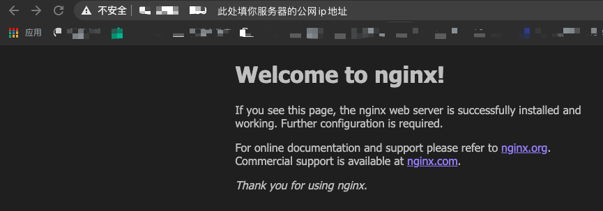

# 用WordPress搭网站学习笔记
## 前期准备
> 一台可以用公网ip地址ssh登陆的服务器
## 一、ssh登陆
### mac以及linux系列系统可以直接用以下方式登陆
> $ ssh username@xxx.xxx.xxx.xxx 

注:username代指登陆服务器所使用的用户,xxx.xxx.xxx.xxx代指服务器ip地址,同时如果使用的端口不是22默认端口需要在上述指令后添加 -p xxxx,使用更改后的端口链接
### windows系统
没有自带的ssh,需要通过配置git或者其它方式下载ssh客户端,参考链接如下
>https://www.cnblogs.com/l199616j/p/11582753.html

## 二、搭建LNMP环境
注:LNMP为Linux、Nginx、MariaDB 和 PHP 的缩写,是常见的Web服务器运行环境搭配
参考链接:https://cloud.tencent.com/document/product/213/38056
### 1.安装Linux 操作系统
此处略...(不会吧不会吧还有人连Linux服务器还不会装吧
**注:以下Linux系统以Centos 7.6为例**
### 2.安装Nginx Web服务器
以下说明都是在上述1中提到的Linux服务器中完成
1.执行以下命令，在 /etc/yum.repos.d/ 下创建 nginx.repo 文件。
>$ vi /etc/yum.repos.d/nginx.repo

2.按 “i” 切换至编辑模式，写入以下内容,并保存退出。
>[nginx] 
name = nginx repo 
baseurl = https://nginx.org/packages/mainline/centos/7/$basearch/ 
gpgcheck = 0 
enabled = 1

**注:上述操作目的为配置用yum下载nginx时使用的源**

3.执行以下命令,用yum安装nginx
>$ yum install -y nginx

4.执行以下命令,打开nginx.conf
> $ vim /etc/nginx/nginx.conf

5.摁“i”切换至编辑模式,找到server{...},将大括号中的内容替换为以下内容,**用于取消对 IPv6 地址的监听，同时配置 Nginx，实现与 PHP 的联动。**
```
server {
    listen       80;
    root   /usr/share/nginx/html;
    server_name  localhost;
    #charset koi8-r;
    #access_log  /var/log/nginx/log/host.access.log  main;
    #
    location / {
    index index.php index.html index.htm;
    }
    #error_page  404              /404.html;
    #redirect server error pages to the static page /50x.html
    #
    error_page   500 502 503 504  /50x.html;
    location = /50x.html {
    root   /usr/share/nginx/html;
    }
    #pass the PHP scripts to FastCGI server listening on 127.0.0.1:9000
    #
    location ~ .php\$ {
    fastcgi_pass   127.0.0.1:9000;
    fastcgi_index  index.php;
    fastcgi_param  SCRIPT_FILENAME  $document_root$fastcgi_script_name;
    include        fastcgi_params;
    }
}
```

注:若 nginx.conf 文件中未找到 server{...}，请在 include /etc/nginx/conf.d/*conf;上方添加以上的 server{...} 配置内容。

6.执行以下命令启动Nginx 
>$ systemctl start nginx

7.执行下列命令,设置Nginx为开机自启动
>$ systemctl enable nginx 

8.在本地浏览器中尝试访问服务器,查看Nginx是否运行正常
如果显示如下,则说明Nginx配置成功


### 3.配置数据库
1.执行以下命令进入MariaDB
>$ mysql

2.创建MariaDB数据库.例如wordpress
>$ CREATE DATEBASE wordpress;

3.创建一个新用户,例如用户名“user”,密码“123456”
>CREATE USER 'user'@'localhost' IDENTIFIED BY '123456';

4.对用户赋予数据库全部权限
>$ GRANT ALL PRIVILEGES ON wordpress.* TO 'user'@'localhost' IDENTIFIED BY '123456';

5.设置root账号密码
>$ ALTER USER root@localhost IDENTIFIED VIA mysql_native_password USING PASSWORD('输入您的密码');

**注:MariaDB 10.4 在 CentOS 系统上已增加了 root 帐户免密登录功能,该步骤目的在于保障您服务器的安全,请设置并牢记您的密码**

6.执行下列命令,使所有配置生效
>$ FLUSH PRIVILEGES;

7.退出MariaDB
>$ \q

## 三、安装和配置WordPress
1.执行以下命令，删除网站根目录下用于测试 PHP-Nginx 配置的index.php文件。
>$ rm -rf /usr/share/nginx/html/index.php

2.依次执行以下命令，进入/usr/share/nginx/html/目录，并下载与解压 WordPress。
>\$ cd /usr/share/nginx/html
\$ wget https://cn.wordpress.org/wordpress-5.0.4-zh_CN.tar.gz
\$ tar zxvf wordpress-5.0.4-zh_CN.tar.gz

3.修改WordPress配置文件
>1.依次执行以下命令，进入 WordPress 安装目录，将wp-config-sample.php文件复制到wp-config.php文件中，并将原先的示例配置文件保留作为备份。
>>$ cd /usr/share/nginx/html/wordpress
$ cp wp-config-sample.php wp-config.php
>>

>2.执行以下命令，打开并编辑新创建的配置文件。
>>$ vim wp-config.php
>>

>3.找到文件中 MySQL 的部分，并将相关配置信息修改为 配置 WordPress 数据库中的内容。
>>// ** MySQL settings - You can get this info from your web host ** //
 /** The name of the database for WordPress */
 define('DB_NAME', 'wordpress'); #此处需要将wordpress改为此前配置数据库时创建的数据库名
/** MySQL database username */
define('DB_USER', 'user'); #同上需要将user进行修改
/** MySQL database password */
 define('DB_PASSWORD', '123456'); #同上需要对数据库密码进行更新
/** MySQL hostname */
 define('DB_HOST', 'localhost'); #此处不需要更改

4.验证是否安装完毕WordPress,在浏览器地址栏输入http://域名或云服务器实例的公网 IP/wordpress 文件夹，例如:
>http://192.xxx.xxx.xxx/wordpress

5.能进入安装页面后,根据指示完成后续基础配置即可

## 四、WordPress个性化配置
### 1.安装ftp
注:ftp即为文件传输协议,WordPress主题/插件等安装需要依赖该协议
>1.首先可以使用以下命令查看是否安装过vsftpd
>>\$ rpm -qa | grep vsftp
>>
>如果有显示版本号则说明已安装,则可以跳过安装ftp这一步,否则使用下列命令下载vsftpd
>>\$ yum -y install vsftpd
>>

>2.文件配置
安装完之后在/etc/vsftpd/路径下会存在三个配置文件。
vsftpd.conf: 主配置文件
ftpusers: 指定哪些用户不能访问FTP服务器,这里的用户包括root在内的一些重要用户。
user_list: 指定的用户是否可以访问ftp服务器，通过vsftpd.conf文件中的userlist_deny的配置来决定配置中的用户是否可以访问，userlist_enable=YES ，userlist_deny=YES ，userlist_file=/etc/vsftpd/user_list 这三个配置允许文件中的用户访问FTP。
可以通过以下命令查看文件默认配置
>>$ cat /etc/vsftpd/vsftpd.conf |grep -v '^#';
>>
>输出的信息中具体的参数说明可以看下面第一个的参考链接

>3.创建FTP用户(ftpusr可以根据自己的喜好自己创建对应用户名)
>>$ useradd ftpusr
>>
>注:ftpusr可以根据自己的喜好自己创建对应用户名

>4.设置用户只能ftp不能登陆,并设置用户密码
>>\$ usermod -s /sbin/nologin ftpusr
\$ passwd ftpusr
>>

>5.更改ftp用户默认家目录
>> $ usermod -d /usr/share/nginx/html ftpusr
>>
>**注:此处如果不更改的话,默认家目录为/home,导致用户只能访问家目录**

>6.启动FTP服务,并设置开机自启动
>> \$ systemctl start vsftpd
>> \$ systemctl enable vsftpd 

### 2.安装主题
进入wordpress后台,网址格式如下:
>http://192.xxx.xxx.xxx/wordpress/wp-admin/

在左侧菜单中依次点击 外观->主题->添加新主题,找到自己喜欢的主题然后点击安装,此处需要填上述创建好的ftp用户信息(主机ip,用户名,密码),然后开始安装
**注:此处如果安装失败并提醒"无法创建目录"或者类似“\<!DOCTYPE html> Error body ...”的话主要是因为ftp用户无文件夹的权限,通过以下操作尝试能不能解决问题**
> \$ cd /usr/share/nginx/html
> \$ chown -R ftpusr

参考链接:
>https://www.cnblogs.com/chenmh/p/5365274.html
>https://blog.csdn.net/lizexing1/article/details/79308961
>https://cloud.tencent.com/developer/ask/77468∂