# 并行程序设计 上机练习一 
## 实验一
**题目:** 课程主页lec2_PP.ppt的P35-36两种重复计算方式的OpenMP和MPI实现。（任务数可约定为2的幂次方）
### 二叉树求和
#### 算法流程图:
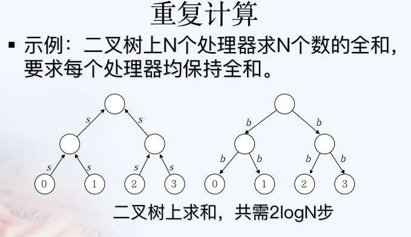
#### PCAM分析
**划分:**
域分解:每个节点均包含一个当前节点权值,均为一个域
功能分解:将任务分成三种,叶子节点,中间节点,根节点
**通信:**
使用静态的结构化异步通信
对于叶子节点,完成两次通信,第一次向其父节点发送该叶子节点的值,第二次等待父亲节点传回sum
对于中间节点,完成三次通信,第一次所有接受子节点的和,第二次等待其父节点回传sum,第三次通信发送收到的sum值给所有儿子节点
对于根节点完成两次通信,第一次通信获得所有子节点的和,第二次将计算的sum发送给所有儿子节点
**组合:**
我们将任务分成三种,因此我们对与每个节点均以自己作为一个组合(不划分)
>+ 对于叶子节点在第二次通信时将节点自身值赋为sum
>+ 对于根节点,在第二次通信前计算所有子节点传来的数值的和,并加上本身节点值
>+ 对于中间节点,在第一次通信以及第二次通信前计算所有子节点传来的数值的和,并加上本身节点值

**映射:**
将对应的任务分别发送给叶子节点/中间节点/根节点

#### 代码实现:
```c++
#include <stdio.h>
#include <string.h>
#include <bits/stdc++.h>
#include "mpi.h"
#define GHH(...) printf(__VA_ARGS__)
// #define GHH(...) 
// using namespace std;

int main(int argc, char* argv[])
{
    clock_t begin = clock();
    int numprocs, myid, source;
    MPI_Status status;
    int data[10];
    MPI_Init(&argc, &argv);
    MPI_Comm_rank(MPI_COMM_WORLD, &myid);
    MPI_Comm_size(MPI_COMM_WORLD, &numprocs);

    data[0] = myid;
    GHH("thread %d begin!\n",myid);
    if(myid == 0);
    else if(myid == 1 ){                 //根节点
        MPI_Recv(data+1, 1, MPI_INT, myid*2, myid*2,  //阶段1,收集来自左右子树的和
            MPI_COMM_WORLD, &status);
        GHH("root %d get sum %d from left son %d\n",myid,data[1],myid*2);
       
        MPI_Recv(data+2, 1, MPI_INT, myid*2+1, myid*2+1,
            MPI_COMM_WORLD, &status);
        GHH("root %d get sum %d from right son %d\n",myid,data[2],myid*2+1);
        
        data[0]+=data[1]+data[2];

        GHH("root %d send sum %d to left son %d\n",myid,data[0],myid*2);
        MPI_Send(data, 1, MPI_INT, myid*2, myid,    //阶段2,向下广播求和的值
            MPI_COMM_WORLD); 

        GHH("root %d send sum %d to right son %d\n",myid,data[0],myid*2+1);
        MPI_Send(data, 1, MPI_INT, myid*2+1, myid,    //阶段2,向下广播求和的值
            MPI_COMM_WORLD); 
    }else if (myid >= (numprocs+1)/2){ //叶子结点
        MPI_Send(data, 1, MPI_INT, myid/2, myid,    //阶段1,向上传递自身节点值
            MPI_COMM_WORLD); 
        GHH("leaf %d send itself to parent %d\n",myid,myid/2);
        
        MPI_Recv(data, 1, MPI_INT, myid/2, myid/2,    //阶段2,收到来自根节点的全局和
            MPI_COMM_WORLD, &status);
        GHH("leaf %d get sum %d from parent %d\n",myid,data[0],myid/2);

    }else {                         //中间节点
        MPI_Recv(data+1, 1, MPI_INT, myid*2, myid*2,  //阶段1,收集来自左右子树的和
            MPI_COMM_WORLD, &status);        
        GHH("midnode %d get sum %d from left son %d\n",myid,data[1],myid*2);

        MPI_Recv(data+2, 1, MPI_INT, myid*2+1, myid*2+1,
            MPI_COMM_WORLD, &status);
        GHH("midnode %d get sum %d from right son %d\n",myid,data[2],myid*2+1);

        data[0]+=data[1]+data[2];

        MPI_Send(data, 1, MPI_INT, myid/2, myid,    //向其父亲节点发送该节点左右子树以及自己的和
            MPI_COMM_WORLD); 
        GHH("midnode %d send itself to parent %d\n",myid,myid/2);

        MPI_Recv(data, 1, MPI_INT, myid/2, myid/2,    //阶段2,向下广播自根节点的全局和
            MPI_COMM_WORLD, &status);
        GHH("midnode %d get sum %d from parent %d\n",myid,data[0],myid/2);

        MPI_Send(data, 1, MPI_INT, myid*2, myid,
            MPI_COMM_WORLD);
        GHH("midnode %d send sum %d to left son %d\n",myid,data[0],myid*2);

        MPI_Send(data, 1, MPI_INT, myid*2+1, myid,
            MPI_COMM_WORLD);
        GHH("midnode %d send sum %d to right son %d\n",myid,data[0],myid*2+1);

    }
    MPI_Finalize();

    clock_t end = clock();
    printf("thread %d sum is %d. Runtime :%lf(ms)\n",myid,data[0],1000.0*(end-begin)/CLOCKS_PER_SEC);
} /* end main */

// mpic++ -o fun test.cpp -fopenmp > compile.log
// mpirun -n 8 -genv OMP_NUM_THREADS 1 ./fun > out.log
```

#### 运行结果展示
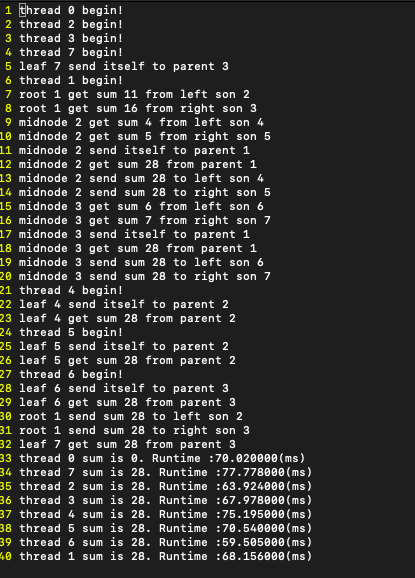

### 蝶式求和
#### 算法流程图
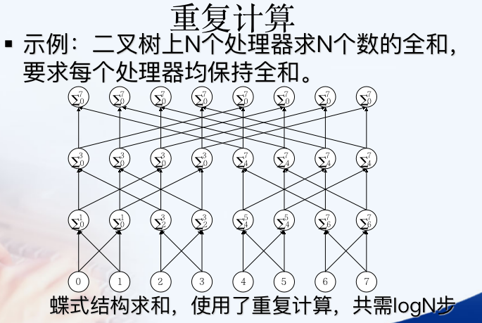
#### PCAM分析
**划分:**
域分解:每个计算节点均等价,因此每个计算节点本身就是一个划分
功能分解:每个计算节点均等价,因此每个计算节点功能一致,仅有一个划分
**通信:**
使用动态的非结构化同步通信
使用同步的方式,记录当前节点id为i(从0到n-1),第k轮将节点i给id为$i\oplus2^k(\oplus 表示异或)$的节点发送当前节点sum
**组合:**
由于任务只有一种,因此我们仅需要叙述每个节点对应的步骤:
>+ 首先使用同步的通信方式,所有节点按轮完成其对应的数据传输任务(保证数据一致性)
>+ 对于第k轮将节点i给id为$i\oplus2^k(\oplus 表示异或)$的节点发送当前节点sum
>+ 保证每个节点均接受到该轮传输的对应$sum_{old}$之后,更新本身节点值$sum=sum+sum_{old}$

**映射:**
将上述组合后的任务分发至所有节点即可
#### 代码实现
```c++
#include <stdio.h>
#include <string.h>
#include <bits/stdc++.h>
#include "mpi.h"
int main(int argc, char* argv[])
{
    clock_t begin = clock();
    int numprocs, myid, source;
    MPI_Status status;
    int data[10];
    MPI_Init(&argc, &argv);
    MPI_Comm_rank(MPI_COMM_WORLD, &myid);
    MPI_Comm_size(MPI_COMM_WORLD, &numprocs);
    data[0]=myid+1;
    for(int i = 1; i < numprocs ; i<<=1){
        MPI_Send(data,1,MPI_INT,myid^i,myid^i,MPI_COMM_WORLD);
        MPI_Recv(data+1,1,MPI_INT,myid^i,myid,MPI_COMM_WORLD,&status);
        data[0] += data[1];
    }
    MPI_Finalize();
    clock_t end = clock();
    printf("thread %d sum is %d. Runrime:%lf(ms)\n",myid,data[0],1000.0*(end-begin)/CLOCKS_PER_SEC);
} /* end main */

// mpic++ -o fun test.cpp -fopenmp > compile.log
// mpirun -n 8 -genv OMP_NUM_THREADS 1 ./fun > out.log
```
#### 运行结果展示
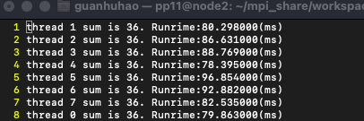

## 实验二
### 题目
前期练习作业题目中的相关程序实现（ex-21-1/2/3 中有要求向量化/并行化的程序实习）。
### 作业1.3.1
#### 题面:
**3. 向量化以下循环。如果不能，请说明原因**。
```c++
(1) for I = 1 to N do 
        S:A(I) = B(I) + C(I+1); 
        T:C(I) = A(I)* D(I); 
    end for 
```
```c++
    S:A(1,N) = B(I:N) + C(2:N+1); 
    T:C(1:N) = A(1:N) * D(1:N); 
```
```c++
(2) for I = 1 to N do 
        S:A(I) = A(I-1) + 1 
    end for 
```
>存在依赖$S\delta^fS$方向向量为(1)因此不能并行化

#### 代码实现:
```c++
#include <bits/stdc++.h>
#include "mpi.h"
using namespace std;
const int n = 1000000;
int a[n+10],b[n+10],c[n+10],d[n+10];
int aa[n+10],bb[n+10],cc[n+10],dd[n+10];
void chuan(){
    clock_t begin = clock();
    for(int i =1;i<=n;i++){
        aa[i]=bb[i]+cc[i+1];
    }
    for(int i=1;i<=n;i++){
        cc[i]=aa[i]*dd[i];
    }
    clock_t end = clock();
    printf("串行用时:%5lf(ms)\n",1000.0*(end-begin)/CLOCKS_PER_SEC);
}
void check(){
    for(int i=1;i<=n;i++){
        if(aa[i]!=a[i]||cc[i]!=c[i]) cout<<"error!"<<endl;
    }
}
int main(int argc, char* argv[])
{
    
    for(int i=0;i<n+5;i++){
        a[i]=aa[i]=rand()%100;
        b[i]=bb[i]=rand()%100;
        c[i]=cc[i]=rand()%100;
        d[i]=dd[i]=rand()%100;

    }
    chuan();

    clock_t begin = clock();
    #pragma omp parallel for 
    for(int i =1;i<=n;i++){
        a[i]=b[i]+c[i+1];
    }
    #pragma omp parallel for 
    for(int i=1;i<=n;i++){
        c[i]=a[i]*d[i];
    }
    clock_t end = clock();
    printf("并行用时:%5lf(ms)\n",1000.0*(end-begin)/CLOCKS_PER_SEC);

    check();
} /* end main */
```
#### 运行结果展示
当OMP_NUM_THREADS 设置为2时运行截图如下:
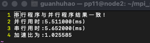
当OMP_NUM_THREADS 设置为4时运行截图如下:
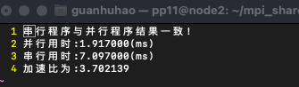
当OMP_NUM_THREADS 设置为8时运行截图如下:
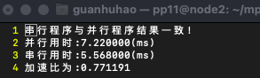

因此我们可以得出,需要设置合适的OMP_NUM_THREADS才能发挥并行的优势

### 作业3.3.2
#### 题面
(2) 尝试向量化/并行化此循环。
```c++
for i = 1 to 100 do // 循环 2 N 是常量
    for j = 1 to 100 do
        S2:B[j] = A[j, N]; // 语句 S2
        doall k = 1 to 100 do 
            S3:A[j+1, k] = B[j] + C[j, k]; // 语句 S3
        enddoall // loop-k
        S4:Y[i+j] = A[j+1, N]; // 语句 S4
    endfor // loop-j
endfor // loop-i

doall i = 1 to 100 do
    S1:X[i] = Y[i] + 10; // 语句 S1
enddoall 
```
#### 代码实现
```c++
#include <bits/stdc++.h>
#include "mpi.h"
using namespace std;
const int n = 100;
int a[n+10][n+10],b[n+10],c[n+10][n+10],d[n+10];
int aa[n+10][n+10],bb[n+10],cc[n+10][n+10],dd[n+10];
int y[n*2+10],x[n*2+10];
int yy[n*2+10],xx[n*2+10];
double chuan(){         //串行程序计算
    clock_t begin = clock();
    for(int i =1;i<=n;i++){
        xx[i]=yy[i]+10;
        for(int j =1;j<=n;j++){
            bb[j]=aa[j][n];
            for(int k=1;k<=n;k++){
                aa[j+1][k]=bb[j]+cc[j][k];
            }
            yy[i+j]=aa[j+1][n];
        }
    }
    clock_t end = clock();
    // printf("串行用时:%5lf(ms)\n",1000.0*(end-begin)/CLOCKS_PER_SEC);
    return 1000.0*(end-begin)/CLOCKS_PER_SEC;
}
bool check(){           //检查是否与串行程序相同
    for(int i=1;i<=n;i++){
        for(int j =1;j<=n;j++)
            if(aa[i][j]!=a[i][j]||cc[i][j]!=c[i][j]) {
                cout<<"error!"<<endl;
                return false;
            }
        if(b[i]!=bb[i]||d[i]!=dd[i]||x[i]!=xx[i]||y[i]!=yy[i]) {
            cout<<"error"<<endl;
            return false;
        }
    }
    return true;
}
void randData(){        //生成随机数据
    for(int i=0;i<n+5;i++){
        for(int j =0;j<n+5;j++) {
            a[i][j]=aa[i][j]=rand()%100;
            c[i][j]=cc[i][j]=rand()%100;
        }
        b[i]=bb[i]=rand()%100;
        d[i]=dd[i]=rand()%100;
        x[i]=xx[i]=rand()%100;
        y[i]=yy[i]=rand()%100;
    }
}
int main(int argc, char* argv[])
{
    randData();      //生成随机数据

    double time_seq = chuan();

    clock_t begin = clock();
    for(int i =1;i<=n;i++){
        for(int j = 1;j<=n;j++){
            b[j]=a[j][n];
            // #pragma omp parallel for 
            for(int k =1;k<=n;k++){
                a[j+1][k]=b[j]+c[j][k];
            }
            y[i+j] = a[j+1][n];
        }
    }
    
    #pragma omp parallel for 
    for(int i=1;i<=n;i++){
        x[i]=y[i]+10;
    }
    clock_t end = clock();

    if(check()) printf("串行程序与并行程序结果一致!\n");
    double time_pra = 1000.0*(end-begin)/CLOCKS_PER_SEC;
    printf("并行用时:%5lf(ms)\n",time_pra);
    printf("串行用时:%5lf(ms)\n",time_seq);
    printf("加速比为:%lf\n",time_seq/time_pra);

} /* end main */
```

#### 运行结果展示
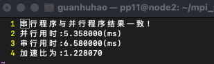

### 作业3.5.1
#### 题面
五、 分析以下 3 个循环中存在的依赖关系；分别通过循环交换、分布和逆转
等多种方法来尝试向量化和/或并行化变换：
```c++
for i = 1 to 100 do //循环 1 
    S:A[i] = A[i] + B[i-1];
    T:B[i] = C[i-1] * 2 ;
    U:C[i] = 1 / B[i] ;
    V:D[i] = C[i] * C[i] ;
endfor
```
#### 代码实现:
```c++
#include <bits/stdc++.h>
#include "mpi.h"
using namespace std;
const int n = 1000000;
const int mod = 1e4;
int a[n+10],b[n+10],c[n+10],d[n+10];
int aa[n+10],bb[n+10],cc[n+10],dd[n+10];
double chuan(){             //串行程序计算
    clock_t begin = clock();
    for(int i=1;i<=n;i++){
        aa[i]=aa[i]+bb[i-1];
        bb[i]=cc[i-1]*2%mod+1;
        cc[i]=int(1/bb[i]);
        dd[i]=cc[i]*cc[i]%mod+1;
    }
    clock_t end = clock();
    // printf("串行用时:%5lf(ms)\n",1000.0*(end-begin)/CLOCKS_PER_SEC);
    return 1000.0*(end-begin)/CLOCKS_PER_SEC;
}
bool check(){
    for(int i=1;i<=n;i++){
        if(aa[i]!=a[i]||cc[i]!=c[i]||bb[i]!=b[i]||dd[i]!=d[i]) {
            cout<<"error!"<<endl;
            return false;
        }
    }
    return true;
}
void randData(){             //生成随机数据
    for(int i=0;i<n+5;i++){
        a[i]=aa[i]=rand()%100;
        b[i]=bb[i]=rand()%100;
        c[i]=cc[i]=rand()%100;
        d[i]=dd[i]=rand()%100;
    }
}
int main(int argc, char* argv[])
{
    randData();          //生成随机数据

    double time_seq = chuan();  //串行程序计算

    clock_t begin = clock();
    for(int i =1;i<=n;i++){
        b[i]=c[i-1]*2%mod+1;
        c[i]=int(1/b[i]);
    }
    #pragma omp parallel for 
    for(int i=1;i<=n;i++){
        a[i]=a[i]+b[i-1];
        d[i]=c[i]*c[i]%mod+1;
    }
    clock_t end = clock();

    if(check()) printf("串行程序与并行程序结果一致!\n");
    double time_pra = 1000.0*(end-begin)/CLOCKS_PER_SEC;
    printf("并行用时:%5lf(ms)\n",time_pra);
    printf("串行用时:%5lf(ms)\n",time_seq);
    printf("加速比为:%lf\n",time_seq/time_pra);

} /* end main */
```
#### 运行结果展示
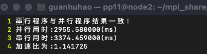

由于该算法比较简单,在数据规模较小时无论怎么设置
### 作业3.5.2
#### 题面
```c++
for i = 1 to 999 do // 循环 2
    S:A[i] = B[i] + C[i];
    T:D[i] = ( A[i] + A[ 999-i+1 ] ) / 2 ;
endfor
```
#### 代码实现
```c++
#include <bits/stdc++.h>
#include "mpi.h"
using namespace std;
const int n = 99999;
const int mod = 1e4;
int a[n+10],b[n+10],c[n+10],d[n+10];
int aa[n+10],bb[n+10],cc[n+10],dd[n+10];
double chuan(){
    clock_t begin = clock();
    for(int i=1;i<=n;i++){
        aa[i]=bb[i]+cc[i];
        dd[i]=(aa[i]+aa[n-i+1])/2;
    }
    clock_t end = clock();
    // printf("串行用时:%5lf(ms)\n",1000.0*(end-begin)/CLOCKS_PER_SEC);
    return 1000.0*(end-begin)/CLOCKS_PER_SEC;
}
bool check(){
    for(int i=1;i<=n;i++){
        if(aa[i]!=a[i]||cc[i]!=c[i]||bb[i]!=b[i]||dd[i]!=d[i]) {
            cout<<i<<" "<<"error!"<<endl;
            return false;
        }
    }
    return true;
}
int main(int argc, char* argv[])
{
    
    for(int i=0;i<n+5;i++){         
        a[i]=aa[i]=rand()%100;
        b[i]=bb[i]=rand()%100;
        c[i]=cc[i]=rand()%100;
        d[i]=dd[i]=rand()%100;

    }

    double time_seq = chuan();

    clock_t begin = clock();
    #pragma omp parallel for 
    for(int i =1;i<=(n+1)/2;i++){
        a[i]=b[i]+c[i];
        // d[i]=(a[i]+a[n-i+1])/2;
    }
    #pragma omp parallel for 
    for(int i =1;i<=(n+1)/2;i++){
        d[i]=(a[i]+a[n-i+1])/2;
    }
    #pragma omp parallel for 
    for(int i=(n+1)/2+1;i<=n;i++){
        a[i]=b[i]+c[i];
        // d[i]=(a[i]+a[n-i+1])/2;
    }
    #pragma omp parallel for 
    for(int i=(n+1)/2+1;i<=n;i++){
        d[i]=(a[i]+a[n-i+1])/2;
    }
    clock_t end = clock();

    if(check()) printf("串行程序与并行程序结果一致!\n");
    double time_pra = 1000.0*(end-begin)/CLOCKS_PER_SEC;
    printf("并行用时:%5lf(ms)\n",time_pra);
    printf("串行用时:%5lf(ms)\n",time_seq);
    printf("加速比为:%lf\n",time_seq/time_pra);
} /* end main */
``` 
#### 运行结果展示
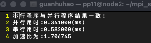
## 实验三
### 题面
新的广播MyBcastMPI实现。基本思路：
（1）将MPI进程按所在节点划分子通讯域N；
（2）可以将各子通讯域的首进程（编号为0）再组成一个子通讯域H；
（3）由广播的root进程将消息发给原来最大通讯域中的0号进程h，再由h在H通讯域中广播（MPI_Bcast），各首进程然后在各自子通讯域N中再行广播（MPI_Bcast）。 
### 代码实现
```c++
// 本实验通信域大小为4,其中所有myid%4=0的构成通信域H
// root节点为id最大的,因此要求numprocs应该为4k+1
#include <stdio.h>
#include <string.h>
#include "mpi.h"
int data[10];
int main(int argc, char* argv[])
{
    int numprocs, myid, source;
    MPI_Status status;
    MPI_Init(&argc, &argv);
    MPI_Comm_rank(MPI_COMM_WORLD, &myid);
    MPI_Comm_size(MPI_COMM_WORLD, &numprocs);


    if(myid == numprocs-1){ //为root节点
        data[0]=100;
        printf("root node send msg to h0\n");
        MPI_Send(data, 1, MPI_INT, 0, 0,MPI_COMM_WORLD); 
    }else if(myid%4 == 0){  //设定myid%4==0的节点构成子通信域N
        if(myid==0){        //myid=0的为0号进程
            MPI_Recv(data, 1, MPI_INT, numprocs-1, myid,
                MPI_COMM_WORLD, &status);
            printf("h0 node received msg %d\n",data[0]);
            for(int i = myid+4; i <= numprocs-1 ; i+=4){
                printf("h0 node send msg to h%d\n",i/4);
                MPI_Send(data, 1, MPI_INT, i, i,MPI_COMM_WORLD);
            }
        }else{
            MPI_Recv(data, 1, MPI_INT, 0, myid,
                MPI_COMM_WORLD, &status);
            printf("h%d node received msg %d\n",myid/4,data[0]);
        }
        for(int i = 1; i <= 3; i++){
            printf("h%d node send msg to n%d%d\n",myid/4,myid/4,i);
            MPI_Send(data, 1, MPI_INT, myid+i, myid+i,
                MPI_COMM_WORLD);
        }
    }else {         //通信域N收到消息
        MPI_Recv(data, 1, MPI_INT, myid-myid%4, myid,
                MPI_COMM_WORLD, &status);
        printf("n%d%d node received msg %d\n",myid/4,myid%4,data[0]);
    }
    MPI_Finalize();
} /* end main */
```
### 运行截图:
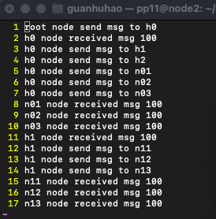
## 实验四
### 题面
用MPI_Send和MPI_Recv来模拟实现诸如MPI_Alltoall, MPI_Allgather功能并与标准MPI实现做简要性能对比
### 代码实现:
```c++
// 本实验通信域大小为4,其中所有myid%4=0的构成通信域H
// root节点为id最大的,因此要求numprocs应该为4k+1
#include <stdio.h>
#include <string.h>
#include <bits/stdc++.h>
#include "mpi.h"
using namespace std;
int data[1050];
int recv[1050];
void my_alltoall(const void *sendbuf, const int sendcount, MPI_Datatype sendtype, 
    void *recvbuf,const int recvcount, MPI_Datatype recvtype, MPI_Comm comm,int numprocs,int myid){
        int offset = 0;
        MPI_Status status;
        // printf("numprocs: %d\n",numprocs);
        for(int i=0;i<numprocs;i++) {
            if(i==myid) continue;
            MPI_Send((int*)(sendbuf)+i*sendcount, sendcount, sendtype, i, 1, comm);
            // printf("thread %d send msg to thread %d\n",myid,i);
        }
        for(int i=0;i<numprocs;i++) {
            if(i==myid) continue;
            MPI_Recv((int*)(recvbuf)+i*recvcount, recvcount, recvtype, i, 1, comm, &status);
        }

        // printf("thread %d recived data :\n",myid);
        // for(int i=0;i<numprocs*recvcount;i++){
        //     printf("%d ",*((int*)(recvbuf)+i*recvcount));
        // }
        // printf("\n");
}
void my_allgather(const void *sendbuf, const int sendcount, MPI_Datatype sendtype, 
    void *recvbuf,const int recvcount, MPI_Datatype recvtype, MPI_Comm comm,int numprocs,int myid){
        int offset = 0;
        MPI_Status status;
        for(int i=0;i<numprocs;i++) {
            if(i==myid) continue;
            MPI_Send((int*)sendbuf, sendcount, sendtype, i, 1, comm);
        }
        for(int i=0;i<numprocs;i++) {
            if(i==myid) continue;
            MPI_Recv((int*)(recvbuf)+i*recvcount, recvcount, recvtype, i, 1, comm, &status);
        }

        // printf("thread %d recived data :\n",myid);
        // for(int i=0;i<numprocs*recvcount;i++){
        //     printf("%d ",*((int*)(recvbuf)+i*recvcount));
        // }
        // printf("\n");
}
int main(int argc, char* argv[])
{
    int numprocs, myid, source;
    MPI_Status status;
    MPI_Init(&argc, &argv);
    MPI_Comm_rank(MPI_COMM_WORLD, &myid);
    MPI_Comm_size(MPI_COMM_WORLD, &numprocs);
    for(int i=0;i<10;i++) data[i]=myid*10+i;

    clock_t begin = clock();
    MPI_Alltoall(data,1,MPI_INT,recv,1,MPI_INT,MPI_COMM_WORLD);
    clock_t end = clock();
    if(myid == 0) printf("MPI_Alltoall 用时%.3lf(ms)\n",1000.0*(end-begin)/CLOCKS_PER_SEC);

    begin = clock();
    my_alltoall(data,1,MPI_INT,recv,1,MPI_INT,MPI_COMM_WORLD,numprocs,myid);
    end = clock();
    if(myid == 0) printf("my_alltoall 用时%.3lf(ms)\n",1000.0*(end-begin)/CLOCKS_PER_SEC);

    begin = clock();
    MPI_Allgather(data,1,MPI_INT,recv,1,MPI_INT,MPI_COMM_WORLD);
    end = clock();
    if(myid == 0) printf("MPI_AllGather 用时%.3lf(ms)\n",1000.0*(end-begin)/CLOCKS_PER_SEC);

    begin = clock();
    my_allgather(data,1,MPI_INT,recv,1,MPI_INT,MPI_COMM_WORLD,numprocs,myid);
    end = clock();
    if(myid == 0) printf("my_allgather 用时%.3lf(ms)\n",1000.0*(end-begin)/CLOCKS_PER_SEC);

    MPI_Finalize();
} /* end main */
```
### 运行截图
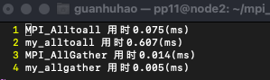
虽然我们写的alltoall以及allgather运行速度比标准mpi的快,但是主要考虑到我们没有做必要的类型检查以及类似的程序鲁棒性保障,对于死锁等问题也仅采用简单控制,因此总体上来说并没有标准mpi完备.