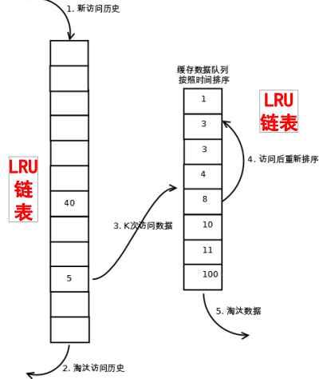
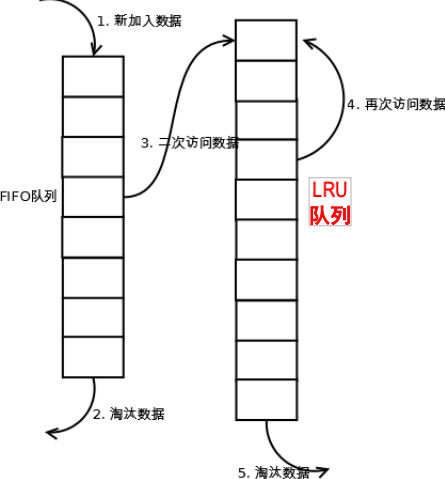
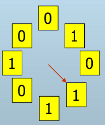

# 第三章 Buffer管理
出发点:通过**预加载**较可能请求的页尽可能多的放在**内存**中,以减少磁盘I/O次数,提升系统性能.通常情况下,通过**历史中访问过的页面**来进行未来的预测(因为真实未来是很难预测的)

本章内容分为下面三块:
>+ 缓冲区结构
>+ 缓冲区置换算法
>+ 缓冲区管理的实现

目前对于缓冲区管理的预测,近些年有采用机器学习的相关算法来进行缓冲区的预测,优点为预测命中概率高,但缺陷在于**预测的耗时可能大于操作的时间**,使得总体效率提升不高.
## 3.1 缓冲区结构:
#### 基本概念介绍:
缓冲区的底层物理层结构:**内存**
缓冲区大小衡量的基本单位:**页(page)**,原因在于磁盘与内存IO之间最小的单位也为page
磁盘page与内存page区分:通常意义下的page一般指磁盘**page**,对于内存页通常使用**frame**来代表,中文的情况下一般叫内存page为“缓存页”
PS:内存的基本单位为page,但是每次可以不按照最小的单位进行内存管理,大多数情况下是将**若干个page一起操作**,提升整体的效率,如释放磁盘空间.但是可能存在下面的现象.

||一个frame对应一个页|一个frame对应多个页|
|---|---|---|
|缺点|缓存置换算法运行CPU代价大(因为一次处理一个页)|cpu代价下降(一次可以处理多个页)|
|优点|缓存100%利用率,使得命中率提升|缓存空间利用率下降,命中率下降|
||||
举例:使用一个frame对应4个page,那么假设一开始内存满了,但是需要读取新的元素,那么从内存中移除4个物理page,然后再加入1个物理page,那么这时出现了3个物理页没有装载,因此导致空间利用率下降,同时由于利用率下降那么命中率就下降了.
由于通常情况下cpu计算时间远小于未命中时IO代价,因此目前系统中通常使用1个frame对应1个page的方式来实现.
但是对于某些计算资源为瓶颈的情况,则可能会使用一个frame对应多个页
### 3.1.1 frame的参数
**Dirty:**
>标记Frame中的块是否改写,数据写回时使用该标志来判断是否需要对磁盘数据进行赋写

**Pin-count:**
>Frame的块被请求但是还未释放的计数,即当前使用该frame的用户数,该标志位主要用于**多进程读**(不是读写,因为读写会冲突),当计数大于等于0的frame不能被改写或释放.
PS:该标识位主要用于**非抢占的架构**,即各进程(用户)平权,如果可以抢占则对于某些优先级高的请求则可以无视Pin-count标志强制进行改写

**\*Other**
>Latch:加锁,会影响性能,但是能保证数据一致性

### 3.1.2 请求/释放块
#### 请求块
由于数据库中无page 概念仅有block的概念,因此需要将数据库的block请求**转化**为缓冲区的page请求:
**情况一:当请求块(block)不在缓冲区(pool)内**
>+ 选择一个frame用于替换
>+ 如果选中的frame有Dirty标记,将该frame对应的页写回磁盘
>+ 将请求的block读取到选中的frame

**情况二:当请求块命中**
>+ 将该块的pin-count值+1
>+ 将该block的地址返回

#### 释放块
>+ 首先需要确保该块pin-count=0
>+ 查看是否有dirty标记
>>无标记的话可以直接释放
>>如果存在dirty标记则需要将数据写回后再释放


## 3.2 缓冲区替换策略
### 基本概念介绍:

**缓冲区替换的替换算法:**
>+ Least-recently-used(LRU),Clock,FIFO,MRU(Most-recently-used)

**页替换前提**
只有当内存块的frames的pin-count为0,才可以被选为替换(当然这也是基于非抢占的架构)

**替换算法受**访问模式**影响很大**
>访问模式:对于数据的一些假设,如对于专利数据库,那么越新的数据访问概率越高,对于古籍数据库,可能对于旧的数据访问概率高,抽奖数据库则每个数据访问概率均等

**理论最优算法:OPT算法**
>+ 也称为Belady’s算法
>+ **理论上最佳**的页面置换算法。它每次都置换以后永远也用不到的页面，如果没有则淘汰最久以后再用到的页面。
>+ OPT算法**必须全部的页面访问序列**，而这在实际DBMS/OS中是无法实现的，因此仅有**理论意义。**,可以**作为理论上界进行对比**
>+ PS:相当于**提前预知所有**的访问序列

### 3.2.1 LRU
#### LRU
>+ 所有frame按照最近一次访问时间排列成一个链表,如下图:
>>
>+ 基于时间局部性(TemporalLocality)假设：越是**最近访问的在未来被访问的概率越高**.总是替换LRU端的frame(相当于当前加载的所有页中上次访问时间最长的frame)

#### 优点:
>+ 适用于重复访问热门页面
>+ $O(1)$复杂度选择被替换页

#### 缺点:
>+ 缓存污染(Sequentialflooding)：容易出现被频次少的一次**连续大量**的请求污染,将之前维护的良好的LRU结构都**清洗**掉了(**最大的问题**---by老师)
>+ 每次访问均需要**维护LRU链表**,链表不支持随机访问
>+ 如果访问不满足时间局部性，则性能较差只考虑最近一次访问，这个是本质上的,相当于**不满足LRU的访问模式假设**
>+ 只考虑最近一次访问,**不考虑访问频率**
>+ 对于每次请求上次被替换的页(最差的情况下),如buffer大小为3,那么对于下面的访问序列其性能很差:1,2,3,4,1,2,3,4,1,2,3,4,...

### 3.2.2 LRU-K
针对现象:LRU不考虑frame的访问频率，不合理
改良方法:如果某个frame的访问次数达到了K次以上，则尽可能不置换

#### 实现方式:
>1. 需要维护2个LRU链表,可以见下图
>>+ 1个是访问次数小于K次的
>>+ 1个是访问次数K次以上的
>2. 优先按照LRU策略置换小于K次的链表
>3. 保证高频访问的页能够尽量在buffer中
>4. 实验表明LRU-2的性能比较好



#### 缺点:
>+ 需要额外的记录访问次数
>+ 对于短时爆发高频的访问某个数据,会使得该数据长时间驻留在系统中,为了解决该现象,提出了对于在访问K次以上的数据可以**设置老化函数来提供退出机制**

### 3.2.3 2Q
与LRU-2类似，不同之处在于访问1次的队列采用FIFO，而不是LRU,结构如下:


### 3.2.4 Second-Chance LRU
#### 实现方法:
>+ 所有frame组成LRU链表，每个frame附加一个bit位，初始为1。当LRU页第一次被选中置换时置为0，并移到MRU端。只有bit位为0的LRU页才被选中置换。
>+ 当某个frame被访问时，移到MRU端并重置bit位为1
>+ 相当于每个frame给了两次置换机会，避免高频访问但最近一轮没有被访问的frame被置换出buffer
>+ 每个frame只需要1个额外bit，空间代价很低
>PS:该方法相当于给每个frame一次复活的机会,之后连续两次被选为置换,且两次之间没有对frame的调用时,将其真正替换.

### 3.2.5 CLOCK
#### 主要想法:
**避免**每次访问时链表**调整代价**
>LRU需要遍历链表找到对应页代表的节点,然后将其调整到MRU端
>Second-Chance FIFO 也需要额外维护一个指针删除调整操作
#### CLOCK算法实现:
>+ 把Second-Chance FIFO组织成**环形**
>+ N个frame组成环形，current指针指向当前frame；每个frame有一个referenced位，初始为1；
>+ 当需要置换页时按顺序执行下面操作:
>>+ 从current开始检查，若pin-count>0，current增加1；//相当于被占用
>>+ 若referenced已启动（=1），则关闭它（=0）并增加current（保证最近的不被替换）；//使用第一次机会复活
>>+ 若pin-count=0并且referenced关闭（=0），则替换该frame，同时current加1 //使用复活机会后仍被选中则真正替换
>+ 注意：Current指针**只在置换时更新**，访问命中时不改变Current指针
>PS:优化了Second-Chance FIFO,减少了头尾指针,以及调整的代价,只需要维护curennt即可

#### 图例

##### 解释:
>current:相当于指针每次加一代表指针移动一位
>referenced:为标志为,每次找到为0的进行替换,为1的将其置换成0(未被占用的情况下)

### 3.2.6 SSD的置换算法
#### 出发点:
闪存设备的读写特点:
>读快写慢,且**写次数有限**,因此减少缓存置换中对闪存的写相当重要.

#### SSD-aware缓存算法
>+ CF-LRU(CASES’06):Clean-first,不用赋写 **(无Dirty标志的)** 的优先替换(减少反复写回),缺点时本质上仍然是LRU算法,因此无法避免LRU算法的所有缺点
>+ LRU-WSR(IEEETransCE’08):相当于CL加上一个Second-Chance,但是**没有考虑频率**
>>+ Clean-first+coldflag 
>>+ 置换：clean>colddirty>hotdirty 
>+ AD-LRU(DKE’10):在上述的基础上还考虑了**频率**以及引入了**动态调整机制**
>>+ coldLRUlist+hotLRUlist 
>>+ Dynamically adjust twoLRUs

### 3.2.7 不使用OS缓冲区管理的原因
>+ DBMS经常能**预测访问模式**(Access Pattern)
>>+ 可以使用更专门的缓冲区替换策略
>>+ 有利于pre-fetch策略的有效使用,pre-fetch指确定数据先后到达顺序,交给OS缓存的话通常情况下无法保证数据的先后到达顺序 **(操作系统会统一打包)**
>+ DBMS需要**强制写回磁盘能力**（如WAL），OS的缓冲写回一般通过记录写请求来实现（来自不同应用），实际的磁盘修改推迟，因此不能保证写顺序,该性质主要**保证数据可恢复性**(写日志,防止断电导致数据不可恢复)

### 3.3 缓冲区管理器的实现(最后的实验要求(大概...))
#### 请求的层层抽象
主要将请求抽象为三层:
> 1. 对于用户提供一个数据库查询record请求
> 2. 数据库软件将record请求转换为内存frame请求
> 3. 当frame中没有指定数据则内存向存储设备发送page请求

### 3.3.1 错误的记录操作例子:
>+ **没有**DBMS自己的**缓冲区管理**和**存储管理**(直接读写磁盘)
>+ 直接基于文件系统，使用了FS的缓冲管理
>>+ 不能保证WAL
>>+ 不利于查询优化
>>+ 不适应应用需求

因此实现时需要进行修改

### 3.3.2 Block与磁盘文件
文件存储在磁盘上的物理形式是bits/bytes，block是由OS或DBMS软件,**对文件所做的抽象**，这一抽象是通过控制数据在文件中的起止offset来实现的
简而言之就是**使用offset来对文件直接抽象block**即可

### 3.3.3 Buffer与磁盘文件
这里大概的意思是一个frame对应一个磁盘page

### 3.3.4 Buffer Size
这个通常情况下DBMS允许用户自己配置,实验没啥要求(大概)

### 3.3.5 Buffer的存储结构
Buffer是一个frame的列表,每个frame对应一个磁盘块,示例如下:
```c++
#define FRAMESIZE 4096  //一个frame所占字节数
#define BUFSIZE 1024    //frame数目

struct bFrame       //内存frame的一个实例
{
    Char field[FRAMESIZE]; //frame中的数据
};

bFramebuf[BUFSIZE]; //多个frame组成的buffer
```
### 3.3.6 Page/Block的一般存储格式
对于定长数据通常使用<块号,槽号>来表示,对于Record的存储结构,我们可以使用下面的结构体来进行表示:
```c++
struct Record{      //一个记录实例
    int page_id;    //页id
    int slot_num;   //槽数目
}
```

### 3.3.7 Buffer中Frame存储结构
多个内存块frame组成Buffer,对于每个内存块我们使用id以及偏移来进行映射到其真实地址.
```c++
struct Frame{       //一个内存块实例
    int frame_id;   //用于标记内存块id
    int offset;     //通过使用偏移来记录当前内存块起始位置
}
```
### 3.3.8 Buffer中Frame的查找
>读磁盘块时:根据page_id确定在Buffer中是否已经存在frame, 
>写磁盘块时：要根据frame_id快速找到文件中对应的page_id

**PS:强调不能用遍历**

需要使用Buffer维护信息Buffer Control Blocks(BCB)来进行对所有frame进行维护.
对于frame到page的查找(索引)使用**hash表**的方式来进行查找

对于BCB我们可以使用下面的方式来表示:
```c++
struct BCB{         //BCB实例
    BCB();          //初始化函数
    int page_id;    //记录页id
    int frame_id;   //记录内存块id
    int count;      
    int time;

    int dirty;      //脏标记用于写回
    BCB *next;      //链表结构
}
```
