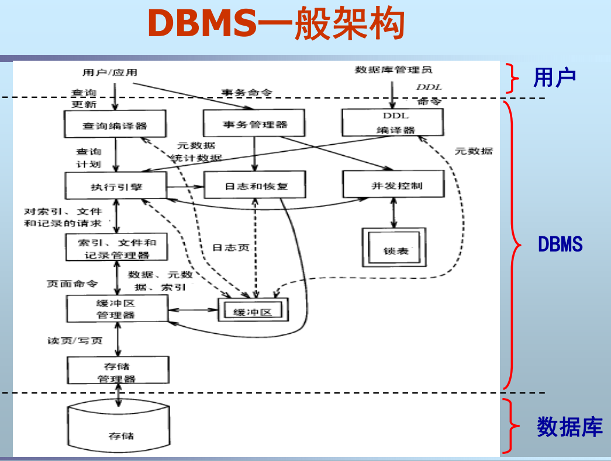
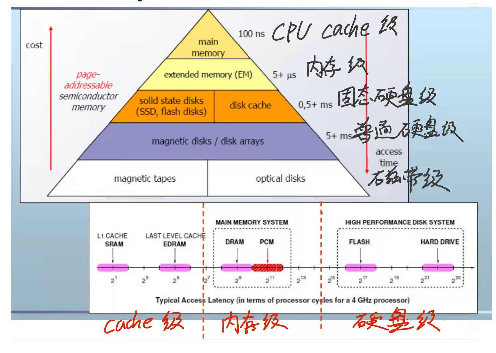
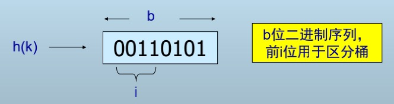
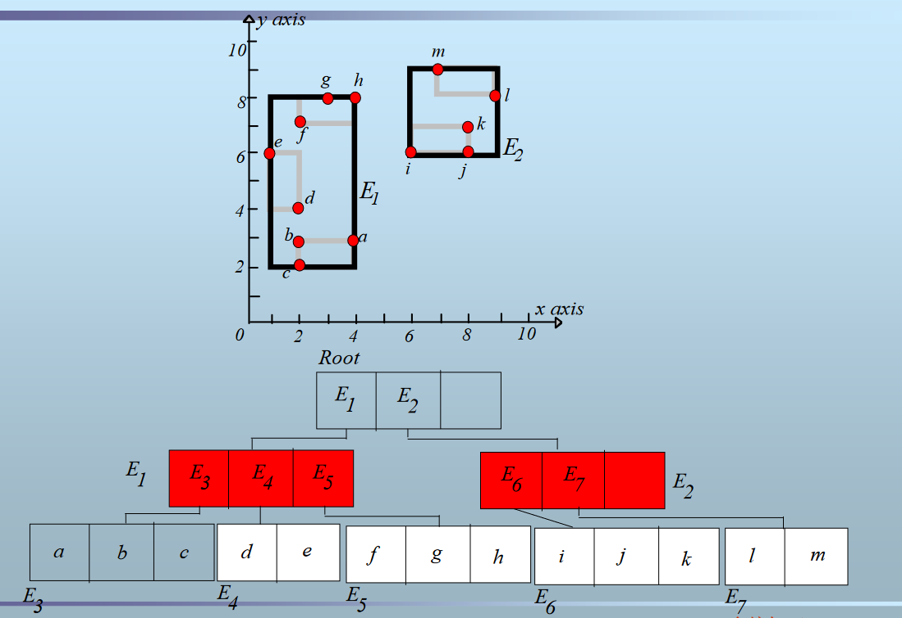

<!-- vscode-markdown-toc -->
* 1. [第1章 概述](#1)
	* 1.1. [1、DBMS系统结构组成](#DBMS)
	* 1.2. [2、数据库、DBMS、数据库系统等基本概念](#DBMS-1)
		* 1.2.1. [数据](#)
		* 1.2.2. [数据库](#-1)
		* 1.2.3. [数据库管理系统](#-1)
		* 1.2.4. [数据库设计问题](#-1)
		* 1.2.5. [数据库语言](#-1)
* 2. [第2章 关系数据库技术回顾 (reading)](#2reading)
	* 2.1. [1、数据模型和关系数据模型](#-1)
		* 2.1.1. [数据模型](#-1)
		* 2.1.2. [关系数据模型](#-1)
	* 2.2. [2、关系代数和SQL](#SQL)
		* 2.2.1. [SQL(数据库语言)](#SQL-1)
	* 2.3. [3、三级模式结构与数据独立性](#-1)
		* 2.3.1. [三级模式:](#:)
		* 2.3.2. [二级映像与数据独立性](#-1)
* 3. [第3章 数据存储](#3)
	* 3.1. [1、磁盘块存取时间](#-1)
	* 3.2. [2、存储器结构](#-1)
	* 3.3. [3、不同类型存储介质之间的差异](#-1)
		* 3.3.1. [闪存(NAND)](#NAND)
		* 3.3.2. [相变存储器(PCM)](#PCM)
* 4. [第4章 数据表示](#4)
	* 4.1. [1、数据项的表示](#-1)
		* 4.1.1. [小结](#-1)
	* 4.2. [2、记录的表示](#-1)
		* 4.2.1. [2.1 对于固定格式定长记录](#-1)
		* 4.2.2. [2.2 可变格式记录](#-1)
	* 4.3. [3、记录在磁盘块中的组织](#-1)
		* 4.3.1. [3.1定长记录的块内组织方式](#-1)
		* 4.3.2. [3.2 变长记录的块内组织形式](#-1)
	* 4.4. [4、链表式堆文件和目录式堆文件](#-1)
		* 4.4.1. [堆文件](#-1)
		* 4.4.2. [链表式堆文件](#-1)
		* 4.4.3. [目录式堆文件](#-1)
* 5. [第5章 缓冲区管理](#5)
	* 5.1. [1、缓冲区结构、frame/dirty/pin-count等概念的含义](#framedirtypin-count)
		* 5.1.1. [基本概念介绍:](#:-1)
		* 5.1.2. [frame/dirty/pin-count含义](#framedirtypin-count-1)
	* 5.2. [2、缓冲区置换算法：LRU、Second-Chance、Clock](#LRUSecond-ChanceClock)
		* 5.2.1. [LRU(最近最久未使用)](#LRU)
		* 5.2.2. [优点:](#:-1)
		* 5.2.3. [缺点:](#:-1)
		* 5.2.4. [Second-Chance(二次机会)](#Second-Chance)
		* 5.2.5. [Clock(时钟置换算法)](#Clock)
	* 5.3. [3、缓冲区管理器的实现](#-1)
* 6. [第6章 索引结构](#6)
	* 6.1. [1、一维索引：B+树、散列表 (包括动态散列表)](#B)
		* 6.1.1. [1.1 密集索引](#-1)
		* 6.1.2. [1.2 稀疏索引](#-1)
		* 6.1.3. [1.3 多级索引](#-1)
		* 6.1.4. [1.4 B+树](#B-1)
		* 6.1.5. [1.5 散列表](#-1)
		* 6.1.6. [1.6 动态散列表](#-1)
	* 6.2. [2、多维索引：R-Tree、网格文件(Grid File)、分段散列函数(Partitioned Hash Func.)](#R-TreeGridFilePartitionedHashFunc.)
		* 6.2.1. [R-Tree](#R-Tree)
		* 6.2.2. [网格文件(Grid File)](#GridFile)
		* 6.2.3. [分段散列函数](#-1)
* 7. [第7章 查询优化](#7)
	* 7.1. [1、查询处理器的工作过程](#-1)
	* 7.2. [2、中间结果大小估计](#-1)
		* 7.2.1. [需要使用的统计量](#-1)
	* 7.3. [3、I/O代价的影响因素](#IO)
* 8. [第8章 连接算法](#8)
	* 8.1. [1、嵌套循环连接](#-1)
	* 8.2. [2、归并连接](#-1)
	* 8.3. [3、索引连接](#-1)
	* 8.4. [4、散列连接](#-1)
	* 8.5. [5、连接算法的I/O代价估计与内存开销](#IO-1)
* 9. [第9章 事务处理I：故障与恢复](#9I)
	* 9.1. [1、数据库的一致性概念](#-1)
	* 9.2. [2、事务的基本概念、ACID和原子操作](#ACID)
		* 9.2.1. [事务的状态:](#:-1)
		* 9.2.2. [事务的原语操作](#-1)
	* 9.3. [3、Undo日志、Redo日志、Undo/Redo日志的恢复过程](#UndoRedoUndoRedo)
		* 9.3.1. [Undo日志](#Undo)
		* 9.3.2. [Redo日志](#Redo)
		* 9.3.3. [Undo/Redo日志](#UndoRedo)
	* 9.4. [4、Checkpoint](#Checkpoint)
* 10. [第10章 事务处理II：并发控制](#10II)
	* 10.1. [1、可串性、冲突可串性的概念](#-1)
	* 10.2. [2、冲突可串性的判定](#-1)
	* 10.3. [3、锁：S、X、U、IS、IX、2PL、MGL](#SXUISIX2PLMGL)
	* 10.4. [4、锁管理器与锁表](#-1)
	* 10.5. [5、视图可串性](#-1)
	* 10.6. [多重图](#-1)
	* 10.7. [6、死锁](#-1)
		* 10.7.1. [死锁检测:](#:-1)
		* 10.7.2. [死锁预防](#-1)
	* 10.8. [7、乐观并发控制技术](#-1)
		* 10.8.1. [有效性确认协议](#-1)
* 11. [第11章 NoSQL数据库概述](#11NoSQL)
	* 11.1. [1、NoSQL数据库的特点](#NoSQL)
	* 11.2. [2、NoSQL产生的原因](#NoSQL-1)
	* 11.3. [3、NoSQL与RDBMS的对比](#NoSQLRDBMS)
		* 11.3.1. [RDBMS](#RDBMS)
		* 11.3.2. [NoSQL](#NoSQL-1)
	* 11.4. [4、NoSQL数据库主要的4种类型](#NoSQL4)
	* 11.5. [5、CAP和BASE理论](#CAPBASE)
		* 11.5.1. [CAP理论](#CAP)
		* 11.5.2. [BASE理论](#BASE)
	* 11.6. [6、LSM-tree](#LSM-tree)
* 12. [不学了,看不动了,awsl,嘤嘤嘤](#awsl)

<!-- vscode-markdown-toc-config
	numbering=true
	autoSave=true
	/vscode-markdown-toc-config -->
<!-- /vscode-markdown-toc -->
<div STYLE="page-break-after: always;"></div>

# 1. 《高级数据库系统》复习提纲

##  1. <a name='1'></a>第1章 概述

###  1.1. <a name='DBMS'></a>1、DBMS系统结构组成

主要分成三条线路
>+ 1. 对于用户查询sql语句,经过**查询编译器**编译为查询计划提供给**执行引擎**,执行引擎对于索引/文件/记录请求交给对应**索引/文件/记录管理器**进行操作,而索引等底层实现即页面(page)因此通过**缓冲区管理器**(Manager Buffer)来进行读取,如果miss,则需要调用**存储管理器**从磁盘中读取
>+ 2. 对于事务命令交由**事务管理器**进行处理,通过**生成日志和恢复**的方式保证一致性,对于生成的日志文件通过与**缓冲区**交互实现持久化,对于并发事务还通过**并发控制**和**锁表**保障数据一致性
>+ 3. 对于数据库管理员的DDL命令(创建/删除表等)交由DDL编译器并通过类似路线1的方式实现

###  1.2. <a name='DBMS-1'></a>2、数据库、DBMS、数据库系统等基本概念
####  1.2.1. <a name=''></a>数据
数据(Data)是数据库中存储的**基本对象**,数据与其**语义**是不可分的
**定义:** 人们用来反映客观世界而记录下来的可以鉴别的符号
**种类:** 数值数据/非数值数据(字符/文字/图像/声音等)

####  1.2.2. <a name='-1'></a>数据库
**定义:** 数据库(Database,简称DB)是**长期储存**在计算机内、**有组织的**、**可共享**的**大量数据**的集合
**基本特征:**
>+ 数据按一定的数据模型组织、描述和储存
>+ 可为各种用户**共享**
>+ 数据间**联系密切**，具有最小的**冗余度**和较高的**独立性**
>+ 服务于某个特定的应用

**数据库模式:** 数据库模式是数据库中全体数据的逻辑结构和特征的描述,即数据库数据的**语义**

####  1.2.3. <a name='-1'></a>数据库管理系统
**定义:** DBMS（Database Management System），是计算机程序的集合，用于创建和维护数据库
**特点:** 
>+ 位于操作系统和用户应用之间
>+ 总是基于某种数据模型

####  1.2.4. <a name='-1'></a>数据库设计问题
>+ 数据冗余:数据项之间强相关,导致重复储存相同,导致数据冗余(如模式设计为<姓名,生日,选课信息>,则对于姓名与生日重复存储)
>+ 更新异常:对于上述模式,如果需要对某个属性进行修改(如生日),则需要对同一个人的所有数据项进行修改,而不能仅对一个数据项修改
>+ 插入异常:对于插入元素由于**主键设置不当**,可能导致插入时因为主键缺失而无法插入
>+ 删除异常:对于单个表,删除某个数据项后,导致其他信息也连带删除了

解决上述问题的办法:
模式分解:将一个大表,分解成若干相对独立的小表,通过共同主键产生关联,但是在查询时会来带额外的join代价

####  1.2.5. <a name='-1'></a>数据库语言
大致分成三类:
>+ 数据定义语言（Data Definition Language,DDL）——存取数据库模式
>+ 数据操纵语言（Data Manipulation Language， DML）——存取数据库数据
>+ 数据库控制语言（Data Control Language，DCL）——存取访问控制信息


##  2. <a name='2reading'></a>第2章 关系数据库技术回顾 (reading)

###  2.1. <a name='-1'></a>1、数据模型和关系数据模型
####  2.1.1. <a name='-1'></a>数据模型
数据模型是对现实世界**数据特征**的抽象
**定义:**描述现实世界实体、**实体间联系**以及**数据语义**和**一致性约束**的模型

**数据模型的要素:**
>+ 数据结构:现实世界实体及实体间联系的表示和实现
>+ 数据操作:数据检索和更新的实现
>+ 数据的完整性约束:数据及数据间联系应具有的制约和依赖规则

####  2.1.2. <a name='-1'></a>关系数据模型
用规范化的二维表格结构表示实体集，外码表示实体间联系，三类完整性表示数据约束的数据模型
**相关术语:**
>+ 属性:二维表格的每一列
>+ 元组:二维表格的每一行
>+ 域:每个属性中所有可能的取值构成的集合
>+ 关系:元组的集合
>+ 超码:唯一标识一个元组的**属性集**(可以包含多个属性)
>+ 候选码:最小的超码构成的集合
>+ 主码:候选码中用户选取的码,其余的称为替换码

**关系模型定义:**
>+ 数据结构:数据库中全部数据及数据间联系都以关系来表示
>+ 数据操作:关系代数(并、交、差、笛卡儿积、选择、投影、连接、除),关系演算
>+ 完整性约束: 
>>+ 实体完整性（Entity Integrity）:主码不可为空
>>+ 参照完整性（Referential Integrity）:参照关系的所有外码值应当等于被参照关系某个候选码的值或为空(参照关系的外码应当包含所有被参照关系的外码)
>>+ 用户自定义完整性（User-Defined Integrity）:用户自定义的完整性约束

###  2.2. <a name='SQL'></a>2、关系代数和SQL
####  2.2.1. <a name='SQL-1'></a>SQL(数据库语言)
数据库语言是用户使用数据库的接口，DBMS支持用户通过数据库语言进行数据存取与管理
sql包括三类数据库语言:
>+ 数据定义语言(DDL):创建/删除/替换 模式/外模式/内模式
>+ 数据操纵语言(DML):插入 删除 选择更新等
>+ 数据控制语言(DCL):权限操作

###  2.3. <a name='-1'></a>3、三级模式结构与数据独立性
####  2.3.1. <a name=':'></a>三级模式:
>+ 概念模式:数据库中全体数据的逻辑结构和特征的描述
>+ 外模式:用户所看到的局部数据的逻辑结构和特征的描述
>+ 内模式:数据物理结构和存储方式(索引/顺序/散列)

对于**概念模式**需要考虑下面内容:
>+ 数据记录由哪些数据项构成
>+ 数据项的名字、类型、取值范围
>+ 数据之间的联系、数据的完整性等

且一个数据库**只有一个概念模式**,通过模式DDL定义

对于外模式,由于是用户看到的局部数据,因此可能存在多个外模式(视图)

对于**内模式**需要考虑下面内容:
>>+ 记录的存储方式：顺序存储、按B树组织还是散列存储？
>>+ 索引按什么方式组织：排序、散列？
>>+ 数据是否加密？是否压缩存储？

但不包含物理块大小/存储介质柱面磁道大小
且一个数据库也**只有一个内模式**

####  2.3.2. <a name='-1'></a>二级映像与数据独立性
使用二级映像实现三级模式之间联系以及转换,二级映像指:
>+ 外模式/模式映像:定义了外模式与概念模式之间的对应关系,保证了数据的**逻辑独立性**
>+ 模式/内模式映像:定义了概念模式与内模式之间的对应关系,保证了数据的**物理独立性**

##  3. <a name='3'></a>第3章 数据存储

###  3.1. <a name='-1'></a>1、磁盘块存取时间
通常情况下次读块时间由以下几个部分组成
读块时间=寻道时间S+旋转延迟R+传输时间T+其他延迟
>+ 寻道时间:磁头定位到对应柱面所花费的时间,与横跨柱面个数正相关
>+ 平均寻道时间(S):假设随机跨柱面的情况下,寻道时间的期望值,一般为10ms-40ms之间
>+ 旋转延迟(R): 定位到对应柱面后,旋转到对应扇区所需时间,通常情况下为旋转1/2周的时间,假设磁盘转速为x RPM,那么对应的平均旋转延迟为$\frac{60}{2x}(ms)$
>+ 传输延迟:定位到对应扇区后,读取扇区内数据所需要的延时(以及转过块间间隙所需要的时间).假设单个磁道可以存储M字节的数据,且每t时间转一周,那么假设我们需要读取m大小的数据,所需要的传输时间为$\frac{mt}{M}$
>+ 其他延迟:1.CPU请求IO时间 2.争用磁盘控制器时间 3.争用总线以及主存时间

###  3.2. <a name='-1'></a>2、存储器结构

###  3.3. <a name='-1'></a>3、不同类型存储介质之间的差异
####  3.3.1. <a name='NAND'></a>闪存(NAND)
**读写特点:** **读快写慢**,写前擦除(不支持单个数据修改),**擦除次数有限**(三种型号分别支持擦除SLC 10w次,MLC 1W次,TLC 1000次)且支持按页读写以及按块擦除.

####  3.3.2. <a name='PCM'></a>相变存储器(PCM)
**读写特点:** 读取延迟较NAND Flash高一点(一倍左右),写入速度远快于NAND Flash快得多(500倍),同时本身读写并不平衡, **写快读慢** (50倍),没有擦除延迟,而NAND Flash需要2ms,对于擦除次数也比NAND高几个数量级

##  4. <a name='4'></a>第4章 数据表示

###  4.1. <a name='-1'></a>1、数据项的表示
|数据类型|字节大小|特殊说明|
|---|---|---|
|Integer,short|2(16bit)|无|
|Real,Float|4(32bit)|N bit代表小数,M bit代表指数,NM根据dbms自己设置|
|Char(n),Character(n)定长字符串|n|小于n时使用特殊填充符|
|Varchar(n)变长字符串|不确定|实现方式1使用NULL终止符,方式2带长度,方式3定长(读取更快,响应更快)|
|Boolean|1(8bit)|TRUE(11111111),FALSE(00000000)|
|enum(枚举类型)|不一定|整数表示设置整数到枚举值的映射关系|
|Date|10/8/7字符或者Integer|对应的表示方式为'YYYY-MM-DD','YYYYMMDD','YYYYDDD',存某一日期(如1899.12.31)以来经过的天数|
|Time|8字符/Varchar/Integer|对应方式分别为'HH:NN:SS'/‘HH:NN:SS.FF’/00:00:00以来的秒数|
|Bit|带长度的二进制串|无|
####  4.1.1. <a name='-1'></a>小结


###  4.2. <a name='-1'></a>2、记录的表示
记录是数据项[字段,Fields]的集合
记录可以分为固定格式以及可变格式(分为定长以及变长)
####  4.2.1. <a name='-1'></a>2.1 对于固定格式定长记录
所有记录具有相同的逻辑结构(模式)
**记录的模式包括:**
>Name of each field(field的名称)
Type of each field(field 的种类)
Order in record (记录的顺序)
Offset of each field in the record(Field 偏移)

**考虑寻址特点**
每个数据开始地址按4的倍数进行对齐(具有**更快的读写速度**),如果不对齐存储空间可以节省一点,但是对于读写可能带来影响(得做实验来进行验证)
**记录首部**
在记录首部存储描述记录的信息如:
>记录类型(模式信息)
记录长度
时间戳
其他信息

####  4.2.2. <a name='-1'></a>2.2 可变格式记录
每个记录的格式不同,**记录的格式存储于记录中**,通过标志字段进行读写

**Key-Value**
记录以“KEY+VALUE”方式进行表示,KEY,VALUE都以字节流的方式进行存储

对于变长记录主要有两种表示方式:

**首部指针法(变长记录表示法)**
定长字段在前,变长字段在后,如下例(name、address变长):


**混合格式:定长记录+变长记录**


###  4.3. <a name='-1'></a>3、记录在磁盘块中的组织
目前**数据库设计中遵循下面两个假设**:
>+ 块的大小固定
>+ 记录数据组织成单个文件(**不允许跨片存储**)
####  4.3.1. <a name='-1'></a>3.1定长记录的块内组织方式
定长记录有两种块内组织:
>前置设定:记录地址rid通常使用<块号,槽号>表示,下面我们针对同一个块中的操作

**方式一:** 使用额外的一个空间记录当前记录数N,对于插入操作插入到第N+1的槽中即可,同时将N->N+1,但是对于删除不友好
**方式二:** 记录当前记录数m的情况下,使用额外N的空间记录槽是否可用(例如0可用,1不可用),支持删除操作,但是针对插入需要先遍历一遍,有额外时间开销.(但是性能差不了多少(老师随口说的))

左边为方式一,右边为方式二
####  4.3.2. <a name='-1'></a>3.2 变长记录的块内组织形式
需要增加元数据来描述数据<记录偏移量,长度>
>+ 记录偏移量:该数据第一项占用的地址
>+ 长度:该数据的长度


对于槽目录(有时也称偏移量表)同时记录记录的偏移量,以及长度

###  4.4. <a name='-1'></a>4、链表式堆文件和目录式堆文件
####  4.4.1. <a name='-1'></a>堆文件
最基本、简单的文件结构
记录不以任何顺序排列(无序)
记录可能存放在物理不邻接的块上
插入容易,但查找、删除代价高

####  4.4.2. <a name='-1'></a>链表式堆文件
使用首块分别维护空闲空间链表块,以及存满数据的链表块,对于存放数据的数据块只能顺序访问

####  4.4.3. <a name='-1'></a>目录式堆文件
使用独立的目录页,记录其他数据页的相关信息(地址索引,是否空闲等信息),可以通过预加载目录页内的信息实现对数据页的访问

##  5. <a name='5'></a>第5章 缓冲区管理

###  5.1. <a name='framedirtypin-count'></a>1、缓冲区结构、frame/dirty/pin-count等概念的含义
####  5.1.1. <a name=':-1'></a>基本概念介绍:
缓冲区的底层物理层结构:**内存**
缓冲区大小衡量的基本单位:**页(page)**,原因在于磁盘与内存IO之间最小的单位也为page
磁盘page与内存page区分:通常意义下的page一般指磁盘**page**,对于内存页通常使用**frame**来代表,中文的情况下一般叫内存page为“缓存页”
PS:内存的基本单位为page,但是每次可以不按照最小的单位进行内存管理,大多数情况下是将**若干个page一起操作**,提升整体的效率,如释放磁盘空间.但是可能存在下面的现象.

||一个frame对应一个页|一个frame对应多个页|
|---|---|---|
|缺点|缓存置换算法运行CPU代价大(因为一次处理一个页)|cpu代价下降(一次可以处理多个页)|
|优点|缓存100%利用率,使得命中率提升|缓存空间利用率下降,命中率下降|
||||
举例:使用一个frame对应4个page,那么假设一开始内存满了,但是需要读取新的元素,那么从内存中移除4个物理page,然后再加入1个物理page,那么这时出现了3个物理页没有装载,因此导致空间利用率下降,同时由于利用率下降那么命中率就下降了.
由于通常情况下cpu计算时间远小于未命中时IO代价,因此目前系统中通常使用1个frame对应1个page的方式来实现.
但是对于某些计算资源为瓶颈的情况,则可能会使用一个frame对应多个页
####  5.1.2. <a name='framedirtypin-count-1'></a>frame/dirty/pin-count含义
**frame:** 见上
**Dirty:**
>标记Frame中的块是否改写,数据写回时使用该标志来判断是否需要对磁盘数据进行赋写

**Pin-count:**
>Frame的块被请求但是还未释放的计数,即当前使用该frame的用户数,该标志位主要用于**多进程读**(不是读写,因为读写会冲突),当计数大于等于0的frame不能被改写或释放.
PS:该标识位主要用于**非抢占的架构**,即各进程(用户)平权,如果可以抢占则对于某些优先级高的请求则可以无视Pin-count标志强制进行改写

**\*Other**
>Latch:加锁,会影响性能,但是能保证数据一致性

###  5.2. <a name='LRUSecond-ChanceClock'></a>2、缓冲区置换算法：LRU、Second-Chance、Clock

####  5.2.1. <a name='LRU'></a>LRU(最近最久未使用)
>+ 所有frame按照最近一次访问时间排列成一个链表,如下图:
>>
>+ 基于时间局部性(TemporalLocality)假设：越是**最近访问的在未来被访问的概率越高**.总是替换LRU端的frame(相当于当前加载的所有页中上次访问时间最长的frame)

####  5.2.2. <a name=':-1'></a>优点:
>+ 适用于重复访问热门页面
>+ $O(1)$复杂度选择被替换页

####  5.2.3. <a name=':-1'></a>缺点:
>+ 缓存污染(Sequentialflooding)：容易出现被频次少的一次**连续大量**的请求污染,将之前维护的良好的LRU结构都**清洗**掉了(**最大的问题**---by老师)
>+ 每次访问均需要**维护LRU链表**,链表不支持随机访问
>+ 如果访问不满足时间局部性，则性能较差只考虑最近一次访问，这个是本质上的,相当于**不满足LRU的访问模式假设**
>+ 只考虑最近一次访问,**不考虑访问频率**
>+ 对于每次请求上次被替换的页(最差的情况下),如buffer大小为3,那么对于下面的访问序列其性能很差:1,2,3,4,1,2,3,4,1,2,3,4,...

####  5.2.4. <a name='Second-Chance'></a>Second-Chance(二次机会)
**实现方法:**
>+ 所有frame组成LRU链表，每个frame附加一个bit位，初始为1。当LRU页第一次被选中置换时置为0，并移到MRU端。只有bit位为0的LRU页才被选中置换。
>+ 当某个frame被访问时，移到MRU端并重置bit位为1
>+ 相当于每个frame给了两次置换机会，避免高频访问但最近一轮没有被访问的frame被置换出buffer
>+ 每个frame只需要1个额外bit，空间代价很低

**总结:** 该方法相当于给每个frame一次复活的机会,之后连续两次被选为置换,且两次之间没有对frame的调用时,将其真正替换.

####  5.2.5. <a name='Clock'></a>Clock(时钟置换算法)
**主要想法:**
**避免**每次访问时链表**调整代价**
>LRU需要遍历链表找到对应页代表的节点,然后将其调整到MRU端
>Second-Chance FIFO 也需要额外维护一个指针删除调整操作

**CLOCK算法实现:**
>+ 把Second-Chance FIFO组织成**环形**
>+ N个frame组成环形，current指针指向当前frame；每个frame有一个referenced位，初始为1；
>+ 当需要置换页时按顺序执行下面操作:
>>+ 从current开始检查，若pin-count>0，current增加1；//相当于被占用
>>+ 若referenced已启动（=1），则关闭它（=0）并增加current（保证最近的不被替换）；//使用第一次机会复活
>>+ 若pin-count=0并且referenced关闭（=0），则替换该frame，同时current加1 //使用复活机会后仍被选中则真正替换
>+ 注意：Current指针**只在置换时更新**，访问命中时不改变Current指针
>PS:优化了Second-Chance FIFO,减少了头尾指针,以及调整的代价,只需要维护curennt即可

###  5.3. <a name='-1'></a>3、缓冲区管理器的实现
实验相关要求(略)

##  6. <a name='6'></a>第6章 索引结构

###  6.1. <a name='B'></a>1、一维索引：B+树、散列表 (包括动态散列表)
####  6.1.1. <a name='-1'></a>1.1 密集索引
>+ 定义:每个记录都有一个索引项,索引项按照查找键排序
>+ 优点:索引项通常比记录小(假设条件,这条不成立时密集索引失效);索引可以常驻内存;查找键值为K的记录是否存在时,无需访问磁盘块
>+ 缺陷: 索引占用太多空间(可以使用稀疏索引改进)

####  6.1.2. <a name='-1'></a>1.2 稀疏索引
>+ 定义:仅有部分记录有索引项通常情况下仅为每个数据块第一个记录建索引
>+ 优点:节省索引空间(对于相同记录,稀疏索引可以使用更少的索引项);如果密集索引大于内存空间时,稀疏索引可能在查询性能上更好
>+ 缺点:无法进行快速的存在性查询,需要访问磁盘块来进行二次确认,只能建立在顺序索引上

####  6.1.3. <a name='-1'></a>1.3 多级索引
>+ 定义:建索引的索引
>+ 优点:一级索引可能还太大,不能常驻内存,而使用多级索引可以常驻内存;减少磁盘I/O
>+ 缺点:维护代价很大,需要维护二级索引结构

其他:
>+ 有效条件:一级索引过大不能常驻内存,而二级索引可以
>+ 二级索引仅可使用稀疏索引
>+ 一般不考虑三级以上索引
>>+ 需要维护多级索引结构
>>+ 有更好的索引结构(B+树)

####  6.1.4. <a name='B-1'></a>1.4 B+树
**基础思想**
>+ 应用场景:应用于文档检索，与辅助索引思想类似
>+ 不同之处
>>+ 记录->文档
>>+ 记录查找->文档检索
>>+ 查找键->文档中的词
>+ 思想
>>+ 为每个检索词建立间接桶
>>+ 桶的指针指向检索词所出现的文档

先使用B+树记录单词,然后使用一个桶来进行存储包含该单词的文档偏移量,减少主键重复,再指向所有包含该单词的文档

**基础定义:**
>+ 一种树型的多级索引结构
>+ 树的层数与**数据大小相关**，通常为3层
>+ 所有结点格式相同：n个值，n＋1个指针
>+ 所有叶结点位于同一层
>+ 多叉、平衡、索引有序
>+ 查找IO复杂度:树高+1(读取)

**叶子结点:**
>+ 1个指向相邻叶结点的指针
>+ n对键/指针对
>+ 至少$\lfloor (n+1)/2\rfloor$ 个指针指向键值

**中间节点:**
>+ n个键值划分n+1个子树
>+ 第 i 个键值是第 i+1 个子树中的最小键值
>+ 至少 $\lfloor (n+1)/2\rfloor$ 个指针指向子树
>+ 根结点至少 2 个指针(防止退化)

**B+树查找**
>+ 从根节点向下直到叶子结点
>+ 在叶子结点顺序查找

**B+树插入**
>+ 查找插入叶结点
>+ 若叶结点中有空闲位置（键），则插入
>+ 若没有空间，则分裂叶结点
>>+ 叶结点的分裂可视作是父结点中插入一个子结点递归向上分裂
>>+ 分裂过程中需要对父结点中的键加以调整
>>+ 例外：若根结点分裂，则需要创建一个新的根结点

**B+树删除**
>+ 查找要删除的键值，并删除之
>+ 若结点的键值填充低于规定值，则调整
>>+ 若相邻的叶结点中键填充高于规定值，则将其中一个键值移到该结点中
>>+ 否则，合并该结点与相邻结点,合并可视作在父结点中删除一个子结点
>>+ 递归向上删除
>+ 若删除的是叶结点中的最小键值，则需对父
结点的键值加以调整

**B+树的效率:**
>+ 访问索引的I/O代价＝树高（B＋树不常驻内 存）或者0（常驻内存）
>+ 树高通常不超过3层，因此索引I/O代价不超 过3（总代价不超过4）
>>+ 通常情况下，**根节点常驻内存**，因此索引I/O代 价不超过2（总代价不超过3）

以块大小为8kb,键2B,指针2B ，则一个块可放2048个索引项,即搜索空间与树高n的关系为:$2048^n$,当n为3时最大可以表示32 G的空间

####  6.1.5. <a name='-1'></a>1.5 散列表
**前置知识**
使用散列表的前提条件(当满足条件时效率较高):
>+ 1.数据在每个桶中**均匀**
>+ 2.**只能回答点查询**,如果需要回答范围查询,则需要遍历所有桶

使用散列表可以辅助B+树进行点查询,但是存在下面的缺陷:
>+ 对于更新操作,相较于单个B+树需要增加额外的更新开销
>+ 可能存在一致性问题

**散列函数(Hash Function)**
h散列函数:实现查找键到桶的映射即,$h(查找键/散列键)\to [0,B-1]$,下标范围B为桶个数
桶(Buckets):查找键重复时,对于重复的映射进行区分的查找表

**散列索引方法**
给定一个查找键K,对应的记录在桶$h(K)$中
当每个桶中仅有一块则其I/O代价为1
否则由参数B决定,即**平均I/O代价=记录数/B**

**散列表查找**
>+ 1. 给定散列键值k,直接计算h(K)
>+ 2. 根据h(K)定位桶
>+ 3. 查找桶中的块

**散列表插入**
>+ 计算插入记录的h(K)，定位桶,若桶中有空间，则插入
>+ 否则建立一个溢出块

**散列表删除**
>+ 计算插入记录的h(K)，定位桶,删除对应桶/记录
>+ 如果有溢出块,需要进行回收

**空间利用率**
>+ 实际键值数 / 所有桶可放置的键值数
>+ < 50％：空间浪费 
>+ \> 80％：溢出问题 
>+ 50％到80％之间（GOOD！）:理想状况

####  6.1.6. <a name='-1'></a>1.6 动态散列表
如果使用静态hash,对于数据文件的增长使桶的溢出块数增多，增加 I/O代价,因此提出动态hash的方式解决该问题,有下面两种实现方式:
>+ 1.可扩展散列表（Extensible Hash Tables）: 成倍增加桶数目(1,2,4,8...)
>+ 2.线性散列表（Linear Hash Tables）: 线性增加(1,1,1,1,...)

**可拓展散列表:**
其散列函数h(k)**前i位**表示桶的数目,(前i位不同的值可能指向同一个桶)

**拓展流程:**
>+ 如果h(K)对应的桶没满,则直接插入
>+ 如果对应桶满了,则进行分裂,桶的数目翻倍,对于插入记录插入到原先桶分裂的空桶中
>+ 对于其他分裂的空桶,由索引表其指针指向原先桶中,同时维护一个i值(表示当前桶实际分裂了i次)
>+ 当i值等于全局分裂次数时主动触发一次全局分裂,否则表示至少还存在一个由其分裂的空桶还没使用,则将原来指向原桶的空桶指针,指回应当存在的空桶,并做好数据迁移,同时i++

**线性散列表:**
类似可拓展散列,但其h(k)函数表示其右边低i位来区分桶,数据存储规则如下:
>+ 相关参数定义:桶数=n,h(k)的右i位＝m
>+ 若$m < n$，则记录位于第m个桶
>+ 若$n ≤ m < 2^i$,则记录位于第 $m-2^{i-1}$ 个桶

对于n的选择,其做法为维持r/n小于某个比例,当一个桶放满了,但是还没有触发分桶条件时,需要使用溢出块进行缓存

###  6.2. <a name='R-TreeGridFilePartitionedHashFunc.'></a>2、多维索引：R-Tree、网格文件(Grid File)、分段散列函数(Partitioned Hash Func.)
对于多维数据为了满足/解决下面问题,因此需要使用多维索引:
>+ 同时在数据的多个维上进行匹配
>+ 传统的索引只能索引一维，不适于多维数据处理

####  6.2.1. <a name='R-Tree'></a>R-Tree
R树结构类似B+树(本身就是B+树的二维实现)
对于每个节点记录一个矩形,对于同属一个节点的子节点被同一个矩形覆盖
同层节点之间没有交集,一个实例可以参考下面的图


**R-Tree的性质:**
>+ 基于磁盘的:数据存储在磁盘,根据需求将其加载到内存中操作
>+ 数据分页:每个节点占用相同大小的磁盘空间
>+ 平衡的:所有叶子节点到跟节点的距离相同
>+ 动态的:支持数据插入删除
>+ 叶子存储数据:中间节点仅提供索引,所有数据存储在叶子节点
>+ 半满的:所有节点至少是半满的

####  6.2.2. <a name='GridFile'></a>网格文件(Grid File)
该算法类似一维数据的桶操作,将二维节点散列二维网格中,每个网格可以理解为一个桶的索引,其中网格文件具有下述特点:
>+ 不同维的网格线数目可以不同
>+ 相邻网格线之间可以有不同的间距
>+ 适合多键值查询

但是需要优化网格划分算法,使得每个网格中数据大致均匀,对于底层存储可以采用分维聚簇的方式存储,如果存在多条记录则可以使用bucket

网格文件适合分布比较**均匀**的多维数据,一般适合2维数据
但存在下面的问题:
>+ 维数增加将导致网格指数级增长
>+ 易出现过多的空桶

####  6.2.3. <a name='-1'></a>分段散列函数
对于每个属性分别散列,构成一个二进制序列,每个属性使用特定的位数,构成一个散列键,根据散列键进行hash存储.
**与网格文件的区别**
>+ 分段散列函数可以轻松拓展到高维空间
>+ 分段散列函数可以将数据均匀散列到桶中(使用合适的散列函数),网格需要对网格划分算法进行优化
>+ 都适合部分匹配查询(即对某个特定属性值进行查询),但是网格文件支持范围查询以及临近查询(NN查询),但分段散列不太行
>+ 从原理上都是将数据划分到桶中,都是类散列方法


##  7. <a name='7'></a>第7章 查询优化

###  7.1. <a name='-1'></a>1、查询处理器的工作过程

>+ 1. 根据给定SQL查询进行**语法分析**生成语法分析树
>+ 2. 生成语法分析树后进行语法检查,查看是否存在非法查询(如查一个不存在的空表),并进行**初始逻辑查询计划生成**
>+ 3. 对于初始逻辑查询计划,根据查询转化规则进行**查询重写**(在数学上进行等价转化),生成最佳逻辑查询计划
>+ 4. 根据最佳逻辑查询计划,**生成物理查询计划**
>+ 5. 对于所有可能的物理查询计划进行**评估**,选出**最佳物理查询计划**
>+ 6. 执行物理查询计划

###  7.2. <a name='-1'></a>2、中间结果大小估计
####  7.2.1. <a name='-1'></a>需要使用的统计量
>+ T(R) : R的元组数 
>+ S(R) : R中每个元组的大小(bytes) 
>+ V(R, A) : R的属性A上的不同值数 
>+ B(R)：容纳R所有元组所需的块数

对于笛卡尔积$W=R1\times R2$
>+ $T(W)=T(R1)*T(R2)$
>+ $S(W)=S(R1)+S(R2)$

##### 1.7.2.1.1. 对于选择操作

对于等值选择操作$W=\sigma_{A=a}(R)$
>+ $S(W)=S(R)$
>+ $T(W)=?$ ,不好估计,但如果假设值在$V(R,z)$上均匀分布则有:$T(W)=\frac{T(R)}{V(R,z)}$

对于区间选择$W=\sigma_{z>val}(R)$
>+ 一种估计:$T(W)=T(R)/2$
>+ 另一种估计:$T(W)=T(R)/3$
>+ 假设值在$V(R,z)$上均匀分布则有:$f=\frac{选择区间元素}{所有元素种数},T(W)=f\times T(R)$

对于不等值查询:
>+ $T(W)=T(R)-\frac{T(R)}{V(R,z)}$

对于选择操作大小估计可以总结为:


##### 1.7.2.1.2. 对于等值连接:
假设:
>+ $V(R1,A)\leq V(R2,A)\Rightarrow R1.A的值都在R2中,否则反之$

对于$T(W)$的估计
>+ 对于R1中的一个元组,在R2中平均有$\frac{T(R2)}{V(R2,A)}$个元祖与之匹配因此可得
$$
T(W)=\frac{T(R2)}{V(R2,A)}\times T(R1)
$$
更一般的结论是:
$$
T(W)=\frac{T(R2)\times T(R1)}{max\{V(R1,A),V(R2,A)\}}
$$

对于$S(W)$的估计:
>+ $S(W)=S(R1)+S(R2)-S(A)$
>+ 可以理解为需要将重复的那一列删除,此处不妨假设主参考键为A

对于$V(W,*)$的估计:
假设R1(A,B,C),R2(A,D),A为主参考键:
>+ $V(W,B)=V(R1,B)$
>+ $V(W,C)=V(R1,C)$
>+ $V(W,D)=V(R1,D)$
>+ $V(W,A)=min\{V(R1,V(R2,A))\}$

对于估计本身需要添加一个系数,因为不一定所有的键值都有对应元组使用,但此处该系数定为1,因为反正定多少都不准确,不如直接选择一个上界来进行估计

##### 1.7.2.1.3. 对于自然连接$\bowtie$
**containment of value sets假设:**
>+ 如果$V(R1,A) ≤ V(R2,A) \Rightarrow R1.A上的值都在R2中$
>+ 如果$V(R2,A) ≤ V(R1,A)\Rightarrow R2.A上的值都在R1中$

基于上述假设我们可以得到进行自然连接之后对应的估计(不妨设$V(R1,A) ≤ V(R2,A)$):
$$
T(W) = \frac{T(R2)}{V(R2,A)}\times T(R1)
$$
对其解释可以理解为每一个R1的元组平均有$\frac{T(R2)}{V(R2,A)}$个元组与之对应

对于V的估计可以总结为: 非主键不变,主键谁小取谁,例子如下

对于$W＝R1(A,B,C) \bowtie R2(A,D) $
我们可以假设： 
>+ $V(W,B)＝V(R1,B) $
>+ $V(W,C)＝V(R1,C) $
>+ $V(W,D)＝V(R2,D) $
>+ $V(W,A) ＝ min\{V(R1,A),V(R2,A)\}$
###  7.3. <a name='IO'></a>3、I/O代价的影响因素
>+ 实现查询计划的逻辑操作符:在选择逻辑查询计划时已确定
>+ 中间结果的大小:使用中间代价估计 
>+ 实现逻辑操作符的物理操作符:例如连接操作是用索引连接还是散列连接？
>+ 相似操作的顺序:例如多关系的连接顺序,可能考虑空间局部性(?)
>+ 物理操作符之间的参数传递方式:Pipeline（流水线）还是Materization（物化）

**流水线:** 多个操作同时执行,不写回磁盘直接通过内存传递到下一个需要的操作
**物化:** 每个操作做完均写回磁盘,可以节省内存开销,但是会增加IO开销

##  8. <a name='8'></a>第8章 连接算法

###  8.1. <a name='-1'></a>1、嵌套循环连接
算法流程可以表示为:
```c++
For each r ∈ R1 Do 
    For each s ∈ R2 do 
        If r.C = s.C Then output r, s pair
```
分别遍历两表找到对应可以连接的元素,复杂度略高为两表大小乘积$O(nm)$,但是不依赖运行环境以及介质,因此作为最基础的连接,一般数据库内都包含
###  8.2. <a name='-1'></a>2、归并连接
要求按连接元素**有序**如果无序则先进行排序:
```c++
While (i ≤ T(R1)) ∧ (j ≤ T(R2)) do { 
    if R1[ i ].C = R2[ j ].C then 
        OutputTuples; 
    else if R1[ i ].C > R2[ j ].C then 
        j ← j+1; 
    else if R1[ i ].C < R2[ j ].C then 
        i ← i+1; 
}
```
通常情况下排序需要使用总用时的$\frac{4}{5}$,但是一旦排好顺序,则可以一趟算法直接解决

###  8.3. <a name='-1'></a>3、索引连接
其算法流程如下:
```c++
For each r ∈ R1 do { 
    X ← index (R2, C, r.C) 
    For each s ∈ X do 
        Output r,s pair
}
Note: X ← index(rel, attr, value) then 
    X = set of rel tuples with attr = value
```
要求在R2上有索引,相当于对嵌套循环连接的优化,使用索引结构优化查找时间,在最坏情况下(当X为R2全集),索引连接算法会比嵌套循环连接算法复杂度高(多了一次索引代价).
对于索引连接中,通常注重对索引的研究

###  8.4. <a name='-1'></a>4、散列连接
先hash后join,对于相同主键,其对应的可以连接的主键会被划分到相同的桶中,因此减少了对全表的遍历,减少开销,其算法流程如下:
```c++
Algorithm 
(1) Hash R1 tuples into G buckets 
(2) Hash R2 tuples into H buckets 
(3) For i = 0 to k do match tuples in Gi, Hi buckets
Note:R1,R2使用相同的hash函数
```
对于hash增加的代价,可以达到整体查询的$\frac{2}{3}$,对于hash处理系统可以通过下面的方式来辅助理解.

对于k的选择通常情况下选择内存可以容纳的情况下尽可能大的空间,对于从原始数据中读取数据后进行hash处理,存放到对应的内存hash块中,当内存hash块满时,将其写回到桶中(提高利用率防止碎片)
代价分析:读一次,写一次,因此是两遍算法

###  8.5. <a name='IO-1'></a>5、连接算法的I/O代价估计与内存开销
影响连接算法代价(I/O)的因素:
>+ 关系的元组是否在磁盘块中连续存放？(contiguous?)
>+ 关系是否按连接属性有序？ (ordered?)
>+ 连接属性上是否存在索引？ (indexed?)

**情况一:不连续**
> 设:
T(R1) = 10,000 T(R2) = 5,000
S(R1) = S(R2) =1/10 block --元组大小
MEM = 101 blocks

朴素算法:对于每一个R1,每次拿出所有R2中所有元素进行对比,其总代价为:
$$T(R1)*[1+T(R2)]=10000*(1+5000)$$

改进后的算法(嵌套循环算法):将内存读满,如100个blobk读R1的元素,剩下的空间将R2依次读完,则总代价为:
$$
\frac{T(R1)}{(MEM-1)/S(R1)}*[T(R2)+(MEM-1)/S(R1)]=\frac{10000}{100/0.1}*[5000+1000]=60000
$$

进一步改进:考虑交换R1,R2,如果R2\< R1则可以更优

**情况二:连续存放**
那么对于上式所有T(R)都乘*S(R2),如对于该例子相当于所有T(R)缩小10倍

**情况三:连续且有序**
相当于R1,R2分别读取一次,因此总代价为:
$$
\frac{T(R1)}{S(R1)}+\frac{T(R2)}{S(R2)}=1000+500
$$

**情况四:连续且无序**
先排序,排序方法一般选择两阶段多路归并排序,两阶段过程如下:
>+ (i) For each 100 blocks of R: 
>>+ Read into memory 
>>+ Sort in memory 
>>+ Write to disk as a chunk 
>+ (ii) Read all chunks + merge + write out

阶段一:局部排序,写入chunk
阶段二:有序chunk的进行merge,进行merge的原理可以理解为,此时所有chunk的第一个元素中一定包含最小的元素将其剔除后可以得到次小的一次类推

整体代价分析:第一阶段读一次写一次,代价为两倍R,阶段二也是读一次写一次因此还是2R,再加上连接的R,因此总代价可以表示为下式,如果不连续存放则对应的R需要替换为对应T(R):
$$
Cost = 5[B(R1)+B(R2)]
$$
归并连接是一个三趟算法

对比:
嵌套循环连接是固有的二次算法，而归并连接是一次算法，当关系较小时，嵌套循环连接可能优于归并连接，但当关系较大时，归并连接更优。

归并排序的条件:
Buffer block数的平方必须大于等于排序关系R的块数B(R),否则两阶段不能完成,需要再进行几次

##  9. <a name='9I'></a>第9章 事务处理I：故障与恢复

###  9.1. <a name='-1'></a>1、数据库的一致性概念
一致状态(Consistent state:):满足所有完整性约束
一致数据库:满足一致状态的数据库

对于事务需要满足下面关系:
>+ 原子性(Atomicity):同一个事务的语句要么都执行,要么都不执行
>+ 一致性(Consistency):如果事务执行之前为一致状态,则执行后仍然为一致状态
>+ 隔离性(Isolation):事务之间不受影响
>+ 耐用性(Durability):将数据持久化

###  9.2. <a name='ACID'></a>2、事务的基本概念、ACID和原子操作
####  9.2.1. <a name=':-1'></a>事务的状态:
>+ 开始 \<Start T\>表示事务T开始
>+ 提交 \<Commit T\>表示事务已经完成,并且写回磁盘持久化
>+ 丢弃 \<Abort T\>T事物中断,所有修改取消

####  9.2.2. <a name='-1'></a>事务的原语操作
>+ Input (x): disk block with x → memory 
>+ Output (x): buffer block with x → disk 
>+ Read (x,t): do input(x) if necessary t ← value of x in buffer 
>+ Write (x,t): do input(x) if necessary value of x in buffer ← t 

###  9.3. <a name='UndoRedoUndoRedo'></a>3、Undo日志、Redo日志、Undo/Redo日志的恢复过程
**事务日志记录了所有更新操作的具体细节**
>+ 日志类型包括:Undo日志、Redo日志、Undo/Redo日志
>+ Undo日志<T, x, old-value>:表示事务T对元素x操作,操作前的值为old-value
>+ Redo日志<T, x, new-value>:表示事务T对x元素操作,操作后的值为new-value
>+ Undo/Redo日志<T, x, old-value, new-value>:表示事务T对x元素操作,操作前的值为old-value,操作后的值为new-value

####  9.3.1. <a name='Undo'></a>Undo日志
**Undo日志规则**
>+ 事务的每一个**修改操作**都生成一个日志记录<T,x, old-value> 
>+ 在x被写到磁盘之前，对应该修改的日志记录**必须已被写到磁盘上(先写日志)** 
>+ 当事务的所有修改结果都已写入磁盘后，将<Commit,T>日志记录写到磁盘上

使用先写日志的方式可以更快的找到数据库是否存在不一致,而先写data无法判断是否一致(但是对于Redo日志则是相反,采用先写数据)

对于实际运行时,日志先存储在内存中,当构成一个page时开始调用写回到磁盘,此时先写一个\<Start T>,都写完之后再写\<Commit T>,如果仅有start无commit此时可能存在不一致的情况出现.

**基于Undo日志的恢复**
>+ 从头扫描日志，找出所有没有\<Commit,T> 或\<Abort,T>的所有事务，放入一个事务列表L中
>+ 从尾部开始扫描日志记录<T,x,v>,如果T∈L，则:
>>+ write(X, v)
>>+ output(X)
>+ For each T∈ L do
>>+ write <Abort,T > to log

####  9.3.2. <a name='Redo'></a>Redo日志
**Redo日志规则**
>+ 在x被写到磁盘之前，对应该修改的Redo日志记录必须已被写到磁盘上 (WAL)
>+ 在数据写回磁盘前先写<Commit,T>日志记录
>+ 日志中的数据修改记录
<T, x, v> - - Now v is the new value

对于Redo操作关注有commit的,因为没有commit一定没有修改,Undo相反

**基于Redo日志的恢复**
**恢复的基础**
>+ 没有<Commit,T>记录的操作必定没有改写磁盘 数据，因此在恢复时可以不理会
>>+ Differ from Undo logging
>+ 有<Commit,T>记录的结果可能还未写回磁盘， 因此在恢复时要Redo
>>+ Still differ from Undo logging

####  9.3.3. <a name='UndoRedo'></a>Undo/Redo日志
>+ 正向扫描日志，将\<commit>的事务放入 Redo列表中，将没有结束的事务放入Undo 列表 
>+ 反向扫描日志，对于\<T,x,v,w>，若T在 Undo列表中，则 Write(x,v); Output(x) 
>+ 正向扫描日志，对于\<T,x,v,w>，若T在 Redo列表中，则 Write(x,w)； Output(x) 
>+ 对于Undo列表中的T，写入\<abort,T>

恢复时先Undo,后Redo,如果反过来的话会恢复到一个更远的一致状态

###  9.4. <a name='Checkpoint'></a>4、Checkpoint
undo日志列表最多为同时在线的用户数, 但redo日志可能会随着用户增长而增长,如果使用其它方式,其效率不高并且内存占用大

当系统故障发生时，必须扫描日志。需要搜索整个日志来确定UNDO列表和REDO列表,主要有下面几个问题
>+ 搜索过程太耗时，因为日志文件增长很快
>+ 会导致最后产生的REDO列表很大，使恢复过程变得很长

因此对于含有redo的日志恢复,commit操作表示所有结果已经写回数据库,因此此时如果需要恢复不需要redo这些事务
##  10. <a name='10II'></a>第10章 事务处理II：并发控制

###  10.1. <a name='-1'></a>1、可串性、冲突可串性的概念
**前提:** 由事务的一致性可以推导出,串行调度一定是正确的,串行调度即各个事务没有任何操作交错之行
**可串化调度:** 如果某个调度的结果与某一串行调度执行的结果等价,那么称该调度是可串化调度,否则则是不可串调度
**冲突可串性**
>+ 冲突等价:如果调度S1,S2可以通过一系列非冲突的操作交换得到,则称这两个调度冲突等价
>+ 冲突可串性:如果一个调度与串行调度冲突等价,则称这个调度满足冲突可串性
>+ 定理:如果一个调度满足冲突可串性,则该调度为可串化调度
###  10.2. <a name='-1'></a>2、冲突可串性的判定
如何 **证明一个调度是可串行** 的,本章提供两种方式:
>+ 冲突可串性
>+ 视图可串性

对于方式一(冲突可串性)可以使用优先图的方式来进行判定

**优先图结构:**
>+ 节点:事务
>+ 有向边:$T_i\to T_j$满足$T_i<_s T_j$,即满足事务$T_i,T_j$中分别由操作$A_i$与$A_j$冲突且$A_i$先于$A_j$

如果生成的优先图**存在环**,则这样的调度为不可串化调度

视图可串可以直接看下面

###  10.3. <a name='SXUISIX2PLMGL'></a>3、锁：S、X、U、IS、IX、2PL、MGL
**S:** 读锁(share lock),可共享的,但是会拒绝其他事务对其上写锁,当事务需要读取数据前需要获取该锁
**X:** 写锁(Exclusive Locks),不可共享,当事务需要对其进行修改时必须加X锁
**U:** 可升级的读锁(Update Lock),不可共享的,但是可以读取已经上了S锁的数据,后续可以将S锁升级为X锁
**IS:** 意向读锁(Intension Share Lock),表示事务要对该结点的某个下层结点加S (X)锁；对任一结点P加S(X)锁，必须先对从根结点到P的路径上的所有结点加IS(IX)锁,主要时解决多粒度锁的低效搜索
**IX:** 意向写锁(Intension Exclusive Lock),操作同上
**MGL:** 多粒度锁(Multi-granularity Lock),对加锁对象大小有区分粒度越细并发度越高,反之越低,需要**构造一棵多粒度树**,深度越深粒度越细,对某个节点上锁后,对以该节点为根节点的子树均上相同的锁
**2PL:** 两阶段锁协议,分为上锁阶段以及解锁阶段,即开始解锁后不再申请新的锁,这种做法可以保证数据一致性

###  10.4. <a name='-1'></a>4、锁管理器与锁表
ppt里面没有orz

###  10.5. <a name='-1'></a>5、视图可串性
弱于冲突可串性，但仍可保证调度的可串性
**要求:**S1和S2中任何事务的读操作的源都相同,即要求对于wj(A)...ri(A)中间没有其他写操作,可以使用**多重图**来进行判定

###  10.6. <a name='-1'></a>多重图
节点:由原先的事务以及假象的开始事务Tb,结束事务Tf组成
初始化:Tb对所有DB元素执行写操作,Tf读取所有DB元素
连边:
>+ 如果在S中存在wi(A)先于rj(A),则添加一条标号为0的边由Ti指向Tj
>+ 上述操作之后枚举所有其他的写操作
>>+ 如果wi为Tb则事务j向所有其他含有写操作的事务连接一条标号为0的边
>>+ 如果rj操作为Tf则所有其他含有写操作的事务向事务i丽娜姐一条标号为0的边
>>+ 如果不满足上述两个条件,则其他所有含有写操作的事务,向i连一条标号为p的边,并由事务j往该事务连接一条标号为p的边
>+ 删除具有相同编号的两条边中的一条,如果存在一种删除方法使得删除后的图不存在环则说明视图可串

###  10.7. <a name='-1'></a>6、死锁
两个或者多个事务都在等待,其他事务释放锁,导致出现环路等待无法进行后续操作
####  10.7.1. <a name=':-1'></a>死锁检测:
使用等待图表示当前事务的锁需求,如果出现环路则说明检测到死锁现象发生了,等待图的构造方式如下
>+ Node：Transactions
>+ Arcs：Ti → Tj, Ti必须等待Tj释放所持有的某个锁才能继续执行

####  10.7.2. <a name='-1'></a>死锁预防
**方式一:** 按照特定顺序请求资源(上锁),这样一定不会发生死锁,可以反证法证明
**方式二:** 使用时间戳的方式,对于事务赋予一个时间戳,当时间戳早的事务S请求一个被时间戳晚的事务T占用的资源时,T回滚(rollback)然后释放锁给S,有两种具体的实现方式(虽然我没看出啥区别)等待-死亡,伤害-等待,这两种方式相对来说等待-死亡用的多
PS:等待-死亡冲突的事务多,但是单个回滚事务少,伤害-等待事务少,但是单个冲突回滚事务多

###  10.8. <a name='-1'></a>7、乐观并发控制技术
**动机:**
如果大部分事务都是只读事务，则并发冲突的概率比较低；即使不加锁，也不会破坏数据库的一致性；加锁反而会带来事务延迟
**“读不加锁，写时协调”**

基于事后协调冲突的思想，用户访问数据时不加锁；如果发生冲突，则通过回滚某个冲突事务加以解决,以此减少了上读锁的时间

####  10.8.1. <a name='-1'></a>有效性确认协议
每个更新事务Ti在其生命周期中按以下三个阶段顺序执行
>+ 读阶段：数据被读入到事务Ti的局部变量中。此时所有write操作都针对局部变量，并不对数据库更新
>+ 有效性确认阶段：Ti进行有效性检查，判定是否可以将write操作所更新的局部变量值写回数据库而不违反可串性
>+ 写阶段：若Ti通过有效性检查，则进行实际的写数据库操作，否则回滚Ti
##  11. <a name='11NoSQL'></a>第11章 NoSQL数据库概述

###  11.1. <a name='NoSQL'></a>1、NoSQL数据库的特点
>+ Non relational:去除关系型特点,数据之间无关系
>+ Scalability: 易拓展,主要原因是因为舍弃了关系
>+ No pre-defined schema:无需预先设定数据存储字段,随时存储需要的字段
>+ CAP not ACID: 不懂,翘课了没听

###  11.2. <a name='NoSQL-1'></a>2、NoSQL产生的原因
>+ 1. RDBMS无法满足Web 2.0的需求：数据量提升,并发性要求提升,高可扩展性和高可用性的需求增加
>+ 2. “One size fits all”模式很难适用于截然不同的业务场景,一个强调高吞吐，一个强调低延时,无法使用同一套模型来抽象
>+ 3. 关系数据库的关键特性包括完善的事务机制和高效的查询机制。这些关键特性在Web 2.0时代出现了变化：不要求严格的数据库事务,不要求严格的读写一致性,不包含大量复杂的SQL查询

###  11.3. <a name='NoSQLRDBMS'></a>3、NoSQL与RDBMS的对比

####  11.3.1. <a name='RDBMS'></a>RDBMS
**优势：** 以完善的关系代数理论作为基础，有严格的标准，支持事务
ACID，提供严格的数据一致性，借助索引机制可以实现高效的查询，
技术成熟，有专业公司的技术支持
**劣势：** 可扩展性较差，无法较好支持海量数据存储，采用固定的数据
库模式，无法较好支持Web 2.0应用，事务机制影响系统的整体性能
等
**应用场景:** 电信、银行等领域的关键业务系统，需要**保证强事务一致性**

####  11.3.2. <a name='NoSQL-1'></a>NoSQL
**优势：** 可以支持超大规模数据存储，数据分布和复制容易，灵活的数
据模型可以很好地支持Web 2.0应用，具有强大的横向扩展能力等
**劣势：** 缺乏数学理论基础，复杂查询性能不高，大都不能实现事务强
一致性，很难实现数据完整性，技术尚不成熟，缺乏专业团队的技术
支持，维护较困难，目前处于百花齐放的状态，用户难以选择
**应用场景:** 互联网企业、传统企业的非关键业务（比如数据分析）

###  11.4. <a name='NoSQL4'></a>4、NoSQL数据库主要的4种类型
>+ 键值数据库
>+ 列存储数据库
>+ 文档数据库
>+ 图数据库
###  11.5. <a name='CAPBASE'></a>5、CAP和BASE理论
####  11.5.1. <a name='CAP'></a>CAP理论
>+ C（Consistency）：一致性,分布式环境中所有节点在同一时间具有相同的数据
>+ A:（Availability）：可用性,即快速获取数据，可以在确定的时间内返回操作结果，保证每个请求不管成功或者失败都有响应
>+ P（Tolerance of Network Partition）：分区容忍性,系统中任意信息的丢失或失败不会影响系统的继续运作。

但是一个系统无法同时拥有上述三个条件,最多两个(经典三选二)

####  11.5.2. <a name='BASE'></a>BASE理论
BASE（Basically Available, Soft-state,Eventual consistency),是对CAP理论的延伸
>+ Basically Available: 基本可用,允许损失部分可用性
>+ Soft-state:软状态”是指状态可以有一段时间不同步，具有一定的滞后性
>+ Eventual consistency:最终一致性是弱一致性的一种特例,允许后续的访问操作可以**暂时**读不到更新后的数据，但是经过一段时间之后，**必须最终**读到更新后的数据

###  11.6. <a name='LSM-tree'></a>6、LSM-tree
LSM-tree是目前许多NoSQL数据库系统的存储引擎
**背景:**
B+树具有下面的问题
>+ 原位更新（In-Place Update）
>+ 写代价高，写性能差
>>+ 对叶节点的写基本都是**随机写**
>>+ 级联分裂、合并等SMO操作带来大量的**随机写**

解决办法:使用日志的方式,对于所有叶子节点进行顺序写(?)

##  12. <a name='awsl'></a>不学了,看不动了,awsl,嘤嘤嘤

