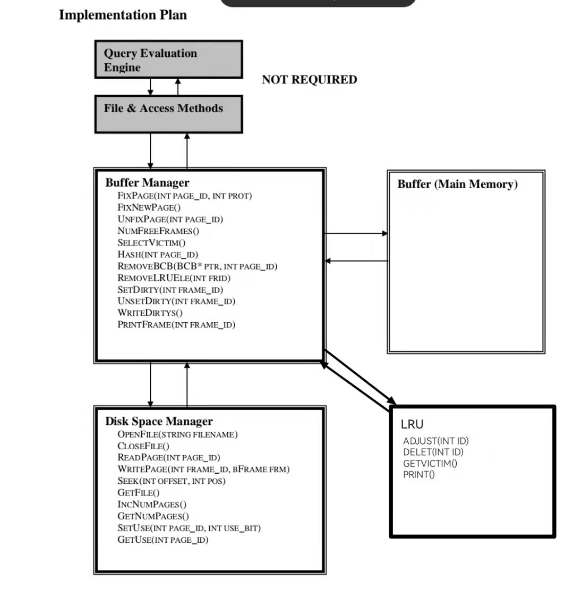
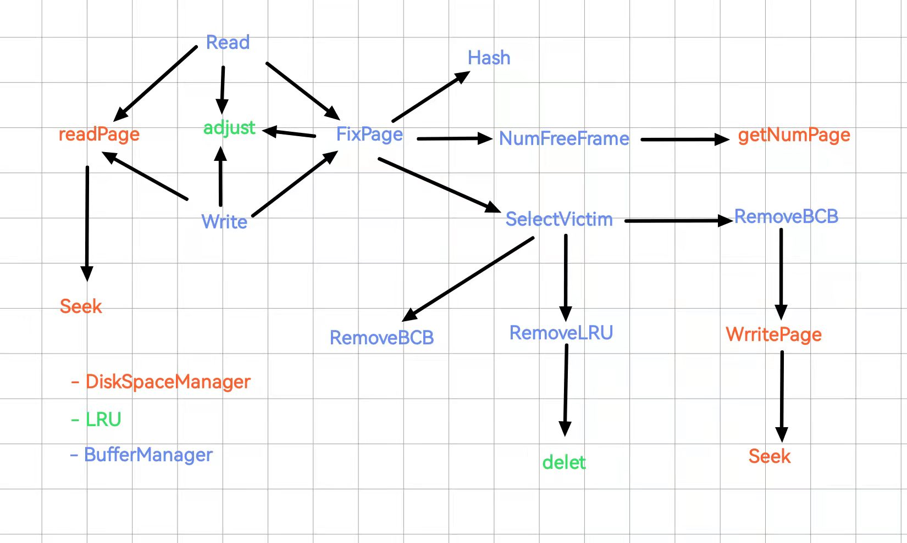
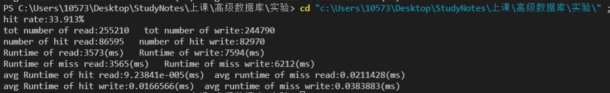
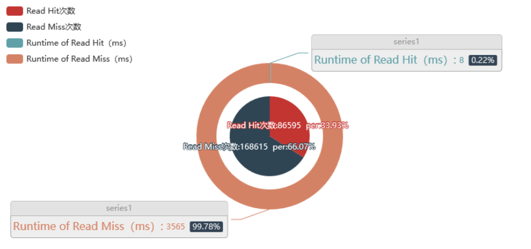
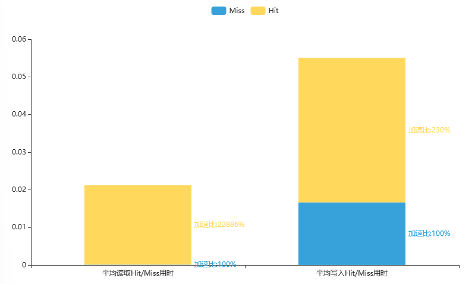

# 存储以及缓存管理器 实验报告

本实验主要涉及:
>+ Buffer以及Frame(内存页)大小设置
>+ Buffer以及Frame存储结构
>+ 页格式
>+ 页存储结构
>+ 文件格式
>+ 缓存技术
>+ 哈希技术
>+ 文件存储结构
>+ 磁盘的接口功能以及缓存模块

## <a name=''></a>目录
<!-- vscode-markdown-toc -->
* [目录](#)
* [一、模块设计](#-1)
	* [1.1 Buffer以及Frame存储结构](#BufferFrame)
		* [Buffer以及Frame大小设置](#BufferFrame-1)
		* [代码实现](#-1)
	* [1.2 页格式](#-1)
	* [1.3 文件格式](#-1)
	* [1.4 缓存管理技术](#-1)
	* [LRU(最近最少使用)](#LRU)
		* [代码实现](#-1)
	* [1.5 哈希技术](#-1)
		* [代码实现](#-1)
	* [1.6 文件存储](#-1)
* [二、类设计](#-1)
	* [2.1 数据存储管理器(Data Storage Manager)](#DataStorageManager)
	* [2.2 缓存管理器(Buffer Manager)](#BufferManager)
	* [2.3 类依赖图以及函数调用关系](#-1)
		* [2.3.1 类依赖图](#-1)
		* [2.3.2 函数调用关系](#-1)
* [三、性能对比](#-1)
	* [3.1 部分结果输出](#-1)
	* [3.2 测试数据分布](#-1)
	* [3.3 命中与非命中耗时分析](#-1)

<!-- vscode-markdown-toc-config
	numbering=false
	autoSave=false
	/vscode-markdown-toc-config -->
<!-- /vscode-markdown-toc -->
<right>
<label><b>姓名:管胡昊 </b></label>

<label><b>学号:S21011162 </b></label>

<label><b>班级:电子信息2班</b></label>
</right>


<div STYLE="page-break-after: always;"></div>


## <a name='-1'></a>一、模块设计
### <a name='BufferFrame'></a>1.1 Buffer以及Frame存储结构
#### <a name='BufferFrame-1'></a>Buffer以及Frame大小设置
Buffer一般指主存空间(内存),是CPU能直接访问的内容,Buffer可以视为frame组成的一维数组,当某页被需求时,将其加载到内存中,主流数据库中内存页(frame)与硬盘页(page)保证相同大小(防止碎片化),本项目中同样采用相同的策略,并且**我们规定内存大小为1024**
#### <a name='-1'></a>代码实现
对于一个Frame,我们可以定义为一串连续的内存空间用于进行数据的存储,其代码表示如下:
```c++
#define FRAMESIZE 4096
struct bFrame 
{
    char field [FRAMESIZE];
};
```
由于Buffer由若干Frame组成,因此我们类似的可以定义:
```c++
#define DEFBUFSIZE 1024
bFrame buf[DEFBUFSIZE]; // or the size that the user defined by the input parameter
```
上述为Buffer的物理表示,其可以被Buffer manager/文件系统或其他方式访问,提供所需页(page)

### <a name='-1'></a>1.2 页格式
本次实验对于页属性仅保留$page\_id$以及$page\_size$,因此忽略页格式的影响

### <a name='-1'></a>1.3 文件格式
本次实验建议使用基于目录的方式建立数据库文件,每个文件由一个索引页(目录)用于**顺序**储存所有其他页的指针,对应的数据页不储存任何文件指针,仅保留数据,额外要求,对于索引页的访问**必须是顺序**的
使用基于目录的方式主要出于可以快速获得对应的页,而不用对一长串的页进行遍历(即只需要对目录页扫一遍就能找到了,但是如果使用链表的方式,则需要对中间所有页进行一次遍历)
本次实验中,由于**直接在操作系统提供的文件系统上建立数据库文件**,因此对于索引我们可以直接使用偏移来进行计算,在上述基础设定下,我们进一步节约了索引页的读取,默认数据库文件为一系列连续的磁盘空间,因此我们只需要对文件指针进行对应的偏移操作就能保证访问任意指定的页.

### <a name='-1'></a>1.4 缓存管理技术
### <a name='LRU'></a>LRU(最近最少使用) 
我们使用LRU作为实验涉及的仅有的替换策略,LRU每次总是找到最近最久未使用的元素进行替换,即对于LRU队列中按最后一次访问时间排序(升序,队首弹出,队尾压入)  
使用LRU的原因处于这样一个假设,最近被使用的元素,在近期更有可能被访问,即时间局部性,并且其运行时间稳定.
这里我们使用静态链表的方式来模拟LRU,静态链表即使用数组模拟链表操作,具有以下优点:
>+ 避免了使用链表时带来的动态内存分配开销(malloc)
>+ 避免了因动态申请内存导致的野指针或内存溢出风险
>+ 在一定程度上支持随机访问,即可以直接获取对应id的节点,而不需要通过对链表结构进行遍历才能得到对应结果

#### <a name='-1'></a>代码实现
```c++
class LRU_List{
public:
    int nxt[DEFBUFSIZE+2],pre[DEFBUFSIZE+2];    //静态数组模拟指针操作
    int head,tail;          //分别表示头指针,尾指针
    LRU_List();             //初始化构造函数
    void adjust(int id);    //将指定id节点放到队尾
    void delet(int id);     //将指定节点从LRU中删除(实际上实现中是将其移动到队首,等待下次使用)
    int getVictim();        //返回第一个可以删除的节点id,即头指针head指向的下一个元素
    void print();           //调试用输出
};
```
我们使用nxt,pre数组来记录节点的前驱以及后继节点id,原本需要使用一个val来储存对应节点的信息,但是考虑到我们这里仅需要记录其id,因此这一维我们省略.
同时我们设置头节点head的id为0,尾节点tail的id为DEBUFSIZE+1,这一步我们在类的初始化函数中完成,并且在初始化函数中我们构造一个形似$0\to 1\to 2\to ...\to tail$的初始链表,这样后续就不涉及LRU的扩充.
对于BufferManager主要调用getVictim来选出下一个可以替换的frame_id,然后等新的page加载到该frame之后调用adjust,将该页放到队尾,参与LRU循环.


### <a name='-1'></a>1.5 哈希技术
对于在内存中的页,使用一个buffer control block(BCB)来进行管理,一个BCB包括下面的信息:
>+ page_id:标记对应物理页id,并且用于hash到对应的桶中进行管理
>+ frame_id:标记对应内存页id,
>+ page_latch:锁
>+ fix_count:用于表示当前有多少个线程正在读它,作用相当于pin-count,当其值为0时才可以被释放
>+ dirty_bit:脏标记用于判断是否需要写回

本次实验使用简单静态哈希,对于静态hash桶的容量时固定的,当满的时候使用溢出块(链表)来储存多余的数据,**对于单个桶的访问也是顺序的**,对于静态hash函数的选择可以参考下面的方式:
```c++
H(k)=(page_id)%buffer_size
```
#### <a name='-1'></a>代码实现
对于BCB我们可以考虑使用下面的结构体来表示:
```c++
struct BCB
{
    BCB();          //构造函数
    int page_id;    //物理页id
    int frame_id;   //内存页id
    int latch;      //是否加锁
    int count;      //是否占用
    int dirty;      //是否写回
    BCB * next;     //链表形式
};
```
对于hash映射函数,我们使用下面的代码来完成对应功能:
```c++
int BMgr::Hash(int page_id){
    return page_id%DEFBUFSIZE;
}
```
其作为BufferManage成员函数供其调用,主要算法流程如下:
>+ 1. 一个新的页需要被读取
>+ 2. 调用hash算出其应该放置在哪个BCB链表中
>+ 3. 在对应BCB中查找是否存在对应的页?如果存在跳转到4,否则跳转到5
>+ 4. 如果存在返回对应frame_id,结束
>+ 5. 如果不存在,则将某一页置换为新的需要读的页,其中涉及到对应BCB的删除,以及新BCB的追加,这些步骤都需要再调用以此hash来进行计算

### <a name='-1'></a>1.6 文件存储
本次实验中我们所有数据以及目录结构都存在一个文件中,并且我们对于该文件命名为**data.dbf**,该文件由50000个页组成,每个页大小为4kb,因此总共约200MB的大小.
对于页的索引,由于我们建立在文件系统上,因此可以视为一串连续的磁盘空间,因此只需要使用偏移即可完成对对应页的读取

## <a name='-1'></a>二、类设计
### <a name='DataStorageManager'></a>2.1 数据存储管理器(Data Storage Manager)
```c++
class DSMgr
{
public:
    DSMgr();    //构造函数
    int OpenFile(string filename);  //打开指定数据文件,返回错误码
    int CloseFile();                //在关闭数据库时调用
    bFrame ReadPage(int page_id);   //从磁盘中读取某页到内存中,被FixPage调用,使用fseek,以及fread获取指定内容
    int WritePage(int frame_id, bFrame frm);    //将内存中某页写回到磁盘,在任意写回时刻被调用,返回值表示写了多少字节,使用fssek以及fwrite进行定向书写
    int Seek(int offset, int pos);  //将文件指针移动到指定位置
    FILE * GetFile();               //返回当前文件指针
    void IncNumPages();             //计数当前使用Page页+1
    int GetNumPages();              //获得当前内存中页数目
    void SetUse(int index, int use_bit);    //使用位图来表示当前页是否被占用,
    int GetUse(int index);                  //获取位图
private:
    FILE *currFile;                         //文件指针用于表示当前文件
    int numPages;                           //当前使用页数目
    int pages[MAXPAGES];                    //物理页
};
```

### <a name='BufferManager'></a>2.2 缓存管理器(Buffer Manager)
```c++
class BMgr
{
public:
    BMgr();     //构造函数
    // Interface functions
    int FixPage(int page_id, int prot); //查找给定page_id是否存在内存中,如果不在则选择某页替换,并返回对应frame_id
    Newpage FixNewPage();                   //申请一个空页,因此需要分别提供空闲的frame以及page,因此将<frame_id,page_id>作为返回值
    int UnfixPage(int page_id);         //接触对应page_id的一次占用,当对应占用为0时可以将其进行替换或者其他操作
    int NumFreeFrames();                //返回当前内存中还空闲的页个数
    // Internal Functions
    int SelectVictim();                 //返回一个可以替换的页
    int Hash(int page_id);              //实现将page_id到frame_id的映射
    void RemoveBCB(BCB * ptr, int page_id); //将page_id对应的BCB删除
    void RemoveLRUEle(int frid);            //在LRU列表中移除对应frid
    void SetDirty(int frame_id);            //将对应frame_id脏标记置1,1表示需写回,0表示不用写回
    void UnsetDirty(int frame_id);          //将对应frame_id脏标记置0
    void WriteDirtys();                     //当系统结束运行时,对于脏标记为1的frame需要调用,保证数据一致性
    PrintFrame(int frame_id);               //打印对应帧消息,用于调试(?)
private:
    // Hash Table
    int ftop[DEFBUFSIZE];                   //frame到page的hash映射
    BCB* ptof[DEFBUFSIZE];                  //page到frame的映射
};
```
### <a name='-1'></a>2.3 类依赖图以及函数调用关系
#### <a name='-1'></a>2.3.1 类依赖图

#### <a name='-1'></a>2.3.2 函数调用关系

上述调用关系图中,红色字体表示DiskSpaceManager的成员函数,绿色字体表示LRU的成员函数,剩下的蓝色字体表示BufferManager的成员函数,对于程序我们分别实例化对应的对象,类与类之间通过该实例化对象实现接口的互相调用.

## <a name='-1'></a>三、性能对比
### <a name='-1'></a>3.1 部分结果输出

上述运行结果主要展示了下面几个我们关注的性能指标:
>+ Hit Rate: 表示命中率,即收到一个请求时,请求页恰好存在主存中不需要额外读取的概率
>+ Tot Number of Read/Write : 表示请求中读取/写入请求的总次数
>+ Number of Hit Read/Write : 表示命中的读取/写入次数
>+ Runtime of Read/Write : 表示读取/写入对应的总运行时间
>+ Runtime of Miss Read/Write : 表示当miss时读取/写入对应的运行时间总和
>+ Avg Runtime of Hit Read/Write : 表示命中时平均的读取/写入所需时间
>+  Avg Runtime of Miss Read/Write : 表示miss时平均的读取写入时间

根据我们初步的实验结果我们可以发现,使用大小为1024的buffer,我们使用LRU策略可以将命中率提高到30%,如果不采用LRU策略我们可以简单的得到,采用随机缓存的策略在使用相同buffer空间的情况下命中率可能仅有$\frac{1024}{50000}\approx 2\%$

### <a name='-1'></a>3.2 测试数据分布

我们对所有对磁盘的查询操作记录其对应的次数,并将其以热力图的形式进行展示,很明显的我们看到数据具有明显的分布趋势,特别是对于0-250区间的磁盘页,其相关的询问请求几乎到达了所有询问的$\frac{1}{3}$这也从另一方面成为了LRU算法得到的近似$30\%$的命中率的保障

### <a name='-1'></a>3.3 命中与非命中耗时分析
对于读取操作以及写入操作,大致上命中概率持平,均在$30\%$左右,但是实际上运行时间差距很大,对于整体来说对于读入操作,如果命中基本上可以不需要花费额外的时间代价,即使对于写入操作在命中率30%的情况下,其运行时间占比也仅为15%,具体结果可以参看下面的饼图:

<center> Read操作运行时间Hit/Miss一览表</center>


<center> Writed操作运行时间Hit/Miss一览表</center>

为了进一步看出区别,我们特别的将加速比以柱状图的形式表现出来,如下表:

我们可以看出对于读取操作Miss/Hit的加速比甚至达到了200倍,对于写入操作,由于都至少完成一次写入操作因此没有读取那么明显,但是很显然其加速比也达到了2倍多的水平,进一步说明了合理的Buffer设置可以极大的提升系统性能