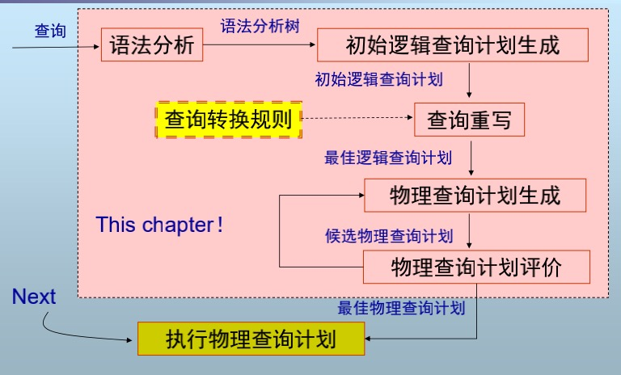
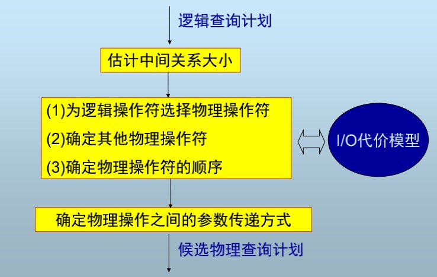
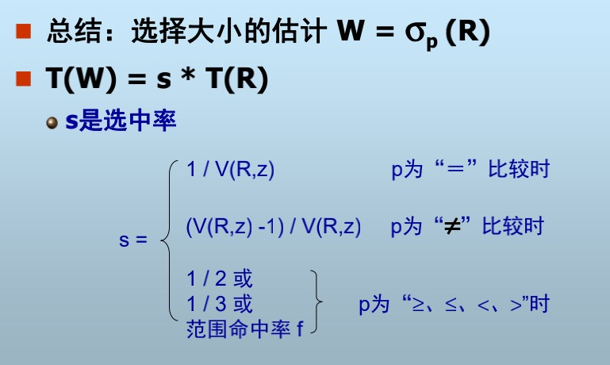

## 查询优化
### 查询处理概述

>+ 1. 根据给定SQL查询进行语法分析生成语法分析树
>+ 2. 生成语法分析树后进行语法检查,查看是否存在非法查询(如查一个不存在的空表),并进行初始逻辑查询计划生成
>+ 3. 对于初始逻辑查询计划,根据查询转化规则进行查询重写(在数学上进行登记啊的转化),生成最佳逻辑查询计划
>+ 4. 根据最佳逻辑查询计划,生成物理查询计划
>+ 5. 对于所有可能的物理查询计划进行评估,选出最佳物理查询计划
>+ 6. 执行物理查询计划

####  本章内容:
>+ 语法分析(Parsing)
>+ 逻辑查询计划生成(Logical Query Plan)
>+ **查询重写(Query Rewrite)**
>+ **查询计划代价估计(Cost Estimation)**
>+ **物理查询计划选择(Physical Query Plan)**

PS:加粗表示本章重点

### 一、语法分析
主要用于构造语分析树,根据SQL查询语句,生成类似编译原理的抽象语法书(AST),不是重点两张PPT直接跳了

### 二、初始逻辑查询计划生成
#### 1.关系代数回顾
|操作符|含义|
|---|---|
|$\cup$|并|
|$\cap$|交|
|$\sigma$|选择|
|$\prod$|投影|
|$-$|差|
|$\bowtie$|自然连接(笛卡尔积)|
|$\bowtie_{A\theta B}$|Theta连接(当$\theta$ 为=时为等值连接)|
#### 2.关系代数与SQL
关系代数是SQL的**代数表达**
关系代数表达式可以与某个SQL进行对应
**NOTE:**
>+ 关系代数**基于集合**(SET)运算
>+ SQL**基于包**(BAG)运算(包可以理解为无序的多重集合)
>+ 集合:无重复元素,包:允许重复元素

### 三、查询重写
目的：将初始逻辑查询计划转换为优化的逻辑查询计划(Maybe)
基于代数转化规则
#### 2、转换规则
运用转换规则，将一个代数表达式转换为另一个等价的代数表达式
涉及到自然连接、并、交、笛卡尔积的交换以及结合率
如下:
>+ $R\times S = S\times R;(R\times S)\times T = R\times(S\times T)$
>+ $R\bowtie S = S\bowtie R;(R\bowtie S)\bowtie T = R\bowtie(S\bowtie T)$
>+ $R\cup S = S\cup R;(R\cup S)\cup T = R\cup(S\cup T)$
>+ $R\cap S = S\cap R;(R\cap S)\cap T = R\cap(S\cap T)$

对于选择操作:
>+ $\sigma_{C1\land C2}(R)=\sigma_{C1}(\sigma_{C2}(R))$
>+ $\sigma_{C1\land C2}(R)=(\sigma_{C1}(R))\cup_S (\sigma_{C2}(R))$

对于选择+自然连接操作:
>+ $\sigma_p(R\bowtie S)=[\sigma_p(R)]\bowtie S$
>+ $\sigma_p(R\bowtie S)=R\bowtie [\sigma_p(S)]$
>+ PS:下推选择,减少元组

基于上述原则我们可以得到进一步的一些规则:
>+ $\sigma_{p\land q}(R\bowtie S) = [\sigma_p(R)]\bowtie[\sigma_q(S)]$
>+ $\sigma_{p\land q\land m}(R\bowtie S) = \sigma_m[[\sigma_p(R)]\bowtie[\sigma_q(S)]]$
>+ $\sigma_{p\land q}(R\bowtie S) = [\sigma_p(R)\bowtie S]\bowtie[R\bowtie \sigma_q(S)]$

对于投影+自然连接
>+ $\pi_{xy}(R\bowtie S)= \pi_{xy}\{[\pi_{xz}(R)]\bowtie[\pi_{yz}(S)]\}$

#### 3. 转换规则的几点思考
转换的最终目的:减少查询的开销(I/O次数) 
转换的直接目的:
>+ 1.减少查询执行时的中间关系大小（元组数）
>+ 2.减少元组的大小

### 四、查询代价估计

#### 1.需要使用的统计量
>+ T(R) : R的元组数 
>+ S(R) : R中每个元组的大小(bytes) 
>+ V(R, A) : R的属性A上的不同值数 
>+ B(R)：容纳R所有元组所需的块数

对于笛卡尔积$W=R1\times R2$
>+ $T(W)=T(R1)*T(R2)$
>+ $S(W)=S(R1)+S(R2)$

##### 对于选择操作

对于等值选择操作$W=\sigma_{A=a}(R)$
>+ $S(W)=S(R)$
>+ $T(W)=?$ ,不好估计,但如果假设值在$V(R,z)$上均匀分布则有:$T(W)=\frac{T(R)}{V(R,z)}$

对于区间选择$W=\sigma_{z>val}(R)$
>+ 一种估计:$T(W)=T(R)/2$
>+ 另一种估计:$T(W)=T(R)/3$
>+ 假设值在$V(R,z)$上均匀分布则有:$f=\frac{选择区间元素}{所有元素种数},T(W)=f\times T(R)$

对于不等值查询:
>+ $T(W)=T(R)-\frac{T(R)}{V(R,z)}$

对于选择操作大小估计可以总结为:

##### 对于等值连接:
假设:
>+ $V(R1,A)\leq V(R2,A)\Rightarrow R1.A的值都在R2中,否则反之$

对于$T(W)$的估计
>+ 对于R1中的一个元组,在R2中平均有$\frac{T(R2)}{V(R2,A)}$个元祖与之匹配因此可得
$$
T(W)=\frac{T(R2)}{V(R2,A)}\times T(R1)
$$
更一般的结论是:
$$
T(W)=\frac{T(R2)\times T(R1)}{max\{V(R1,A),V(R2,A)\}}
$$

对于$S(W)$的估计:
>+ $S(W)=S(R1)+S(R2)-S(A)$
>+ 可以理解为需要将重复的那一列删除,此处不妨假设主参考键为A

对于$V(W,*)$的估计:
假设R1(A,B,C),R2(A,D),A为主参考键:
>+ $V(W,B)=V(R1,B)$
>+ $V(W,C)=V(R1,C)$
>+ $V(W,D)=V(R1,D)$
>+ $V(W,A)=min\{V(R1,V(R2,A))\}$

对于估计本身需要添加一个系数,因为不一定所有的键值都有对应元组使用,但此处该系数定为1,因为反正定多少都不准确,不如直接选择一个上界来进行估计

##### 对于自然连接$\bowtie$
containment of value sets假设:
>+ 如果$V(R1,A) ≤ V(R2,A) \Rightarrow R1.A上的值都在R2中$
>+ 如果$V(R2,A) ≤ V(R1,A)\Rightarrow R2.A上的值都在R1中$

基于上述假设我们可以得到进行自然连接之后对应的估计(不妨设$V(R1,A) ≤ V(R2,A)$):
$$
T(W) = \frac{T(R2)}{V(R2,A)}\times T(R1)
$$
对其解释可以理解为每一个R1的元组平均有$\frac{T(R2)}{V(R2,A)}$个元组与之对应

对于V的估计可以总结为: 非主键不变,主键谁小取谁,例子如下

对于$W＝R1(A,B,C) \bowtie R2(A,D) $
我们可以假设： 
>+ $V(W,B)＝V(R1,B) $
>+ $V(W,C)＝V(R1,C) $
>+ $V(W,D)＝V(R2,D) $
>+ $V(W,A) ＝ min\{V(R1,A),V(R2,A)\}$

#### 2.I/O代价估计
估计目标:执行查询计划所必须读（写）的磁盘块数目
需要的参数:
>+ B(R)：R所需的块数 
>+ f(R)：每块可容纳的R的最大元组数 
>+ M：可用的内存块数 
>+ HT(i)：索引i的层数 
>+ LB(i)：索引i的叶结点所需的块数

##### 物理操作符之间的参数传递
**物化方式:**
>+ 操作依次执行，并且每个操作的结果（中间关系）都写到磁盘上供其它操作存取 
>+ 通过磁盘物理进行数据传递 
>+ 节省主存空间

**流水线:**
>+ 多个操作同时执行，一个操作产生的元组直接通过共享内存传递给其它操作 
>+ 节省I/O 
>+ 但占用主存，若缓冲区出现“颠簸”则I/O增加

### 六、 MS SQL Server查询优化
**MS SQL Server查询优化过程**
>+ 语法分析
>+ 查询树生成
>+ 逻辑优化：逻辑查询计划等价转换
>+ 基于代价的物理优化

#### 1.执行计划
MS SQL Server 执行计划包含下面两个主要组件：
>+ 查询计划：只读数据结构，可由任意数量的用户使用。这称为查询计划。
>+ 执行环境：每个正在执行查询的用户都有一个包含其执行专用数据（如参数值）的数据结构。该数据结构称为执行环境。执行环境数据结构可以重新使用。

将查询计划与参数剥离开来,使得对于短时间内的查询可以复用查询计划,而不需要再生成一次查询计划,节约编译SQL语句开销

#### 2.执行计划的缓存/重用
对于SQL语句,先查看缓存中是否存在已编译的执行计划,如果存在则直接返回否则生成新的执行计划

#### 3. 执行计划的老化退出机制
年龄机制:对于缓存中的每个执行计划储存一个编译成本因子以及年龄机制,年龄=成本因子*引用次数,该方法对于brust query可能会导致一直驻留在缓存中
老化机制:定期扫描缓存内的对象列表,每扫描一次就将年龄字段减少一,满足下面条件时释放对象:
>+ 内存管理器需要内存且所有可用内存都正在使用。 
>+ 对象的年龄字段是0。 
>+ 对象在当前没有被连接引用。

#### 4.执行计划的重编译
需要重编译的情况:
>+ 1.对查询所引用的表进行任何结构更改。
>+ 2.通过语句（如 UPDATE STATISTICS）显式生成或者自动生成新的统计信息。
>+ 3.删除执行计划所使用的索引。 
>+ 4.显式调用 sp_recompile。 
>+ 5.对键的大量更改（其他用户对由查询引用的表使用 INSERT 或 DELETE 语句所产生的修改
>+ 6.对于带触发器的表，inserted 或 deleted 表内的行数显著增长。

#### 6.多阶段优化器
>+ Trivial Plan阶段：某些查询只有一个执行计划 （如Insert），优化器只需产生一个计划
>+ Simplification阶段：语法转换 
>+ Statistics Loading阶段：装载代价估计所需的 统计信息 
>+ Cost-Based Optimization阶段：分阶段运用 转换规则生成执行计划，并估计代价 
>>+ 事务处理查询阶段：使用简单转换规则 
>>+ 复杂查询阶段：使用包括连接、分组等的转换规则