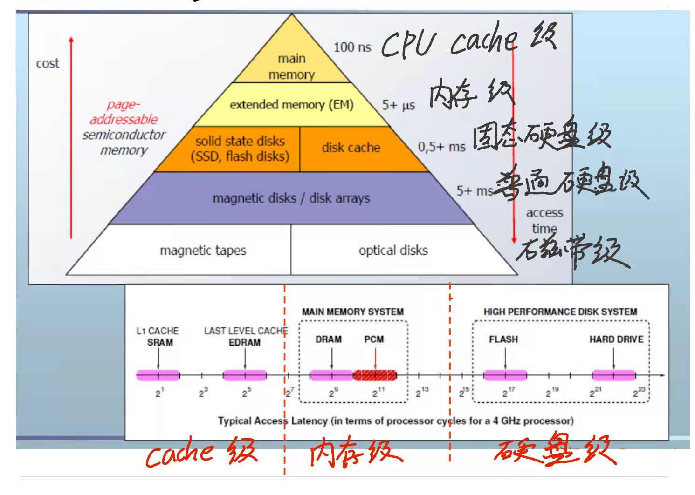
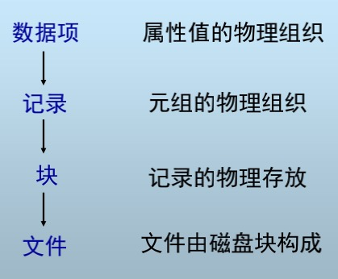
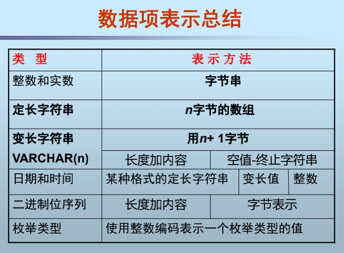
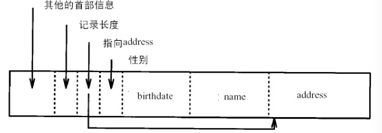
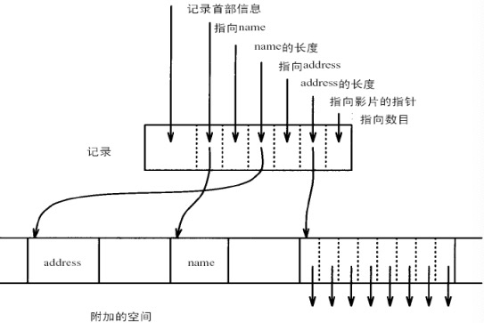
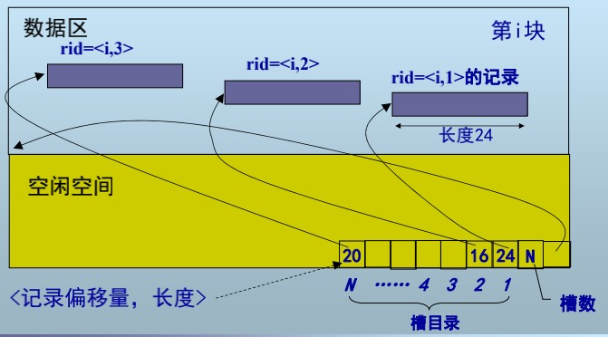
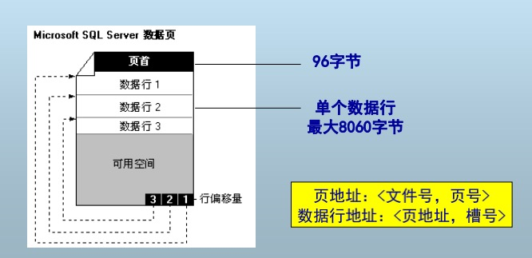
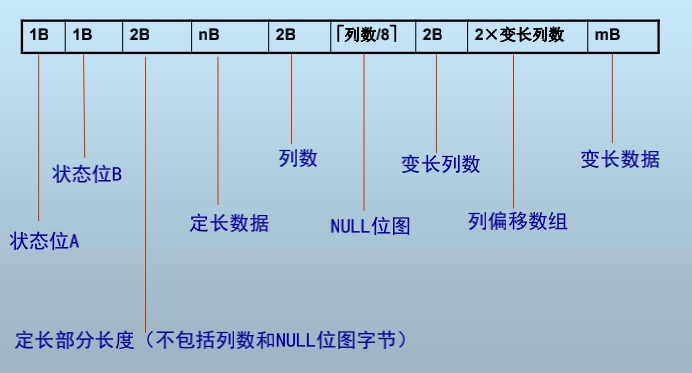

## 第二章 数据存储
### 一、存储器结构

### 二、磁盘结构

**名词解释:**
磁盘由多个**读写磁头(R-W head)** 以及**盘片(platter)** 堆叠而成,每片盘片由若干同心圆状的**磁道(track)** 组成,对于一片盘片上所有的磁道构成该盘片上的**盘面(surface)**(一片盘片可能有正反两个盘面),多个盘片相同半径的磁道堆叠组成**柱面(cyliner)** ,对于一个磁道,我们又划分若干个扇形单元叫做**扇区(sector)** ,并且扇区是**硬件层面上最小的存储单元.**

#### 块(block)
块是操作系统(OS)或者数据库管理系统(DBMS)进行数据存取的最小逻辑单位,通常由若干连续扇区构成.
**PS:扇区是物理层面的最小操作单元,块是软件逻辑层面最小操作单元.**
### 三、磁盘相关时间计算
#### 磁盘块读取时间(读块时间)
通常情况下次读块时间由以下几个部分组成
##### 读块时间=寻道时间S+旋转延迟R+传输时间T+其他延迟
下面是对应组成部分的详细介绍
>##### 寻道时间:磁头定位到对应柱面所花费的时间,与横跨柱面个数正相关
>##### 平均寻道时间(S):假设随机跨柱面的情况下,寻道时间的期望值,一般为10ms-40ms之间
>##### 旋转延迟(R): 定位到对应柱面后,旋转到对应扇区所需时间,通常情况下为旋转1/2周的时间,假设磁盘转速为x RPM,那么对应的平均旋转延迟为$\frac{60}{2x}(ms)$
>##### 传输延迟:定位到对应扇区后,读取扇区内数据所需要的延时(以及转过块间间隙所需要的时间).假设单个磁道可以存储M字节的数据,且每t时间转一周,那么假设我们需要读取m大小的数据,所需要的传输时间为$\frac{mt}{M}$
>##### 其他延迟:1.CPU请求IO时间 2.争用磁盘控制器时间 3.争用总线以及主存时间

PS:对于数据读取时,如果下一块在同一柱面,则寻道时间为0,我们将该情况定义为**顺序IO(Sequential I/O)**,而对于不在一个柱面的情况,通常需要花费大量时间到寻道上,此时读取性能较差,我们将这种情况称之为**随机IO(Random I/O)**,两种读取速度差异可以达到十几倍差距.

#### 磁盘块写入时间(写入时间)
与磁盘块读取类似:
##### 写入时间=寻道时间S+旋转延迟R+传输时间T+其他延迟
另如果需要校验块是否正确写入,则需要加上额外一次旋转延迟以及传输时间

#### 块修改
块修改主要分解为下面流程:
>1.将块读入主存
2.在驻村中完成修改
3.将块重新写入到磁盘

因此我们需要至少一次块读取时间,一次块写入时间,以及主存修改所需要的运算时间.

#### 相关计算式子:
读取单个磁道时间:60000/RPM 单位ms
读取单个块时间:读取单个磁道时间/一个磁道块数-总扇区间隔时间/总扇区数
随机读取某块时间:
>总的计算方式:**T=S+R+Trans**,S为寻道时间,R为旋转延迟,Trans为数据传输时间.
**最差时间**:则S为最大寻道时间,R旋转整个磁道所需要时间
**最优时间**:则S,R均为0
**平均时间**:则S为平均寻道时间,R为旋转1/2个磁道所需要的时间.

### 四、磁盘存取优化
#### 4.1使用缓冲区按柱面组织数据:
使用少量主存作为缓冲区,将随机IO转变为顺序IO
##### 单缓冲:
设P=处理时间,R=读取时间,n=总共块数,单缓冲只能顺序执行,因此总时间花费为n*(P+R)
##### 双缓冲:
P,R,n定义同上,当P>R时双缓冲可以在处理数据的时候,将下一块数据读入内存形成流水线,因此总时间花费为n*P+n,同理当R>P时总时间花费为n*R+P

##### 缓冲的缺点:
主存代价:相对来说使用主存需要增加额外开销,降低系统性能.
缓冲区管理:缓冲区合理调度提高整体性能
一致性维护:如意外掉电时数据还原
#### 4.2 块大小选择
对于OS或者DBMS来说块是其能操作的最小单元,每次智能以块为单位进行存取操作.
选择快变大,相对来说需要的I/O**操作次数会降低**(一次读取更大块能一次处理更多数据),但是可能会出现**读入大量无用操作数据**,同时大块的读写**需求更多的时间**.但目前总的趋势时往大块发展.
#### 4.3 新型存储

目前计算机系统性能依赖于下面两个方面:
>处理器的计算能力(消耗)
存储器往处理器传输数据的能力(供给)

##### 存储墙问题:
>处理单元算力增长较存储器数据供给能力(容量)增长更快.
SRAM/DEAM功耗过高
##### 新型存储器:
闪存,相变存储器,磁阻式存储,电阻式存储器,忆阻器(以上均为非易失)
**优点:** 存储密度高,功耗低,无机械延迟,存取速度快,便携,抗震,低噪
**缺点:** 读写性能不对称(读快写慢或读慢写快),读写次数有限,可靠性不高.

##### 4.3.1 闪存
**工业化实例**:SSD(固态硬盘),组成部分包括闪存芯+控制器+**FTL(?)**
**NAND读写特点:** 读快写慢,写前擦除(不支持单个数据修改),擦除次数有限(三种型号分别支持擦除SLC 10w次,MLC 1W次,TLC 1000次)且支持按页读写以及按块擦除.
**闪存数据库面临的挑战:**读/写/擦除不均衡,数据物理组织结构变化容易影响山村寿命. 代价模型查询优化(针对nand读写特性进行优化),索引评价标准,索引结构(与传统基于机械硬盘的评价标准不同),换入患处代价以及空间分配损耗均衡以及压缩存储.
##### 4.3.2 相变存储器
**工业化实例:**PCM,电阻式非易失性半导体存储器,使用硫组化物材料作为存储介质,使用相变材料在不同结晶状态时显著的电阻差异来进行数据存储(使用物质不同状态时电阻差异来代表0/1)
**相变存储器与flash比较:** 读取延迟较NAND Flash高一点(一倍左右),写入速度远快于NAND Flash快得多(500倍),同时本身读写并不平衡,写块读慢(50倍),没有擦除延迟,而NAND Flash需要2ms,对于擦除次数也比NAND高几个数量级
**相变存储器与DRAM比较:** DRAM读写均衡,但总体来说PCM在读取稍慢的情况下,写入数据速度远超DRAM,不过DRAM无擦除限制

## 第三章 数据表示
### 数据元素表示层次

数据项组成记录,记录组成块,块组成文件.根据具体应用可能会在当前模型件增加或者删除部分抽象映射.
PS:索引就是文件
### 一、数据项的表示
数据项使用字节序列进行表示,表示元组的属性值.
#### SQL数据表示方法
|数据类型|字节大小|特殊说明|
|---|---|---|
|Integer,short|2(16bit)|无|
|Real,Float|4(32bit)|N bit代表小数,M bit代表指数,NM根据dbms自己设置|
|Char(n),Character(n)定长字符串|n|小于n时使用特殊填充符|
|Varchar(n)变长字符串|不确定|实现方式1使用NULL终止符,方式2带长度,方式3定长(读取更快,响应更快)|
|Boolean|1(8bit)|TRUE(11111111),FALSE(00000000)|
|enum(枚举类型)|不一定|整数表示设置整数到枚举值的映射关系|
|Date|10/8/7字符或者Integer|对应的表示方式为'YYYY-MM-DD','YYYYMMDD','YYYYDDD',存某一日期(如1899.12.31)以来经过的天数|
|Time|8字符/Varchar/Integer|对应方式分别为'HH:NN:SS'/‘HH:NN:SS.FF’/00:00:00以来的秒数|
|Bit|带长度的二进制串|无|
#### 小结

### 二、记录的组织
记录是数据项[字段,Fields]的集合
记录可以分为固定格式以及可变格式(氛围定长以及变长)
#### 2.1 对于固定格式定长记录
所有记录具有相同的逻辑结构(模式)
**记录的模式包括:**
>Name of each field(field的名称)
Type of each field(field 的种类)
Order in record (记录的顺序)
Offset of each field in the record(Field 偏移)

**考虑寻址特点**
每个数据开始地址按4的倍数进行对齐(具有更快的读写速度),如果不对齐存储空间可以节省一点,但是对于读写可能带来影响(得做实验来进行验证)
**记录首部**
在记录首部存储描述记录的信息如:
>记录类型(模式信息)
记录长度
时间戳
其他信息

下面是一个记录首部的一个实例:

#### 2.2 可变格式记录
每个记录的格式不同,**记录的格式存储于记录中**,通过标志字段进行读写

**Key-Value**
记录以“KEY+VALUE”方式进行表示,KEY,VALUE都以字节流的方式进行存储
Key-Value特点:
>数据类型没有限制
应用与数据库之间不需要转换数据格式
不提供KEY和VALUE的内容和结构数据
应用必须知道所用VALUE的含义.

**可变格式记录优点**
>灵活的记录格式,适合松散记录
适合处理重复字段
适合记录格式演变

**可变格式缺点**
>标记存储方式空间代价高(需要大框额外KV存储记录信息)
KV方式难以支持复杂查询
应用负担重且事务处理实现困难.

**首部指针法(变长记录表示法)**
定长字段在前,变长字段在后,如下例(name、address变长):

**混合格式:定长记录+变长记录**

### 三、记录在块中的组织
目前**数据库设计中遵循下面两个假设**:
>+ 块的大小固定
>+ 记录数据组织成单个文件(**不允许跨片存储**)

#### 3.1定长记录的块内组织方式
定长记录有两种块内组织:
>前置设定:记录地址rid通常使用<块号,槽号>表示,下面我们针对同一个块中的操作

**方式一:** 使用额外的一个空间记录当前记录数N,对于插入操作插入到第N+1的槽中即可,同时将N->N+1,但是对于删除不友好
**方式二:** 记录当前记录数m的情况下,使用额外N的空间记录槽是否可用(例如0可用,1不可用),支持删除操作,但是针对插入需要先遍历一遍,有额外时间开销.(但是性能差不了多少(老师随口说的))

左边为方式一,右边为方式二
#### 3.2 变长记录的块内组织形式
需要增加元数据来描述数据<记录偏移量,长度>
>+ 记录偏移量:该数据第一项占用的地址
>+ 长度:该数据的长度

对于槽目录(有时也称偏移量表)同时记录记录的偏移量,以及长度

#### 3.3不重要概念理解即可(by 老师)
记录分隔:
定长记录:不需要分割
使用特殊标记(对于变长记录)
使用块内偏移(类似槽目录)进行分隔

跨块 vs 不跨块
不跨块:记录必须在一个块内存储,缺点会产生大量碎片,但是会提高读取速度(每次一定读一块),且强制要求记录长度不得超过块长度
跨块:记录可以跨块存储,可以减少磁盘碎片的产生,但是读取速度会收到影响,且影响无法确定上界,对于极端情况空间甚至是增加的(因为需要额外辅助空间记录跨块索引)

聚簇(不同关系)
前提:一块中可以存储不同类型的记录
好处:可以将经常一起访问的记录存储在同一块或者连续块,加快访问速度
坏处:只对于特定的查询有优化,对于其他的查询可能会带来额外的负担,因此我们需要针对使用场景来对查询进行假设

另一种聚簇(单关系上的聚簇)
将记录安某字段顺序排列在块中(一般按主键进行聚簇,一般使用b+树)
好处:1.加快查询效率 2.有利于归并链接
坏处:对于特定字段有序,那通常对其他字段无序

实际上的按序存储
用指针连接,而不是真实的物理连续,对于块内通常使用槽目录来进行标识,而不是实际移动数据适得其反在物理上连续

记录的分裂:
适合于变长记录的混合格式表示(如记录大文件,影片,图片等)
将定长部分存储于某块中,将变长部分储存于另一块中,与跨块存储类似

记录的地址:
一般不使用物理地址,而是使用逻辑地址
而逻辑地址到物理地址通常使用映射表进行映射(
优点:删除/移动只需要改变映射    
缺点:但需要额外的空间代价

借助文件系统的逻辑地址:
文件号+逻辑块地址+块内偏移
借助文件系统获得一个逻辑上连续的空间

### 四、记录的修改
插入:
无序:较简单,直接插入到空闲的任意块中,或者申请一个新块(所有酷块都满了),同时使用偏移量表来记录
有序:找到应该放置的对应位置,如果能放则直接放并调整记录顺序即可,常用的方法有两种
1.周围块中找空间
2.使用溢出表,直接插入溢出表中,当溢出表慢时进行调整

删除:
1.马上回收,加到可用空间列表中
2.如果删除记录位于溢出块中,删除记录后可重新对链进行组织去除溢出块
使用删除标记:
>使用删除标记(常用),使用偏移表时,可以直接修改偏移表项指针将其置空
如果使用逻辑-物理地址映射表可以将物理地址置空
可以在记录首部预留标志位

### 五、块在文件中的组织
**堆文件**
最基本、简单的文件结构
记录不以任何顺序排列
记录可能存放在物理不邻接的块上
插入容易,但查找、删除代价高
#### 5.1 链表式对文件组织
没听QAQ

#### 5.2 目录式对文件组织
实验要求目录式文件结构,不要求B+树
其他的也没听到QAQ

### 六、SQL Server的数据存储结构
SQL Server的数据库文件是多个对象的集合,包括多个表、索引(**基于文件系统**)
基于文件系统好处:方便
坏处:经过文件系统这一层代理,可能访问顺序与预想的有出入,因此对于大数据库会使用自己控制

#### 1.页
在 SQL Server中,数据存储的基本单位为页,在SQL Server中页大小为8KB

**不允许跨块存储**,因此去除页首后单个数据最多8060字节

#### 2.扩展盘区
扩展盘区是一种基本单元,将空间分配给表和索引,扩展盘区由8个邻接页(64kb)组成,用于存储插入信息
SQL Server中包含两种类型的扩展盘区:
>+ 统一扩展盘区:由单个对象所有,扩展盘区总只能由该盘区所有者的对象使用
>+ 混合扩展盘区:可以由多个对象进行共享

优点:针对多次插入减少空间分配次数(代价)
缺点:可能存在空间浪费的问题

优化方法:开始时分配混合扩展盘区,但当索引增长到8页时,拆分变为统一扩展盘区

#### 3.SQL Server文件组织
SQL Server中有三种类型的文件:
>+ 主要数据文件:为数据库的起点,指向数据库文件的其他部分,每个数据库都有一个主要数据文件其拓展名为.mdf
>+ 次要数据文件:包含除了主要数据文件外所有数据文件,对于某些数据库可能没有次要数据文件,其拓展名为.ndf
>+ 日志文件:

##### 额外空间代价
数据文件的起始结构:
**PFS页(页可用空间):**
记录拓展盘区中哪些页已经分配或者可用,以及剩余多少空间,每个PFS页包含8000页,PFS对每一页都存在一个1B的位图,表示该页记录状态(空/1\~50满/51\~80满/...)

**GAM页(全局分配映射表):**
表示已分配的扩展盘区,每个GAM包含64000的扩展盘区(一个GAM页可以标记4GB的空间),但GAM仅能表示该拓展盘区是否可用(未被占用)

**SGAM页(共享全局分配映射表):**
记录特定的拓展盘区(为混合扩展盘区,且至少有一个页未被使用),每个SGAM能包含64000个盘区,按位表示对应盘区状态,为1则表示为混合扩展盘区且有可用页,否则表示其反面.

**例子(?)**
太快了没记完

##### 表组织
IAM页表示记录了分配给对象的拓展盘区
数据页没有特定顺序,也不互相连接,只通过IAM页进行连接,服务器通过使用IAM页查找数据页,进行表扫描或串行读
当插入新行而当前页没有可用空间时,SQL Server使用IAM页查找分配给对象拓展盘区.对于分配的拓展盘区,SQL Server搜索PFS页,查看是够存在有足够的空间容纳该数据

#### 4.SQL Server记录结构
