## 作业零
## 二叉树求和
**划分:**
域分解:每个节点均包含一个当前节点权值,均为一个域
功能分解:将任务分成三种,叶子节点,中间节点,根节点
**通信:**
使用静态的结构化异步通信
对于叶子节点,完成两次通信,第一次向其父节点发送该叶子节点的值,第二次等待父亲节点传回sum
对于中间节点,完成三次通信,第一次所有接受子节点的和,第二次等待其父节点回传sum,第三次通信发送收到的sum值给所有儿子节点
对于根节点完成两次通信,第一次通信获得所有子节点的和,第二次将计算的sum发送给所有儿子节点
**组合:**
我们将任务分成三种,因此我们对与每个节点均以自己作为一个组合(不划分)
>+ 对于叶子节点在第二次通信时将节点自身值赋为sum
>+ 对于根节点,在第二次通信前计算所有子节点传来的数值的和,并加上本身节点值
>+ 对于中间节点,在第一次通信以及第二次通信前计算所有子节点传来的数值的和,并加上本身节点值

**映射:**
将对应的任务分别发送给叶子节点/中间节点/根节点

## 蝶式求和
**划分:**
域分解:每个计算节点均等价,因此每个计算节点本身就是一个划分
功能分解:每个计算节点均等价,因此每个计算节点功能一致,仅有一个划分
**通信:**
使用动态的非结构化同步通信
使用同步的方式,记录当前节点id为i(从0到n-1),第k轮将节点i给id为$i\oplus2^k(\oplus 表示异或)$的节点发送当前节点sum
**组合:**
由于任务只有一种,因此我们仅需要叙述每个节点对应的步骤:
>+ 首先使用同步的通信方式,所有节点按轮完成其对应的数据传输任务(保证数据一致性)
>+ 对于第k轮将节点i给id为$i\oplus2^k(\oplus 表示异或)$的节点发送当前节点sum
>+ 保证每个节点均接受到该轮传输的对应$sum_{old}$之后,更新本身节点值$sum=sum+sum_{old}$

**映射:**
将上述组合后的任务分发至所有节点即可
## 作业一 
并行编译
**1. 找出以下循环中的存在依赖关系(包括依赖类型)，画出语句依赖图。**
```c++
 for I = 0 to 100 do 
    S: A(I) = C(I)+2; 
    T: B(I) = A(I-1)-A(2*I-5); 
 end for
```
>依赖关系:
$S\delta^f T:\{<S(i),T(j)>|i=j-1;1\leq j\leq 100\}$
$T\delta^a S:\{<S(i),T(j)>|i=2j+5;3\leq j\leq 52\}$

$S\delta^f S:\{<S(i),S(j)>|2*j = 2*i + 4; 2\leq i \leq 9\}$
$S\delta^a S:\{<S(i_1,j_1),S(i_2,j_2)>|i_2 = i_1+1,j_2=j_1+1;2\leq i_1,j_1\leq 9\}$
>
>语句依赖图:
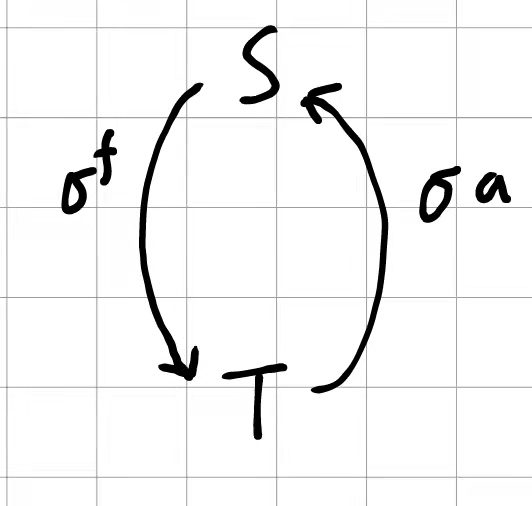</img>

**2. 找出以下循环中的存在依赖关系(包括依赖类型、依赖向量)，画出迭代依赖图(注意：要“窥一斑而知全豹”)。**
```c++
for I = 1 to 100 do 
    for J = 1 to 50 do 
        S: A(I+2,J) = B(2*I,J) - 5; 
        T: B(2*I,J-1) = A(I,J+2) + 4; 
    end for 
end for 
```
 >依赖关系:
 >1. 语句T流依赖于语句S,即$S\delta^fT$,满足依赖关系的偶对为:
 $$\{<S(i_1,j_1),T(i_2,j_2)>|i_2=i_1+2,j_2=j_1-2;1\leq i_1\leq 98,3\leq j_1\leq 100\}$$
 距离向量为(2,-2),此依赖关系由外层循环携带
 >2. 语句T反依赖于语句S.即$S\delta^a T$,满足依赖关系的偶对为:
 $$\{<S(i_1,j_j),T(i_2,j_2)>|i_2=i_1,j_2=j_1+1;1\leq i_1\leq 100,1\leq j_1\leq 49\}$$
 距离向量为(0,1),此依赖关系由内层循环携带
 >
 > 迭代依赖图:
 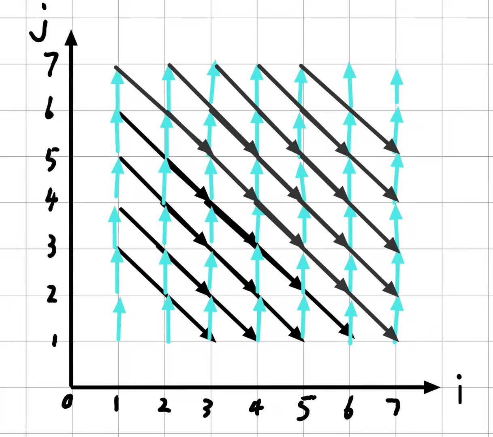</img>

**3. 向量化以下循环。如果不能，请说明原因**。

```c++
(1) for I = 1 to N do 
        S:A(I) = B(I) + C(I+1); 
        T:C(I) = A(I)* D(I); 
    end for 
```
```c++
    S:A(1,N) = B(I:N) + C(2:N+1); 
    T:C(1:N) = A(1:N) * D(1:N); 
```
```c++
(2) for I = 1 to N do 
        S:A(I) = A(I-1) + 1 
    end for 
```
>存在依赖$S\delta^fS$方向向量为(1)因此不能并行化

**4. 分析以下循环中的存在依赖关系(包括依赖类型)，画出迭代依赖图。**
```c++
for I = 1 to 5 do 
    S:B(I) = B(I) / A(I,I); 
    for J = I+1 to 5 do 
        T:B(J) = B(J) – A(I,J) * B(I); 
    end for 
end for 
```
依赖关系:
>+ 语句S反依赖与语句S,即$S\delta^a S$,满足依赖关系的偶对为:
$$
\{S(i_1,j_1),S(i_2,j_2)>|i_2=i_1,j_2=j_1;2\leq i\leq j\leq 5\}
$$
依赖向量为(0,0)
>+ 语句T反依赖与语句T,即$T\delta^a T$,满足依赖关系的偶对为:
$$
\{<T(i_1,j_1),T(i_2,j_2)>|i_2=i_1,j_2=j_1;2\leq i\leq j\leq 5\}
$$
依赖向量为(0,0)
>+ 语句T流依赖与语句S,即$S\delta^f T$,满足依赖关系的偶对为:
$$
\{<S(i_1,j_1),T(i_2,j_2)>|i_2=i_1,j_2=j_2;2\leq i\leq j\leq 5\}
$$
依赖向量为$(0,j_2)$
>+ 语句S输出依赖与语句T,即$T\delta^o S$,满足依赖关系的偶对为:
$$
\{<T(i_1,j_1),S(i_2,j_2)>|i_2=j_1,j_2=0;2\leq i\leq j\leq 5\}
$$
依赖向量为$(j_1-i_1,-j_1)$
>+ 语句S流依赖与语句T,即$T\delta^f S$,满足依赖关系的偶对为:
$$
\{<T(i_1,j_1),S(i_2,j_2)>|i_2=j_1,j_2=0;2\leq i\leq j\leq 5\}
$$
依赖向量为$(j_1-i_1,-j_1)$
迭代依赖图为:
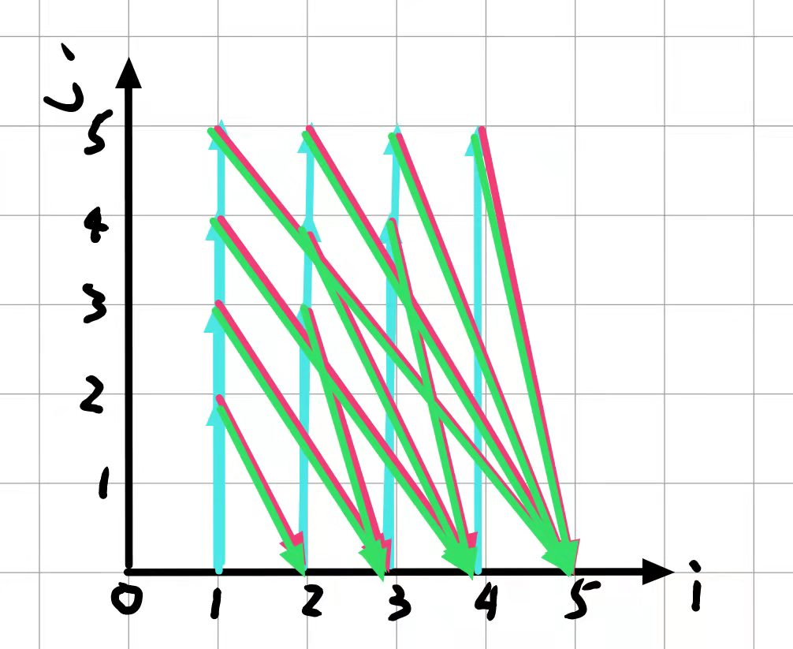

## 作业二
**1．描述以下循环中的存在依赖关系(包括迭代对、依赖类型、依赖向量和距离向量)**
```c++
 for I = 1 to 100 do 
    for J = 1 to 100 do 
        S:A(I,J) = B(I+4,J-2) - B(I-2,J+1) + B(I,J+3); 
        T:B(I,J) = D(I,J-1) - C(I+2,J) 
    endfor 
 endfor 
```
>+ 语句T反依赖于S,即$S\delta^a T$,其满足依赖关系的偶对为:
$$
\{<S(i_1,j_1),T(i_2,j_2)>|i_2=i_1+4,j_2=j_1-2;1\leq i_1\leq 96,2\leq j_1\leq 100\}
$$
依赖向量为(4,-2)
方向向量为(1,-1)
>+ 语句T反依赖于S,即$S\delta^a T$,其满足依赖关系的偶对为:
$$
\{<S(i_1,j_1),T(i_2,j_2)>|i_2=i_1,j_2=j_1+3;1\leq i_1\leq 100,1\leq j_1\leq 97\}
$$
依赖向量为(0,3)
方向向量为(0,1)
>+ 语句S流依赖于T,即$T\delta^f S$,其满足依赖关系的偶对为:
$$
\{<T(i_1,j_1),S(i_2,j_2)>|i_2=i_1+2,j_2=j_1-1;1\leq i_1\leq 98,2\leq j_1\leq 100\}
$$
依赖向量为(2,-1)
方向向量为(1,-1)


**2．分析循环②是否分别与循环③、④和⑤等价？**
 循环②:
```c++
for I = 1 to 100 do
    for J = 4 to 100 do 
        A(I,J) = A(I-1,J+1)
    endfor
endfor
```
循环③:
```c++
for J = 4 to 100 do
    for I = 1 to 100 do
        A(I,J) = A(I-1,J+1)
    endfor
endfor
```
>依赖向量为(1,-1)
$$
(1,-1)\times 
\begin{bmatrix}
0,1\\
1,0\\
\end{bmatrix}=(-1,1)
$$
因此不等价

循环④:
```c++
for I = 1 to 100 do
    doall J = 4 to 100 do 
        A(I,J) = A(I-1,J+1)
    enddoall
endfor
```
>由于存在依赖向量(1,-1),不含(0,1)方向向量,因此可以循环并行化,故等价


循环⑤:
```c++
doall I = 1 to 100 do
    for J = 4 to 100 do 
        A(I,J) = A(I-1,J+1)
    endfor
enddoall
```
>由于存在依赖向量(1,-1),包含含(1,*)方向向量,因此不可以循环并行化,故不等价

**3 （1）给出下面循环中的依赖关系描述和迭代依赖图。**
```c++
for I = 1 to 8 do 
    for J = max(I-3,1) to min(I,5) do 
        S:A(I+1, J+1) = A(I,J) + B(I,J) 
    endfor 
endfor 
```
> 语句S反依赖S,即$S\delta^aS$,其满足依赖关系的偶对为:
$$\{<S(i_1,j_1),S(i_2,j_2)>|i_2=i_1+1,j_2=j_1+1;1\leq i_1\leq 7,1\leq j_1\leq7\}$$
迭代依赖图:
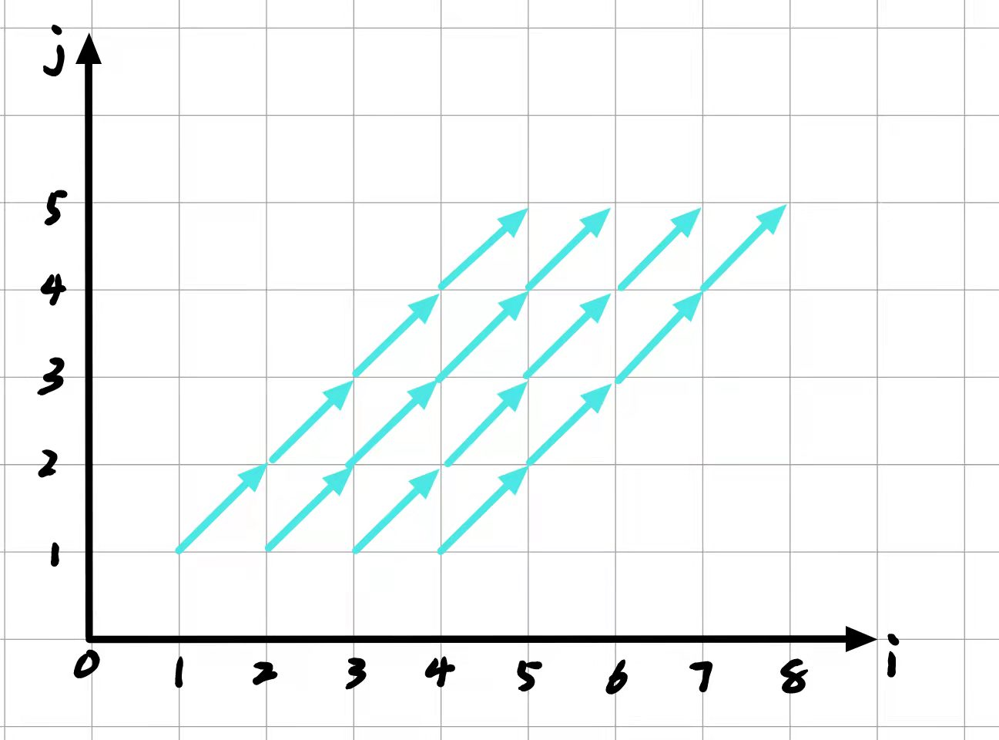

（2）分析下面循环中存在的数据依赖关系。
```c++
for I = 2 to 9 do 
    S: if A(I) > 0 then 
    T:    A(I) = B(I-1) + 1 
    else 
    U:    B(I) = A(I) * 2 
    endif 
endfor 
```
>+ 语句T反依赖于语句S,即$S\delta^a T$,其满足依赖关系的偶对为:
$$\{<S(i),T(j)>|i=j;2\leq i\leq 9\}$$
>+ 语句T流依赖于语句U,即$U \delta^f T$,其满足依赖关系的偶对为:
$$\{<U(i),T(j)>|j=i+1;2\leq i\leq 9\}$$


## 作业三
**一、 分析以下循环中的依赖关系, 并给出相应的迭代依赖图：**
```c++
for i = 2 to 10 do //循环 1 
    for j = 2 to 10
S:      A[i,j] = ( A[i-1,j-1] + A[i+1,j+1] )* 0.5;
    endfor
endfor
```
>+ 语句S反依赖于S,即$S\delta^a S$,满足依赖关系的偶对为:
$$
\{<S(i_1,j_1),S(i_2,j_2)>|i_2=i_1+1,j_2=j_1+1;2\leq i \leq 9,2\leq j\leq 9\}
$$
>+ 语句S流依赖于S,即$S \delta^f S$,满足依赖关系的偶对为:
$$
\{<S(i_1,j_1),S(i_2,j_2)>|i_2=i_1+1,j_2=j_1+1;2\leq i \leq 9,2\leq j\leq 9\}
$$
迭代依赖图为:


```c++
for i = 2 to 20 do // 循环 2
   S: A[2*i+2] = A[2*i-2] + B[i];
endfor
```
>+ 语句S流依赖于S,即$S\delta^f S$,满足依赖关系的偶对为:
$$
\{<S(i),S(j)>|j=i+2;2\leq i\leq20\}
$$
迭代依赖图为:
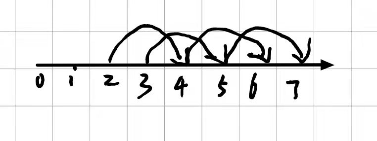

```c++
for i = 2 to 20 do // 循环 3
    if A[i] > 0 then
       S: B[i] = C[i-1] + 1
    else
       T: C[i] = B[i] – 1
    endif
endfor
```
>+ 语句S流依赖于T,即$T\delta^f S$,满足依赖关系的偶对为:
$$
\{<T(i),S(j)>|j=i+1;2\leq i\leq 19\}
$$
迭代依赖图为:
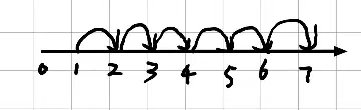

**二、针对以下两个循环**
```c++
for i = 1 to M do //循环 1 M ，N，C 均是常量
    for j = 1 to N
        A[i+1,j+1] = A[i,j] + C;
    endfor
endfor
```
(1) 给出迭代依赖示意图。
>存在流依赖,满足依赖关系的偶对为:
$$
\{<S(i_1,j_1),S(1_2,j_2)>|i_2=i_1+1,j_2=j_1+1;1\leq i_1\leq M-1,1\leq j_1\leq N-1\}
$$
依赖向量为(1,1);
迭代依赖图如下:
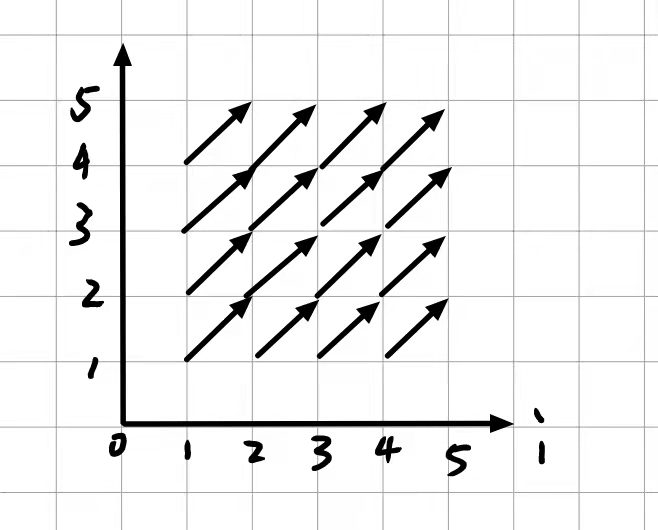
(2) 简述能否逆转外层的 i 循环？能否交换内外循环次序？
经过变换之后依赖向量为(-1,1)正向量因此不可以逆转
$$
(1,1)\times 
\begin{bmatrix}
0,1\\
1,0
\end{bmatrix}=(1,1)
$$
因此可以逆转
```c++
for i = 1 to 100 do // 循环 2 N 是常量
    X[i] = Y[i] + 10; // 语句 S1
    for j = 1 to 100 do
        B[j] = A[j, N]; // 语句 S2
        for k = 1 to 100 do 
            A[j+1, k] = B[j] + C[j, k]; // 语句 S3
        endfor // loop-k
        Y[i+j] = A[j+1, N]; // 语句 S4
    endfor // loop-j
endfor // loop-i
```
>(1) 给出此循环的语句依赖图。
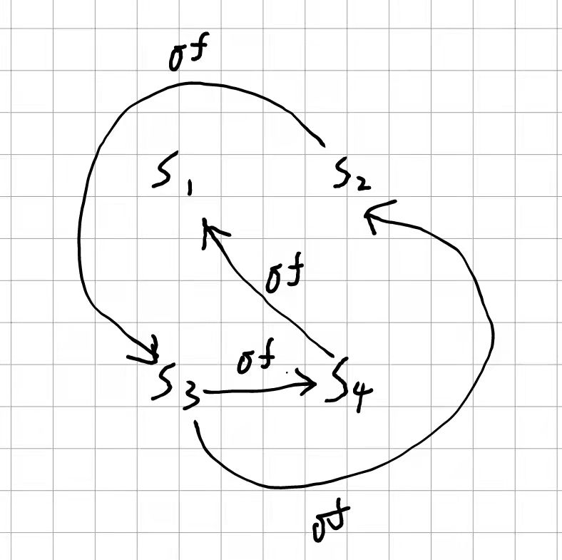
(2) 尝试向量化/并行化此循环。
```c++
for i = 1 to 100 do // 循环 2 N 是常量
    for j = 1 to 100 do
        S2:B[j] = A[j, N]; // 语句 S2
        doall k = 1 to 100 do 
            S3:A[j+1, k] = B[j] + C[j, k]; // 语句 S3
        enddoall // loop-k
        S4:Y[i+j] = A[j+1, N]; // 语句 S4
    endfor // loop-j
endfor // loop-i

doall i = 1 to 100 do
    S1:X[i] = Y[i] + 10; // 语句 S1
enddoall 
```


**三、 针对以下循环/程序：**
```c++
for i = 1 to 100 do //循环 1 
    for j = 1 to 50 do
        A[3*i+2,2*j-1] = A[5*j,i+3] + 2;
    endfor
endfor
```
>（1） 给出满足依赖方向向量(1,1)的迭代依赖对集合的描述。
>>+ 当$i_1< j_2$时满足条件的依赖集合为:
$$
\{<S(i_1,j_1),S(i_2,j_2)>|3i_1+2-5j_2=0,2j_1-1-i_2-3=0;1\leq i_1,i_2\leq 100 ,1\leq j_1,j_2\leq 50\}
$$
>>+ 当$ i_2< j_1$时满足条件的依赖集合为:
$$
\{<S(i_1,j_1),S(i_2,j_2)>|5j_1-3i_2-2=0,i_1+3-2j_2+1=0;1\leq i_1,i_2\leq 100 ,1\leq j_1,j_2\leq 50\}
$$
>
>（2） 找出与迭代（i=11, j=11）相依赖的迭代（m,n）并指出是哪种依赖？
>>当i=11,j=11时
如果为A[3*i+2,2*j-1],则对应的下标为[35,21],因此此时对应的依赖迭代为(18,7),此时迭代(11,11)反依赖于迭代(18,7)
如果为A[5j,i+3]则对应的下标为[55,14]由于55无法表示为3i+2的形式因此无对应依赖迭代
>>
>（3） 能否向量化最内层的 j 循环？如不行，简述理由。
迭代对(6,5)流依赖于(6,4),其方向向量为(0,1)因此无法向量化

```c++
S1: x = y * 2
    for i = 1 to 100 do
S2:     C[i] = B[i] + x
S3:     A[i] = C[i-1] + z
S4:     C[i+1] = A[i] * B[i]
        for j = 1 to 50 do
S5:         D[i,j] = D[i,j-1] + x
        endfor
    endfor
S6: z = y + 4
```
>给出上述程序的语句依赖图。
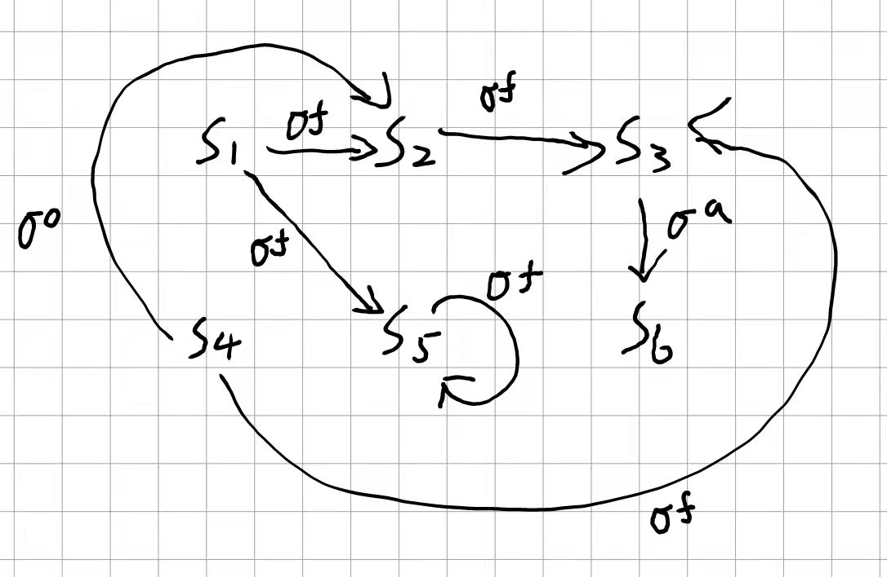

**四、 分析以下循环中的依赖关系，并给出相应的迭代依赖图：**
```c++
for i = 2 to 10 do //循环 1 
    for j = i to 10
        S:A[i,j] = ( A[i,j-1] + A[i-1,j] )* 0.5;
    endfor
endfor
```
>语句S流依赖于语句S:
$$
\{S(i_1,j_1),S(i_2,j_2)|i_2=i_1,j_2=j_1+1;2\leq i_1\leq 9,i_1\leq j \leq 9\}
$$
语句S流依赖于语句S:
$$
\{S(i_1,j_1),S(i_2,j_2)|i_2=i_1+1,j_2=j_1;2\leq i_1\leq 9,i_1\leq j \leq 9\}
$$
迭代关系图为:
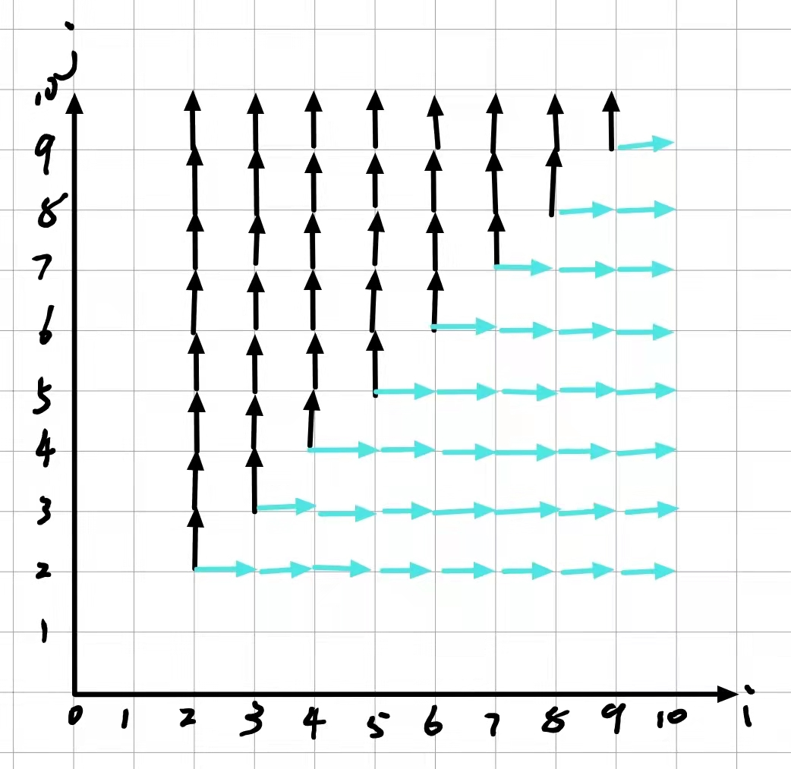
```c++
for i = 1 to 16 do // 循环 2
    S:A[i+3] = A[i] + B[i];
endfor
```
> 语句S流依赖于语句S:
$$
\{S(i),S(j)|j=i+3;2\leq i\leq 13\}
$$
其迭代依赖图为:
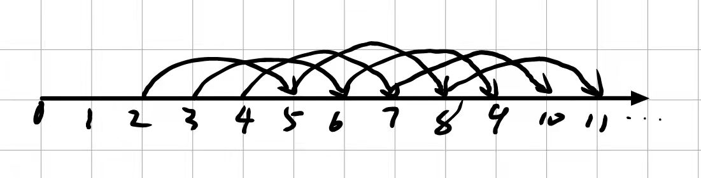
```c++
for k = 1 to 16 step 5 do // 循环 3 ,k 的循环步长为 5
    for i = k to min(16,i+4) do //设 min 为求最小值函数
        S:A[i+3] = A[i] + B[i]
    endfor
endfor
```
> 存在流依赖,其满足依赖关系的偶对为:
$$\{<S(k_1,i_1),S(k_2,i_2)>|k_2=k_1,i_2=i_1+3;1\leq k_1\leq 16,k_1\leq i_1<leq \;min(16,i_1+4)\}$$
其迭代依赖图为:


五、 分析以下 3 个循环中存在的依赖关系；分别通过循环交换、分布和逆转
等多种方法来尝试向量化和/或并行化变换：
```c++
for i = 1 to 100 do //循环 1 
    S:A[i] = A[i] + B[i-1];
    T:B[i] = C[i-1] * 2 ;
    U:C[i] = 1 / B[i] ;
    V:D[i] = C[i] * C[i] ;
endfor
```
> 语句S反依赖于S,即$S\delta^a S$,其满足依赖关系的偶对为:
$$
\{<S(i),S(j)>|j=i;1\leq i\leq 100\}
$$
语句U流依赖于T,即$T\delta^f U$,其满足依赖关系的偶对为:
$$
\{<T(i),U(j)>|j=i;1\leq i\leq 100\}
$$
语句S流依赖于T,即$T\delta^f S$,其满足依赖关系的偶对为:
$$
\{<T(i),S(j)>|j=i+1;1\leq i\leq 99\}
$$
语句V流依赖于U,即$U\delta^f V$,其满足依赖关系的偶对为:
$$
\{<U(i),V(j)>|j=i;1\leq i\leq 100\}
$$
语句T流依赖于U,即$U\delta^f V$,其满足依赖关系的偶对为:
$$
\{<U(i),V(j)>|j=i+1;1\leq i\leq 99\}
$$
并行化后结果为:
```c++
for i = 1 to 100 do //循环 1 并行化结果 
    T:B[i] = C[i-1] * 2 ;
    U:C[i] = 1 / B[i] ;
endfor
S:A[1:100] = A[1:100] + B[0:99];
V:D[1:100] = C[1:100] * C[1:100] ;
```
```c++
for i = 1 to 999 do // 循环 2
    S:A[i] = B[i] + C[i];
    T:D[i] = ( A[i] + A[ 999-i+1 ] ) / 2 ;
endfor
```
>语句T流依赖于语句S,满足依赖关系的偶对为:
$$
\{<S(i),T(j)>|j=i;1\leq i\leq999\}
$$
语句S反依赖于语句T,满足依赖关系的偶对为:
$$
\{<T(i),S(j)>|j=999-i+1;1\leq i\leq 500\}
$$
语句T流依赖于语句S,满足依赖关系的偶对为:
$$
\{<S(i),T(j)>|j=999-i+1;500 \leq i\leq 99\}
$$
其优化后结果为:
```c++ 
S:A[1:500] = B[1:500] + C[1:500];
T:D[1:500] = ( A[1:500] + A[999:500] ) / 2 ;
S:A[501:999] = B[501:999] + C[501:999];
T:D[501:999] = ( A[501:999] + A[500:1] ) / 2 ;
```
---
```c++
for i = 1 to 100 do // 循环 3
    for j = 1 to 100 do
    S:A[3*i+2*j, 2*j] = C[i,j] * 2 ;
    T:D[i,j] = A[i-j+6, i+j] ;
    endfor
endfor
```
> 存在语句T流依赖于语句S
$$
\{<S(i_1,j_1),T(i_2,j_2)>|i_2=3i_1+2j_1+j_2-6,j_2=2j_1-i_2\}
$$
优化后结果为:
```c++
doall i = 1 to 100 do // 循环 3
    doall j = 1 to 100 do
        S:A[3*i+2*j, 2*j] = C[i,j] * 2 ;
    enddoall
enddoall
doall j = 1 to 100 do
     T:D[i,j] = A[i-j+6, i+j] ;
enddoall
```
