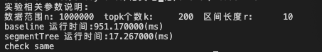

## 参数表:
|参数|解释|
|---|---|
|n|数据流数据范围|
|k|topk的个数|
|r|指定区间长度|

||时间复杂度|空间复杂度|说明|
|---|---|---|---|
|baseline|$O(kn+kr)$|$O(2n)$|做k次,每次扫一遍找出区间后打上标记,为确定性算法,需要额外1倍空间用于标记防止区间重叠|
|baseline优化|$O(\frac{n\log n}{r}+k\log n)$|$O(\frac{n\log n}{r})$|使用线段树维护区间内长度为r的区间,分治递归,时间复杂度第一项是初始化代价,第二项是查询代价|

有个小小的bug,如果最大值相同的两个区间存在交集,可能会有贪心问题

实验结果:
