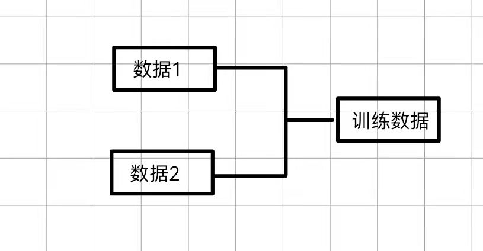
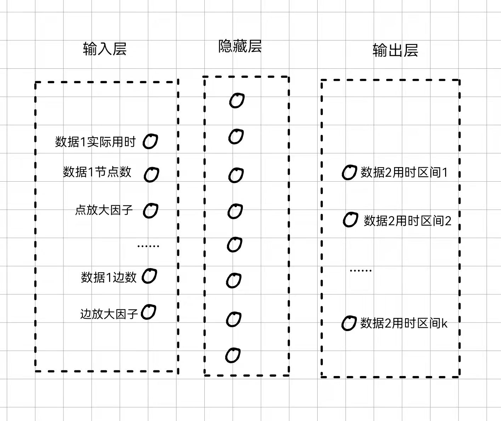
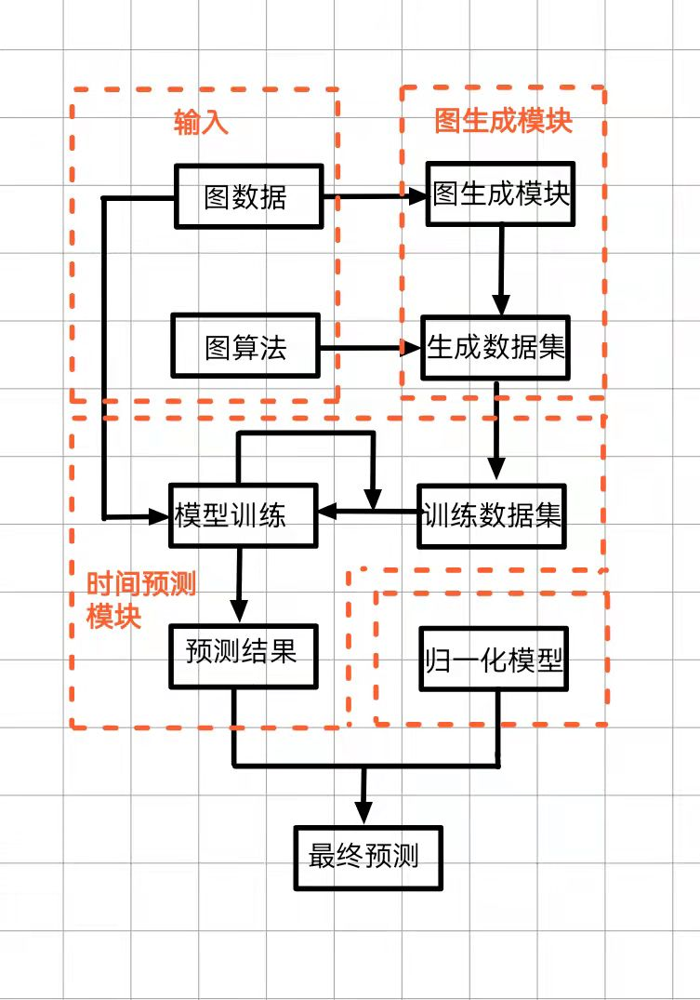

# 基于生成图的普适图算法时间预测
## 概述:

### 研究问题:
问题一:
对于用户提交的任意一个图算法任务可以表示为这样的二元组$<数据，算法>$,我们希望在具体算法执行之前完成一个对于该计算任务运行所需时间的估计，对于该框架我们希望与可以兼容各种算法（提高泛用性），且估计所需用时应当远小于实际算法执行时间（否则该估计没意义，不如直接执行对应算法）。如果有可能我们希望得到一个关于相关影响参数的表达式。对于执行步骤可以主要分为下面几步：
>+ 给定一个$<数据,算法>$作为输入，要求算法将数据作为参数传入，即可以更爱对应接口实现数据的更换
>+ 由原图分别采样子图/生成子图，对于单个图(即输入的图数据)生成大量数据规模较小(但可能跨数量级)的数据,但结构上存在相似的图数据进行训练.
>+ 对于训练好的模型,将原图作为输入对原图计算时间进行预测.
>+ 总结:对于只需要预测一次的任务,我们生成规模更小的数据来预测当数据规模变大时的趋势

问题二:
一个更普遍的问题,我们对于某个算法我们不仅希望得到对于某个输入图的计算时间估计,而希望得到对于各种类型图的期望运行时间,而由于不同类型图结构存在差异,导致实际运行时间可能也会有较大的区别,假设我们需要使用同一个算法对不同图数据上进行计算,那么我们需要注重平均性能,此时需要额外引入图结构信息对于运行时间带来的影响.
>+ 总结:在问题一的基础上,由于需要针对不同类型图进行多次预测,因此需要引入图结构信息来辅助预测,而对于问题一我们只注重单个任务的预测精确性,因此不需要考虑不同图结构带来的影响

### 主要贡献
>+ 1.对于原先计算复杂度难以估计的相关图算法提供一个可以参考的平均复杂度估计
>+ 2.提出了对小样本数据进行学习,预测大样本数据计算时间的方式(即不涉及大样本数据时,完成对跨数量级数据的验证),这一步主要为了满足估计时间远小于实际执行时间的前提,这个想法应该是挺新的
>+ 3.通常来说图算法对于图结构敏感,对于相同的图算法不同图结构也存在差异,因此这也是图算法估计存在困难的原因之一,而图结构作为非欧几里得数据,与传统算法估计的使用的欧几里得数据存在不小的区别(如点数、边数、联通分量数等常用图统计信息),因此需要使用某种方式将这两种数据进行融合.

## 一、模块划分:
>+ 时间预测模块:针对给定输入图,算法,预测运算所需时间
>+ 图生成模块:给定一个原始图,分别使用采样/生成的方式得到数据规模更小,但在结构上存在相似的子图
>+ 算力归一化模型:针对不同型号计算设备,给出同一问题在不同计算能力计算设备上预测用时
## 二、模块细分:
### 时间预测模块
#### 输入数据形式:
>输入我们可以认为是$<原数据,算法>$的一个二元组,但实际上我们不直接使用,而是通过原数据生成数据规模更小的图,使用算法计算对应运行时间,对于生成的小图统计图特征信息作为输入,使用实际运行时间作为输出对比,对于图特征信息主要包含下面两种:
>>+ 非结构数据主要包含如节点数,边数,联通分量数等可以直接统计出来的整体图的信息
>>+ 图结构作为非欧几里得数据,主要用来描述图连接情况,与传统算法估计的使用的欧几里得数据存在不小的区别,因此目前有两种技术路线:
1.将图结构信息转化为欧几里得数据
2.将统计的欧几里得信息转化为图结构类似的非欧几里得数据.
目前对于前者有初步想法,即将图结构信息转化为不同类型图的相似度,使得图结构信息转化为向量空间可以表示的方式
>
>**技术路线**  
>对于非结构数据的采集,可以使用简单遍历预处理得到
对于结构化数据的处理目前想到的一个将非欧几里得数据转化为欧几里得数据的处理方案为,对于给定图计算相似度,将其作为输入传入模型进行预测.

#### 输出数据形式:
> 期望最好以概率分布的形式进行预测,即形成对于给定输入预计执行时间落入对应时间区间内的概率,也可使用线性回归的思想得出一个确切的数字.
>
>**技术路线**  
>对于该模块还没有想好比较合适,技术力足够的模型,之前采用的是将时间分片作为标签,进行多标签预测,但是这样的处理会导致丧失标签之间的联系,即预测的结果应该是连续变化的,而非标签这种离散的标记.

##### 网络设计
对于输入层为了达到预设目的(对小样本数据进行学习,预测大样本数据计算时间),对于一次训练我们需要同时引入两个原始数据的组合$<小数据,大数据>$(这样的形式某种程度上也能缓和数据稀疏问题),即:

使用小数据实际运算时间,以及小数据与大数据之间相关变量的放大因子作为输入,来预测大数据实际输出时间,其网络设计大致如下(层与层之间使用全连接):

### 图生成模块

**数据生成:**

> 为了解决数据稀少的问题,并且为了解决该问题中需要的结构相似,但是规模更小的图,我们需要使用某种图生成方式来进行小规模图的生成,这一块感觉可以成为工作的主要贡献以及工作量的地方
PS:需要注意的是,之前提及的是否能直接生成嵌入之后的子图表示的问题,这里我们生成的图必须是实际的图,而非嵌入之后的图,因为我们需要对生成的图进行实际的计算,而embedding之后的图无法直接进行相关计算,因此这种方法除非再写一个由embedding形式还原原图的解码器否则不能使用

**技术路线**  

由于需要生成跨数量级的图,因此不能使用简单删边加边的方式来进行处理,这里结合之前调研的相关技术,目前主要关注这几篇论文中提及的方法:
>+ Molecular Generative Adversarial Network (MolGAN):使用强化学习的方式生成满足需求的目标生成,使用一个生成器以及辨别器的方式来进行竞争训练,生成器生成假图,辨别器使用历史数据进行辨别,并且对辨别器引入奖励网络,来鼓励生成满足特定性质的某些图.
优点:使用对抗生成网络的想法,可以自监督的来进行学习,且能生成满足特定性质的图
不足:原文针对的是化学分子的相关生成,可能存在迁移难度(另一方面也可能成为我们的工作贡献)
>+ GraphRNN:使用一个图级别RNN,以及一个边级别的RNN来建模节点以及边的生成过程,图级别的GNN每次向节点序列中添加一个新的节点,边级别RNN生成一个二进制串用于表示新节点与之前节点的连接强度.
>+ Deep Generative Model of Graphs (DeepGMG):对于一般意义上的图通过迭代添加节点以及边的方式来生成满足一定条件的图,其首先假设一个图的概率是所有可能的节点排列的集合:
$$
p(G)=\sigma_{pi}(G,\pi)
$$ 
其中π表示一个节点的排列,其获取所有节点以及边的复合概率,其通过做出一系列决策来生成图:
>>+ 1.是否添加一个节点?
>>+ 2.添加哪个节点?
>>+ 3.是否添加一条边?
>>+ 4.将哪个节点与新的节点连边?

上述算法目前仅做简单了解,还没有实际复现,目前主观上感觉第一个MolGAN可能更加适合,需要后续实验验证

### 算力归一化模型
为了解决不同算力设备的预测,因此需要对算力进行归一化,使得当切换不同计算设备时,预测时间可以进行一定的换算.这样也更符合日常使用的逻辑.
目前设想该模块与预测模块相互独立,即使用使用的设备不作为时间预测的输入,因为在不考虑设备异构的情况下,对于同一种计算设备,对于各个设备之间算力主要取决于类似频率,流处理器个数,显存大小等成正相关,在尽可能对原预测模型改动不大的情况下,这部分可以使用简单的线性拟合来替代,后续可以看一下是否需要将设备型号作为输入.

**技术路线**  

对于不同图相关计算,找到不同计算设备之间算力的一个简单归一化表示

## 三、理想实现的目标:
待定

## 四、目前待解决的问题:
目前对于该命题的主要问题在于:  
1.不确定是否有效,需要实际实验之后验证  
2.该问题属于提出一个新问题,我们需要自己定义合适的衡量指标来说明我们架构的有效性

## 五、总结
对于模块划分以及整体运行流程图如下:

技术路线在之前已经提及,不再重复,后续打算将任务划分为下面几个阶段:

**阶段一(模型验证):**  
在不考虑输入以及图生成模块的情况下,对于提出的学习网络进行实现以及验证,假设输入$f(n)$为任意给定函数(如指数函数,多项式函数等),验证是否这种设计网络能学习到数据增长规律

**阶段二(数据集搜集)**  
对于常用图算法,以及对应使用的图数据进行搜集以及获取,对于搜集的算法至少选择3种来作为后续实验的主要研究方案

**阶段三(图生成模块)**  
该阶段可能耗时最久,主要用于相关技术路线的验证以及对模型进行修改

**阶段四(模块初步整合)**  
该阶段主要讲输入部分,图生成模块以及预测模块进行初步整合,看一下运行状况,以及是否存在问题,或者待改进的部分,在确定评价指标之后,尽可能提高.

**阶段五(归一化模型搭建)**  
这一步主要为了进一步完善整体项目的结构,相对来说这部分相对简单,变数相对较少,但是这一部分也是整个项目中不可缺少的

