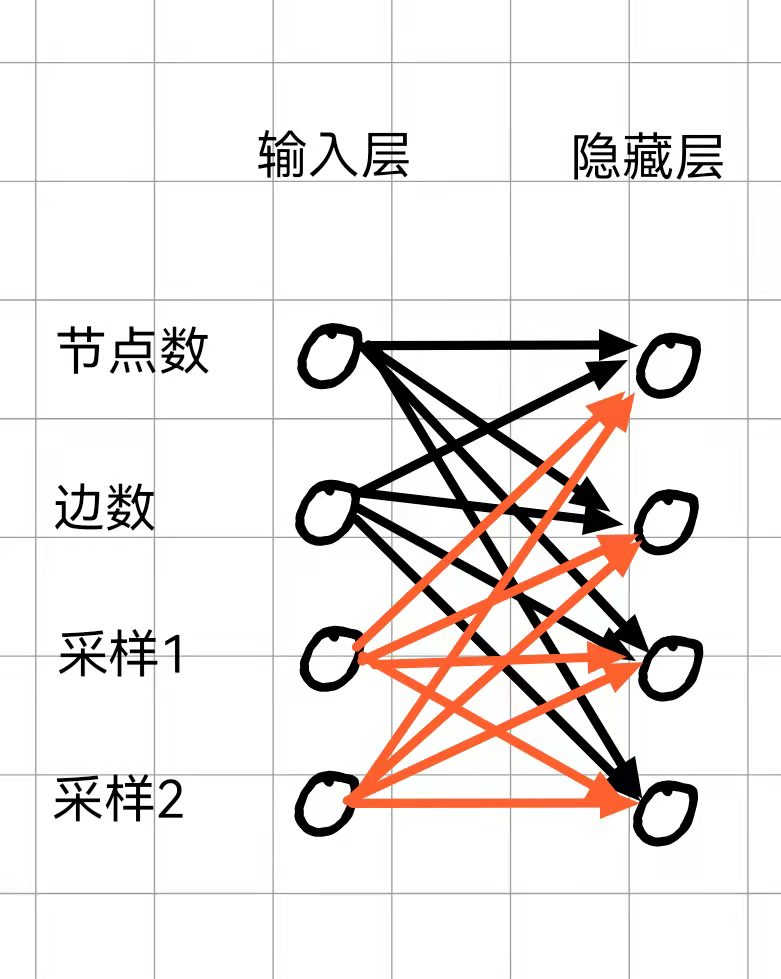

# 面向云计算的服务端资源分配以及调度
## 概述:

### 研究问题:
对于云计算中心对于任务池中任务耗费资源估计以及调度,主要可以理解为下面几个步骤
>+ 1.对于用户提交一个云计算中心一个任务(目前主要针对图计算)(此处需要明确是否需要用户提供任务对应代码)
>+ 2.云计算中心需要完成对该任务计算资源的估计,用于收费或者合理资源推荐
>+ 3.对于成功提交的任务,云计算中心通过调度的方式完成对于服务器相对优秀的调度.

### 主要贡献
待定

## 一、模块划分:
>+ 时间预测模块:针对给定输入图,算法,预测运算所需时间,计算资源等等,作为后续调度模块调度的依据.
>+ 图生成模块:由于图样本数据较少,而时间预测模块需要大量数据才能训练出有效的模型,因此对于原始数据我们需要生成相似的图扩充数据集
>+ 调度模块:对于给定任务池,选择合适的调度方案使得某些性能能得到提升

## 二、模块细分:
### 时间预测模块
#### 输入数据形式:  
使用图结构数据以及非结构数据
>+ 非结构数据主要包含如节点数,边数,联通分量数等可以直接统计出来的整体图的信息
>+ 结构化数据主要用于描述子图连接状况,包括但不限于三角计数以及子图采样,其中对于子图采样可能存在技术难点,具体可以参考问题2.

**技术路线**  
对于非结构数据的采集,可以使用简单遍历预处理得到
对于结构化数据的预处理需要参考图embedding技术,其中包括但不限于传统算法(random walk)或者基于学习的方法(Graph attention),技术选型偏向于使用后者.

##### 输出数据形式:  
> 期望最好以概率分布的形式进行预测,即形成对于给定输入预计执行时间落入对应时间区间内的概率,也可使用线性回归的思想得出一个确切的数字.

**技术路线**  
对于该模块还没有想好比较合适,技术力足够的模型,之前采用的是将时间分片作为标签,进行多标签预测,但是这样的处理会导致丧失标签之间的联系,即预测的结果应该是连续变化的,而非标签这种离散的标记.

### 图生成模块  
**数据生成:**  
> 涉及到训练部分必须要解决图数据稀少的问题,并且该问题对于图计算相关算法来说一直是相对来说薄弱的部分,即数据稀疏的问题.通常情况下图计算仅在一张图内进行相关计算,而我们进行的工作实际上解决$f(图,算法)\to 时间$这样一种映射关系,为了得到相对准确的模型我们必须解决形如这样的二元组$(图,算法)$作为训练数据.

**技术路线**  
之前的操作主要采用对于原始图进行删除/添加部分边的形式,主要的缺陷有图大致规模是确定的,这样会导致对于不同规模的数据丧失预测准确性(如训练都是使用几百个节点的图,但如果用户提交了大小上万的图数据就会丧失准确性),因此该方式在后续肯定是需要调整的,而且这方式过于native
目前设想的技术路线为:使用图生成的方式,给定目标图,逐步生成不同大小的图,对于这些数量级跨度大的图分别进行计算,并将其作为训练数据.

### 调度模块:
> 这一模块我们需要先明确,我们到底是怎么提供服务的,我们需要提升的是什么性能,这样我们才能确定我们需要对什么进行调度

## 三、理想实现的目标:
待定

## 四、目前待解决的问题:
1.首先目前事实上对于云计算服务提供商是否存在该需求,即对某些特定算法,有用户提供不同数据集进行求解.
>+ 该问题影响到如何面向用户提供对应服务,如**是否需要用户提供计算程序**,如果用户提供代码如何保证多设备并发,如果不提供如何保证根据用户需求实现定制化服务
>+ 另一方面,这影响到该工作的motivation是否足够强,以及是否具有现实意义,根据我之前审稿以及交流过程中,如果这个点没有处理好,可能成为论文的致命伤,也是我一直顾虑的关键

2.对于结构化信息中子图采样部分,我们考虑到由于使用采样方式,那么因此对于模型来说表示采样数据在输入层的向量表示应当是向量无关的,但是非结构化数据显然是固定的,将这两个糅合在同一个模型中可能存在不小的难度,可以见下面的示例图,黑色边在反向传播时可:

3.对于该云计算资源配置我们需要先明确一下我们以何种形式提供服务,目前云计算服务主要分为:
>+ 基础架构即服务（IaaS）:提供基础架构级别的服务,如直接提供一台什么都没有的空的服务器,需要用户根据自己需求自行配置,目前云计算主要服务提供形式
>+ 平台即服务（PaaS）:不需要考虑/管理基础设施(如网络、服务器、操作系统或存储),只需要根据自己需求,托管对应服务即可,该服务通常由需求方自行设计(相关代码由需求方提供),云计算节点仅提供运行所需要的环境或者相关支持,该形式比较常见服务提供方式主要有,托管博客/网站.
>+ 软件即服务（SaaS）:对于特定需求频繁,且形式相对固定的基础功能提供对应接口,用户通过调用接口获得对应输出,如用户给定一句话,云计算中心返回该话的情绪分析,又或者用户提供一张照片,云计算中心返回对该照片处理后的结果(可能是分类标签,也可能是相似图片生成)

我们发现我们涉及的问题不属于IaaS以及PaaS,而对于SaaS我们需要明确我们给定的计算任务是否真的有大量重复需求,且需要解决问题的问题形式是否相对确定?

4.调度模块到底针对什么指标进行调度，如果用户直接租用设备，那么不涉及调度，如果用户仅提供任务那么对于任务池中的调度可以直接抽象为操作系统中的线程调度，那么我们怎么在这一块中做出自己的贡献，需要做出与操作系统线程调度不同的区别，否则这一块工作属于吃力不讨好的活。

## 五、总结
上述是本人对这项工作存在的问题的汇总，对于部分问题我觉得是相当大的，属于没处理好就会导致之前所有花费的努力以及功夫直接打水漂的水平（如云计算中是否真的有这种需求，说的严重一点是否属于没有需求创造需求（或者说虽然有需求但是没那么大需求），为了写一个系统而写系统，当然这只是我的观点，如果您有更好的理解希望您能帮我解决目前对此的困惑），但是也不是说这个问题毫无可做之处，我从中抽象的提炼出一个新的子问题"对于任意一个图算法，用较小代价生成基于原图的规模更小的规模不同的图，通过分析解决这些图所需用时，得到对于不同规模图（通常来说是期望预估规模更大的）该算法运行时间的估计"，我称之为"基于生成图的普适图算法时间预测"，其技术路线以及需求分析，将在后续文档中进行说明。

